# 🎨 YEHA Project - Comprehensive Architecture Diagrams

**Generated:** February 23, 2026  
**Purpose:** Visual representations of system architecture, dependencies, and data flows  
**Companion to:** COMPREHENSIVE_ARCHITECTURE_SITEMAP.md

---

## 1. Complete System Architecture Diagram

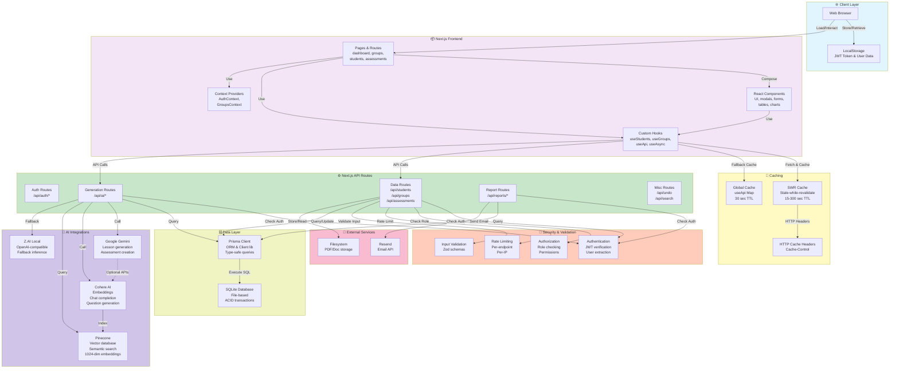

---

## 2. Data Request Flow Diagram

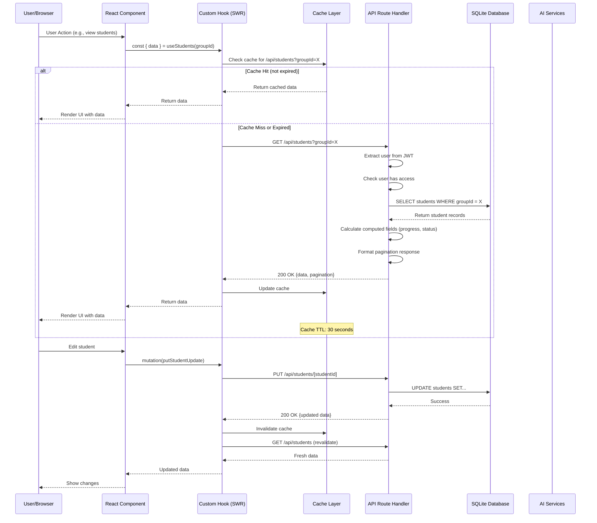

---

## 3. State Management Hierarchy

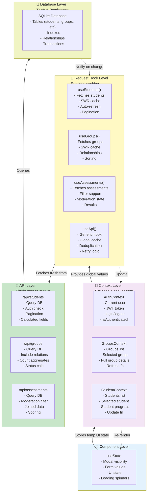

---

## 4. API Routes Dependency Map

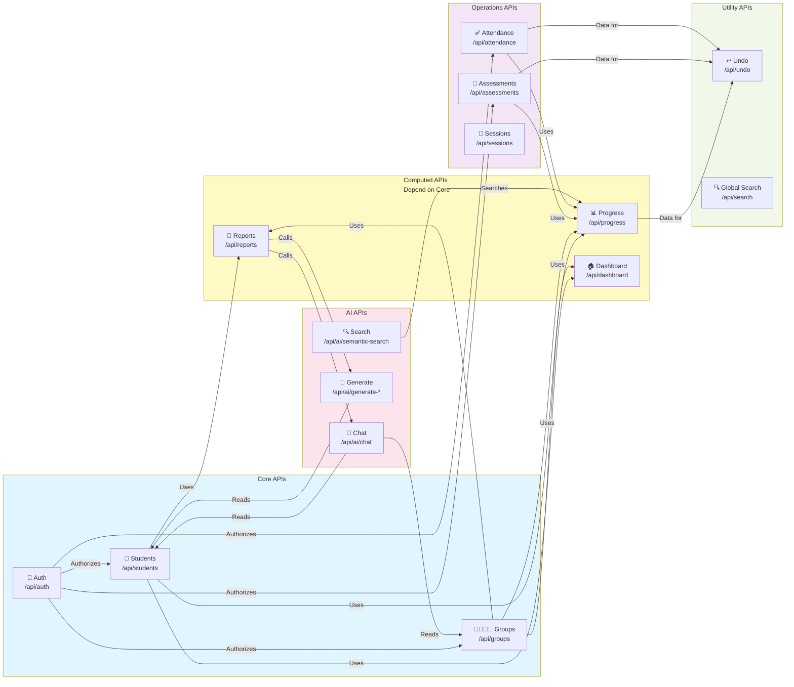

---

## 5. Database Entity Relationships

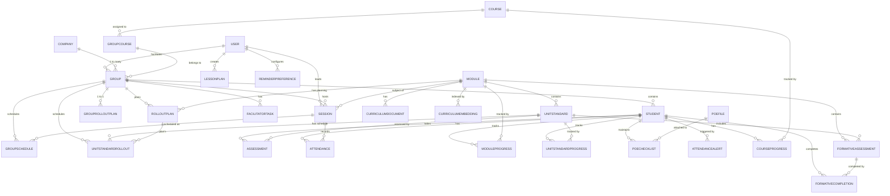

---

## 6. Request Authorization Flow

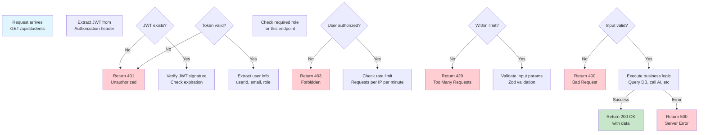

---

## 7. Caching Strategy Timeline

```
Request Timeline (Example: GET /api/students)
════════════════════════════════════════════════════════════════════════

T=0ms         T=500ms         T=1s         T=10s        T=30s
│             │               │            │            │
├─ Request    │               │            │            │
│  API        │               │            │            │
│             │               │            │            │
├────────────────────────────────────────────────────────┤
│  SWR Cache: FRESH (use cached data immediately)       │
├────────────────────────────────────────────────────────┤
        Response rendered
        No network request
        
T=30s+       T=31s           T=32s        T=35s        T=40s
│            │               │            │            │
├─ Cache     │               │            │            │
│  STALE     │               │            │            │
│            │               │            │            │
├────────────────┬───────────────────────────────────────┤
│ Still show     │ Background refresh kicked off         │
│ cached data    │                                       │
│                │                                       │
│                ├────────────────────┬──────────────────┤
│                │ API call in flight │                 │
│                │                    │                 │
│                │                    └─────────────────┤
│                │                    Data received,
│                │                    cache updated,
│                │                    UI re-renders
│
Revalidation Triggers:
├─ Page focus (revalidateOnFocus: true)
├─ Network reconnection
├─ Manual mutation call
└─ Time-based refresh (RefreshInterval: 30000ms)

Deduplication Window (5 seconds):
├─ Request 1: GET /api/students
├─ Request 2 (same URL within 5s): Merged with Request 1
└─ Only 1 network request sent to server
```

---

## 8. AI Integration Flow

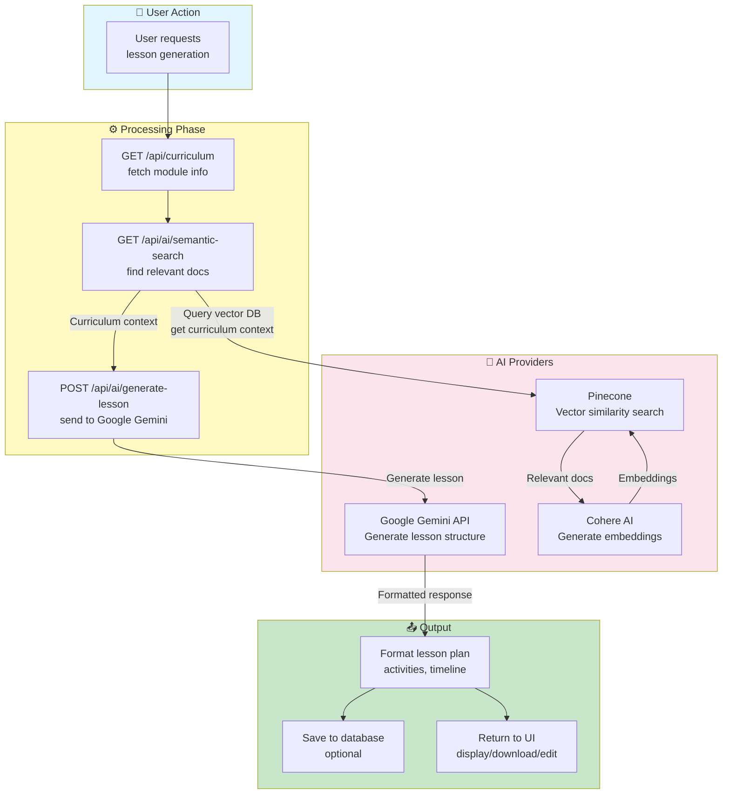

---

## 9. Data Freshness Guarantee

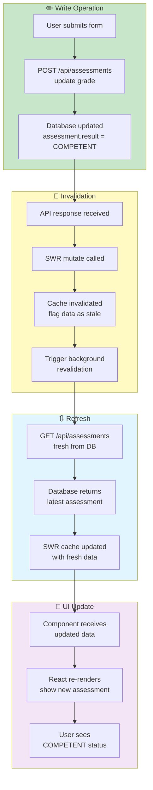

---

## 10. Security & Authentication Sequence

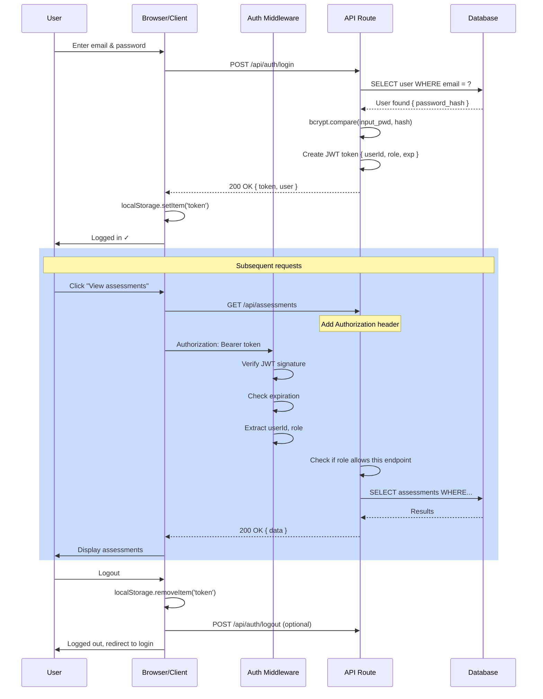

---

## 11. Component Dependency Tree

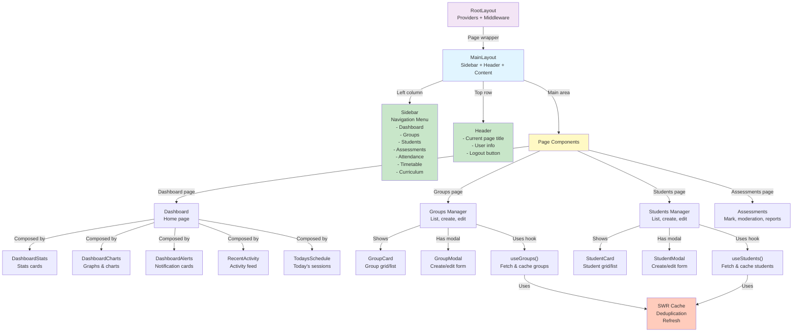

---

## 12. Error Handling Flow

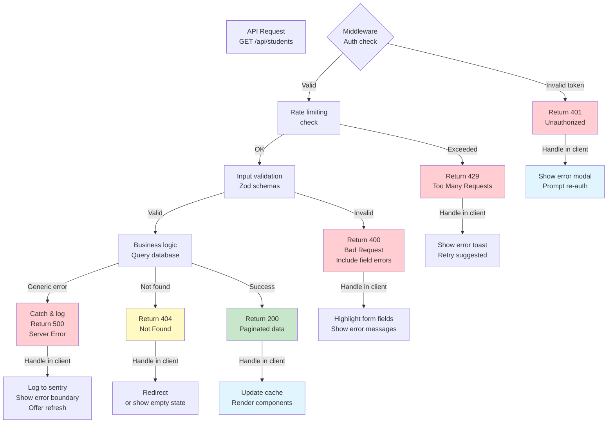

---

## 13. Real-Time Consideration (Polling Pattern)

```
Current Architecture (Interval Polling):
═══════════════════════════════════════════════════════

┌─────────────────────────────────────────────────┐
│         SWR Refresh Intervals (Per Feature)     │
├─────────────────────────────────────────────────┤
│                                                 │
│ Dashboard        ▓▓▓▓▓▓▓▓▓▓ 30 seconds          │
│ Students         ▓▓▓▓▓▓▓▓▓▓ 30 seconds          │
│ Attendance       ▓▓▓▓▓▓▓▓   15 seconds (live)   │
│ Assessments      ▓▓▓▓▓▓▓▓▓▓ 30 seconds          │
│ Curriculum       ▓▓▓▓▓▓▓▓▓▓▓▓▓▓▓▓▓ 5 minutes     │
│ Sites            ▓▓▓▓▓▓▓▓▓▓▓▓ 2 minutes         │
│                                                 │
└─────────────────────────────────────────────────┘

Trade-offs:
┌──────────────────┬──────────────────┐
│ PROS             │ CONS             │
├──────────────────┼──────────────────┤
│ ✓ Simple         │ ✗ Higher latency │
│ ✓ No backend     │ ✗ More bandwidth │
│ ✓ Stateless      │ ✗ Perceived lag  │
│ ✓ Works offline* │ ✗ Not truly      │
│                  │   real-time      │
└──────────────────┴──────────────────┘

For true real-time, would need:
├─ WebSocket server (separate backend)
├─ Message queue (RabbitMQ, Kafka)
├─ Change data capture (CDC)
└─ Event broadcasting system
```

---

## 14. Database Load Optimization

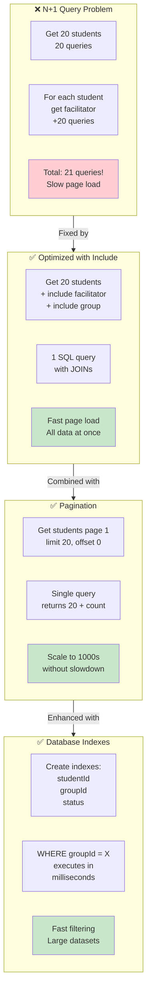

---

## 15. Deployment Architecture

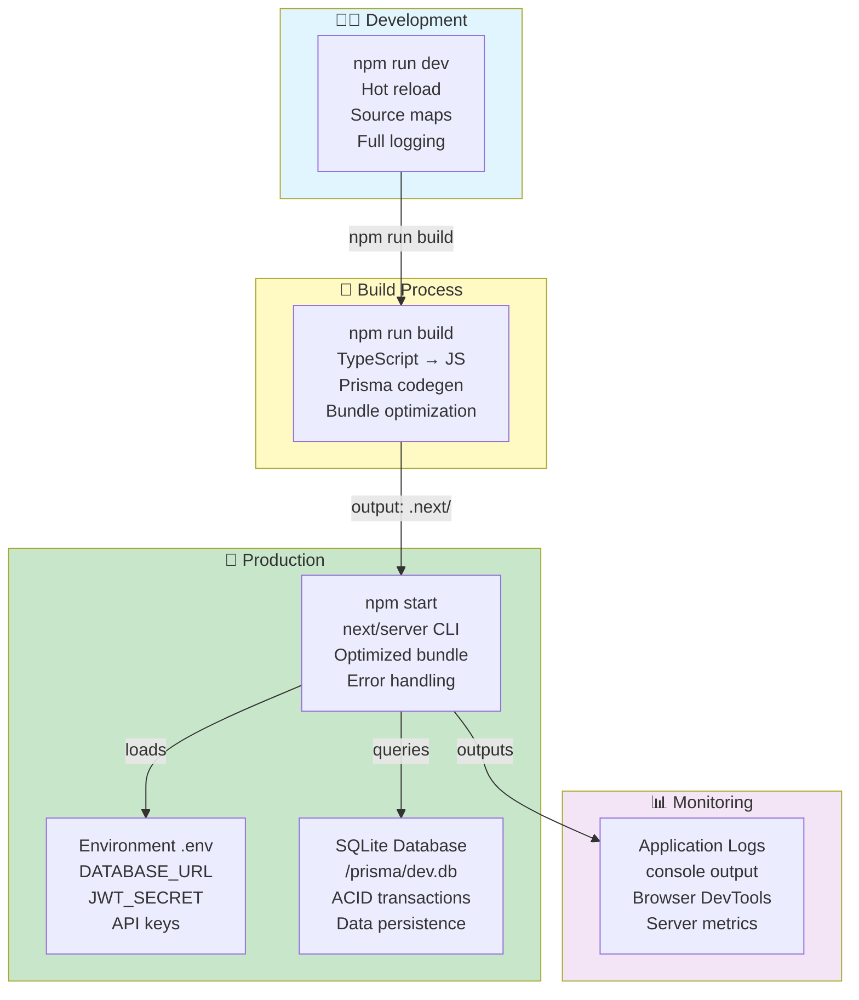

---

**End of Architecture Diagrams**

For detailed explanations of each diagram, refer to the corresponding section in the main COMPREHENSIVE_ARCHITECTURE_SITEMAP.md document.
