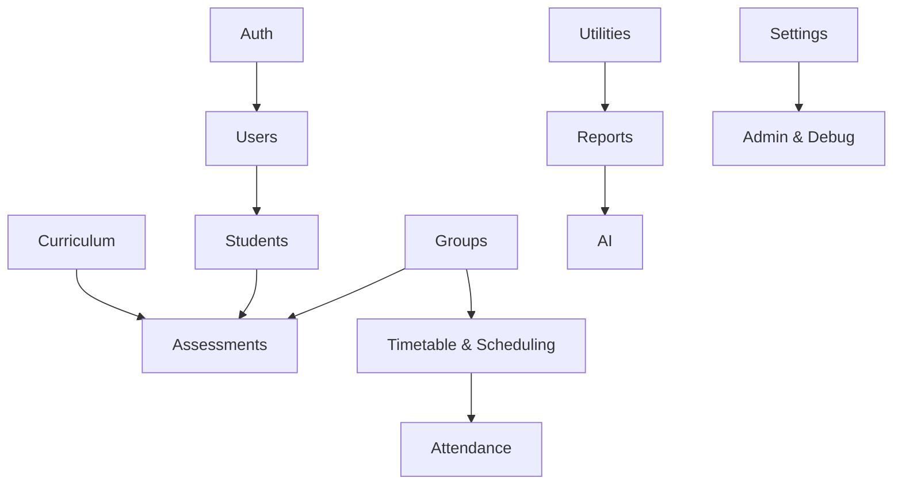

# Backend API Sitemap

This list is generated from route handlers under src/app/api. It groups endpoints by feature, includes short descriptions, and brief request/response notes.

## Auth
- [POST] /api/auth/login — Sign in and return token/user. req: credentials; res: token + user.
- [POST] /api/auth/logout — End session. req: token; res: success.
- [GET] /api/auth/me — Get current user. req: token; res: user.
- [POST] /api/auth/register — Create account. req: profile + password; res: token + user.

## Users
- [GET, POST] /api/users — List or create users. req: optional filters (GET), user data (POST); res: user list or user.
- [GET, PUT, DELETE] /api/users/[id] — Read, update, or delete user. req: id + updates; res: user or success.
- [PUT] /api/users/[id]/password — Change user password. req: current/new password; res: success.

## Students
- [GET, POST] /api/students — List or create students. req: filters (GET) or student payload (POST); res: students or student.
- [GET, PUT, DELETE] /api/students/[id] — Read, update, or delete student. req: id + updates; res: student or success.
- [GET, POST] /api/students/[id]/progress — Read or update student progress. req: id + progress updates; res: progress snapshot.

## Groups
- [GET, POST, PUT, DELETE] /api/groups — List, create, update, or delete groups. req: group payload; res: groups or success.
- [GET, PUT, DELETE] /api/groups/[id] — Read, update, or delete a group. req: id + updates; res: group or success.
- [GET] /api/groups/[id]/assessment-status — Group assessment completion summary. req: id; res: completion stats.
- [POST] /api/groups/[id]/rollout — Save rollout plan dates. req: id + rollout data; res: success.
- [POST] /api/groups/[id]/lessons/generate — Auto-generate lessons for group. req: id; res: result summary.
- [POST] /api/groups/upload — Bulk group upload. req: file data; res: import summary.
- [POST] /api/groups/merge — Merge groups. req: source/target ids; res: merged group.
- [POST] /api/groups/auto-calculate — Auto calculate group stats. req: group criteria; res: stats.
- [GET, POST] /api/groups/auto-rollout — Preview or create rollout plan. req: group inputs; res: plan.

## Assessments
- [GET, POST, PUT, DELETE] /api/assessments — List, create, update, or delete assessments. req: filters/payload; res: assessments or success.
- [GET, POST] /api/assessments/[id]/complete — Complete assessment and read completion. req: id; res: completion state.
- [GET] /api/assessments/analytics — Assessment analytics summary. req: filters; res: analytics.
- [POST] /api/assessments/bulk — Bulk assessment creation. req: batch payload; res: summary.
- [POST] /api/assessments/bulk-generate — Generate assessments by rules. req: generation payload; res: summary.
- [PUT] /api/assessments/bulk-update — Bulk update results. req: ids + status; res: summary.
- [GET] /api/assessments/by-group — Grouped assessments. req: group filters; res: grouped list.
- [GET] /api/assessments/export — Export assessments. req: filters; res: file/stream.
- [GET, POST, PUT] /api/assessments/marking — Assessment marking workflow. req: marking payload; res: status.
- [POST] /api/assessments/moderate — Moderate assessments. req: moderation data; res: success.
- [GET] /api/assessments/stats — Assessment stats summary. req: filters; res: counts/rates.
- [GET, POST] /api/assessments/templates — List/create templates. req: template payload; res: templates.

## Attendance
- [GET, POST, PUT, DELETE] /api/attendance — Attendance CRUD. req: date, student, status; res: records.
- [GET, POST, PUT, DELETE] /api/attendance/alerts — Alerts management. req: filters/payload; res: alerts.
- [POST, PUT] /api/attendance/bulk — Bulk attendance marking. req: batch payload; res: summary.
- [GET] /api/attendance/export — Export attendance data. req: filters; res: file/stream.
- [GET] /api/attendance/history — Attendance history window. req: date range; res: records.
- [GET, POST] /api/attendance/policies — Attendance policy read/update. req: policy payload; res: policy.
- [GET] /api/attendance/rates — Attendance rates by student. req: student ids; res: rates.
- [GET] /api/attendance/stats — Attendance aggregate stats. req: filters; res: stats.

## Curriculum & Unit Standards
- [GET] /api/curriculum — Curriculum library. req: none; res: modules and units.
- [GET] /api/modules — Module list. req: include flags; res: modules.
- [GET] /api/modules/[id] — Module detail. req: id; res: module.
- [GET, POST] /api/unit-standards — List/create unit standards. req: payload; res: unit standards.
- [GET, PUT, DELETE] /api/unit-standards/[id] — Unit standard CRUD. req: id + updates; res: unit standard.
- [GET] /api/formatives — Formatives list. req: filters; res: list.
- [POST] /api/formatives/completion — Mark formative completion. req: ids; res: summary.

## Timetable & Scheduling
- [GET, POST] /api/timetable — Timetable list/create. req: schedule data; res: entries.
- [GET, PATCH, DELETE] /api/timetable/[id] — Timetable entry read/update/delete. req: id + changes; res: entry or success.
- [GET] /api/timetable/[id]/audit — Timetable audit trail. req: id; res: audit events.
- [PATCH] /api/timetable/[id]/reschedule — Reschedule entry. req: id + new time; res: entry.
- [GET, POST, DELETE] /api/timetable/schedule — Generate/manage schedule series. req: batch payload; res: schedule.
- [GET, POST] /api/group-schedules — Group schedule list/create. req: payload; res: schedules.
- [GET, POST] /api/schedule-templates — Schedule template list/create. req: payload; res: templates.
- [GET, POST] /api/sessions/generate — Generate sessions. req: inputs; res: session list.
- [GET, POST, DELETE] /api/recurring-sessions — Manage recurring sessions. req: payload; res: schedule.
- [GET, POST] /api/plans — Calendar plans list/create. req: payload; res: plans.
- [PATCH, DELETE] /api/plans/[id] — Update/delete plan. req: id + updates; res: success.

## Lessons
- [GET, POST] /api/lessons — Lesson plan list/create. req: lesson payload; res: lessons.
- [GET, PUT, DELETE] /api/lessons/[id] — Lesson plan read/update/delete. req: id + changes; res: lesson.

## Reports
- [POST] /api/reports/daily — Generate daily report data. req: groups/date; res: report data.
- [POST] /api/reports/daily/generate-ai — AI-generated daily report text. req: report context; res: AI text.
- [GET] /api/reports/group-progress — Group progress report. req: filters; res: report.
- [GET, POST] /api/reports/unit-standards — Unit standards report. req: filters/payload; res: report.
- [GET] /api/search — Global search. req: query/filter; res: results.

## Dashboard
- [GET] /api/dashboard/summary — Dashboard summary stats. req: none; res: totals + health.
- [GET] /api/dashboard/stats — Legacy stats snapshot. req: none; res: stats.
- [GET] /api/dashboard/charts — Chart series data. req: time range; res: chart data.
- [GET] /api/dashboard/recent-activity — Activity feed. req: none; res: list.
- [GET] /api/dashboard/alerts — Alert list. req: none; res: alerts.
- [GET] /api/dashboard/schedule — Today schedule. req: none; res: schedule.
- [GET] /api/dashboard/today-classes — Today classes list. req: none; res: classes.

## AI
- [POST] /api/ai/chat — AI chat completion. req: messages; res: response + sources.
- [GET, POST] /api/ai/semantic-search — Semantic search. req: query; res: results.
- [GET, POST] /api/ai/generate-assessment — Assessment generation. req: unit standard + params; res: questions.
- [GET, POST] /api/ai/index-documents — Index documents. req: files; res: index status.
- [GET] /api/ai/recommendations — Content recommendations. req: context; res: suggestions.

## POE
- [GET, POST, PUT, DELETE] /api/poe — POE checklist CRUD. req: student + checklist; res: checklist.

## Compliance & Progress
- [GET, POST] /api/progress — Progress stats and updates. req: filters/payload; res: progress.
- [GET] /api/attendance/stats — Compliance-driven attendance stats. req: filters; res: stats.

## Settings & Reminders
- [GET, PUT] /api/settings/profile — Profile settings. req: updates; res: profile.
- [GET, PUT] /api/settings/notifications — Notification settings. req: updates; res: settings.
- [GET, POST] /api/settings/reminders — Reminder settings. req: updates; res: settings.
- [GET, POST] /api/settings/security — Security settings. req: updates; res: settings.
- [GET, PUT] /api/settings/system — System settings. req: updates; res: settings.
- [GET, PUT] /api/settings/appearance — Appearance settings. req: updates; res: settings.
- [GET, POST] /api/reminders — Reminder list/create. req: payload; res: reminders.
- [DELETE] /api/reminders/[id] — Delete reminder. req: id; res: success.
- [PATCH] /api/reminders/[id]/mark-read — Mark reminder read. req: id; res: success.
- [POST] /api/reminders/send-pending-emails — Send queued reminders. req: none; res: summary.

## Companies
- [GET, POST, PUT, DELETE] /api/companies — Company CRUD. req: payload; res: companies.

## Admin & Debug
- [POST] /api/admin/cleanup — Admin cleanup job. req: none; res: summary.
- [GET] /api/debug/groups-notes — Debug group notes. req: none; res: notes.

## Utilities
- [GET, POST] /api/test-endpoint — Test endpoint. req: payload; res: echo.

