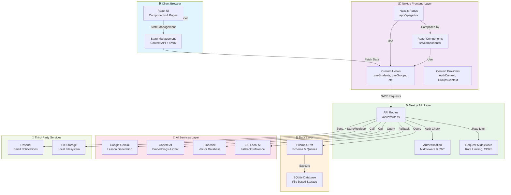
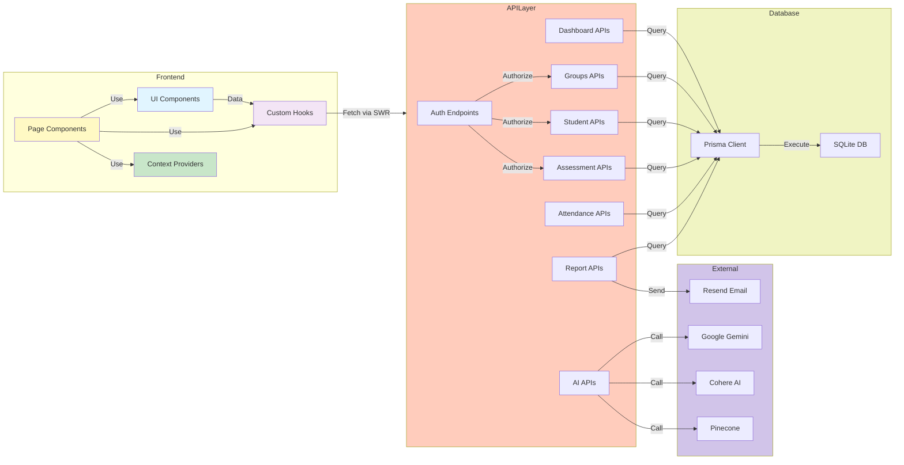
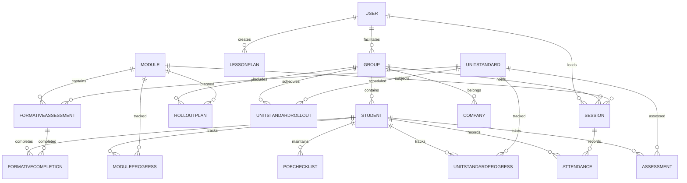
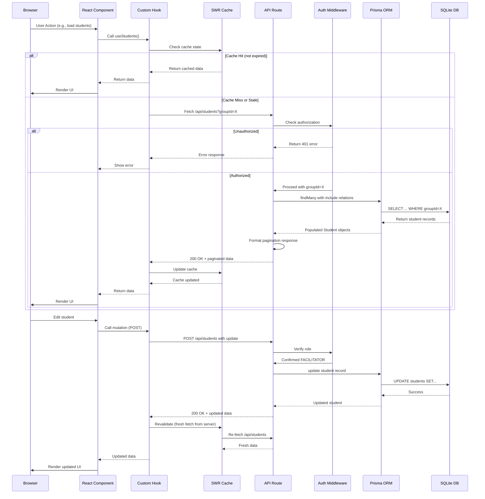

# 🏗️ YEHA Project - Comprehensive Architecture Sitemap

**Generated:** February 23, 2026  
**Project:** YEHA - Youth Education & Skills Management System  
**Scope:** Full system architecture, dependency mapping, and data flow analysis  
**Status:** Complete

---

## 📋 Table of Contents

1. [Executive Summary](#executive-summary)
2. [High-Level Architecture](#high-level-architecture)
3. [Technology Stack](#technology-stack)
4. [Project Structure & Organization](#project-structure--organization)
5. [Component Breakdown](#component-breakdown)
6. [Dependency Graph](#dependency-graph)
7. [Data Models & Entity Relationships](#data-models--entity-relationships)
8. [Data Flow & Synchronization](#data-flow--synchronization)
9. [API Architecture](#api-architecture)
10. [State Management & Caching](#state-management--caching)
11. [AI Service Integrations](#ai-service-integrations)
12. [Security Architecture](#security-architecture)
13. [Build & Deployment](#build--deployment)
14. [Key Design Decisions](#key-design-decisions)
15. [Architectural Assumptions](#architectural-assumptions)

---

## Executive Summary

YEHA is a **monolithic Next.js 14 full-stack application** designed for managing SSETA NVC Level 2 training programs. The system features:

- **Frontend-heavy architecture**: React 18 with TypeScript and Tailwind CSS
- **Backend-on-serverless**: Next.js API Routes for backend functionality
- **Client-side state management**: React Context + SWR for caching
- **SQLite database**: Lightweight, file-based database via Prisma ORM
- **AI-powered features**: Integration with multiple AI providers (Google Gemini, Cohere, Pinecone)
- **Comprehensive reporting**: PDF generation, CSV export, analytics dashboards

**Key Characteristics:**
- No external backend service required (fully self-contained)
- Production-ready with authentication, authorization, and rate limiting
- Performance-optimized with intelligent caching strategies
- Extensible for multiple AI model providers

---

## 2. High-Level Architecture



---

## 3. Technology Stack

### **Core Framework & Language**
| Layer | Technology | Version | Purpose |
|-------|-----------|---------|---------|
| **Frontend** | Next.js | 14.2.0 | Full-stack React framework with SSR/SSG |
| **Runtime** | React | 18.3.0 | UI component library and rendering engine |
| **Language** | TypeScript | 5.4.5 | Type-safe development |
| **Styling** | Tailwind CSS | 3.4.3 | Utility-first CSS framework |
| **Icons** | Lucide React | 0.445.0 | Icon library for UI |

### **Backend & Database**
| Component | Technology | Version | Purpose |
|-----------|-----------|---------|---------|
| **ORM** | Prisma | 5.22.0 | Database abstraction and migrations |
| **Database** | SQLite | - | File-based relational database |
| **Client Lib** | @prisma/client | 5.22.0 | Prisma runtime client |
| **Encryption** | bcryptjs | 2.4.3 | Password hashing and verification |

### **State Management & Data Fetching**
| Component | Technology | Version | Purpose |
|-----------|-----------|---------|---------|
| **Client Cache** | SWR | 2.2.5 | Stale-while-revalidate data fetching |
| **State** | React Context | Built-in | Global state management |
| **Local Storage** | Browser API | Built-in | Client-side persistent storage |

### **AI & Machine Learning**
| Service | Library | Version | Purpose |
|---------|---------|---------|---------|
| **Google Gemini** | @google/generative-ai | 0.24.1 | Lesson planning, assessment generation |
| **Cohere** | cohere-ai | 7.20.0 | Embeddings, semantic search, chat |
| **Pinecone** | @pinecone-database/pinecone | 7.0.0 | Vector database for curriculum search |
| **OpenAI Compat** | openai | 6.17.0 | Z.AI and other OpenAI-compatible APIs |

### **Document Processing**
| Component | Library | Version | Purpose |
|-----------|---------|---------|---------|
| **PDF** | jspdf | 4.1.0 | PDF generation |
| **PDF Tables** | jspdf-autotable | 5.0.7 | PDF table formatting |
| **PDF Parsing** | pdf-parse | 2.4.5 | PDF text extraction |
| **Word Docs** | docx | 9.5.1 | Word document generation |
| **Word Parsing** | mammoth | 1.11.0 | Word document text extraction |
| **CSV** | papaparse | 5.5.3 | CSV parsing and generation |

### **Authentication & Security**
| Component | Library | Version | Purpose |
|-----------|---------|---------|---------|
| **JWT** | jsonwebtoken | 9.0.2 | JWT token creation and verification |
| **JWT JOSE** | jose | 6.1.3 | Alternative JWT implementation |
| **Auth Utilities** | @types/jsonwebtoken | 9.0.6 | Type definitions |

### **Notifications & Email**
| Component | Service | Version | Purpose |
|-----------|---------|---------|---------|
| **Email** | Resend | 6.9.1 | Email API for notifications |

### **Utilities**
| Component | Library | Version | Purpose |
|-----------|---------|---------|---------|
| **Date Handling** | date-fns | 3.3.1 | Date manipulation and formatting |
| **Recurrence Rules** | rrule | 2.8.1 | Recurring event scheduling |
| **Charts & Graphs** | recharts | 3.7.0 | Data visualization |
| **Validation** | zod | 3.23.8 | Schema validation and type checking |
| **Merge Utilities** | clsx, tailwind-merge | Latest | CSS class merging |

### **Testing & Development**
| Component | Framework | Version | Purpose |
|-----------|-----------|---------|---------|
| **Test Runner** | Vitest | 4.0.18 | Fast unit testing framework |
| **Linting** | ESLint | 8.57.0 | Code quality and style |
| **Static Analysis** | TypeScript | 5.4.5 | Type checking and compilation |

---

## 4. Project Structure & Organization

```
learnership-management/
├── 📁 src/
│   ├── 📁 app/                           # Next.js App Router (pages & API)
│   │   ├── 📁 api/                       # API Route handlers
│   │   │   ├── admin/                    # Admin endpoints
│   │   │   ├── ai/                       # AI service endpoints
│   │   │   │   ├── chat/                # AI chat endpoint
│   │   │   │   ├── generate-lesson/     # Lesson generation
│   │   │   │   ├── generate-assessment/ # Assessment generation
│   │   │   │   ├── semantic-search/     # Vector search
│   │   │   │   └── index-documents/     # Document indexing
│   │   │   ├── assessments/              # Assessment CRUD & grading
│   │   │   ├── attendance/               # Attendance marking & reporting
│   │   │   ├── auth/                     # Authentication endpoints
│   │   │   ├── groups/                   # Group management
│   │   │   ├── students/                 # Student management
│   │   │   ├── sessions/                 # Session scheduling
│   │   │   ├── dashboard/                # Dashboard stats & summary
│   │   │   ├── curriculum/               # Curriculum access
│   │   │   ├── progress/                 # Progress calculation
│   │   │   ├── reports/                  # Report generation
│   │   │   ├── rollout/                  # Rollout planning
│   │   │   ├── timetable/                # Timetable management
│   │   │   ├── undo/                     # Undo/redo operations
│   │   │   └── [other modules]/          # Additional endpoints
│   │   ├── 📁 admin/page.tsx             # Admin dashboard
│   │   ├── 📁 assessments/page.tsx       # Assessment management
│   │   ├── 📁 attendance/page.tsx        # Attendance tracker
│   │   ├── 📁 groups/page.tsx            # Groups management
│   │   ├── 📁 students/page.tsx          # Students management
│   │   ├── 📁 timetable/page.tsx         # Timetable scheduler
│   │   ├── 📁 curriculum/page.tsx        # Curriculum viewer
│   │   ├── 📁 login/page.tsx             # Authentication page
│   │   ├── 📁 register/page.tsx          # Registration page
│   │   ├── layout.tsx                    # Root layout with providers
│   │   ├── page.tsx                      # Dashboard homepage
│   │   ├── globals.css                   # Global styles
│   │   └── middleware.ts                 # Request middleware
│   │
│   ├── 📁 components/                    # Reusable React components
│   │   ├── 📁 ai/                        # AI-related components
│   │   │   └── AIChat.tsx                # AI chatbot widget
│   │   ├── 📁 dashboard/                 # Dashboard components
│   │   │   ├── DashboardStats.tsx        # Stats cards
│   │   │   ├── DashboardCharts.tsx       # Chart visualizations
│   │   │   └── DashboardAlerts.tsx       # Alert notifications
│   │   ├── 📁 calendar/                  # Calendar components
│   │   ├── 📁 tables/                    # Data table components
│   │   ├── 📁 modals/                    # Modal dialogs
│   │   ├── 📁 ui/                        # Base UI components
│   │   ├── 📁 forms/                     # Form components
│   │   ├── 📁 views/                     # Alternative view components
│   │   ├── 📁 widgets/                   # Dashboard widgets
│   │   ├── MainLayout.tsx                # Main page layout wrapper
│   │   ├── Sidebar.tsx                   # Navigation sidebar
│   │   ├── Header.tsx                    # Page header
│   │   ├── providers.tsx                 # Context providers setup
│   │   └── [component].tsx               # Many other specific components
│   │
│   ├── 📁 contexts/                      # React Context providers
│   │   ├── AuthContext.tsx               # Authentication state
│   │   ├── GroupsContext.tsx             # Groups data provider
│   │   ├── StudentContext.tsx            # Student data provider
│   │   └── StudentContextSimple.tsx      # Simplified student provider
│   │
│   ├── 📁 hooks/                         # Custom React hooks
│   │   ├── useApi.ts                     # Generic API request hook
│   │   ├── useStudents.ts                # Student data hook
│   │   ├── useGroups.ts                  # Group data hook
│   │   ├── useAssessments.ts             # Assessment data hook
│   │   ├── useAttendance.ts              # Attendance data hook
│   │   ├── useDashboard.ts               # Dashboard stats hook
│   │   ├── useLessons.ts                 # Lesson data hook
│   │   ├── useCurriculum.ts              # Curriculum access hook
│   │   ├── useProgress.ts                # Progress calculation hook
│   │   ├── useLocalStorage.ts            # Local storage hook
│   │   ├── useDebounce.ts                # Debounce hook
│   │   ├── useAsync.ts                   # Async operation hook
│   │   └── [other hooks].ts              # Additional hooks
│   │
│   ├── 📁 lib/                           # Utility libraries
│   │   ├── ai/                           # AI service integrations
│   │   │   ├── pinecone.ts               # Pinecone vector DB client
│   │   │   ├── cohere.ts                 # Cohere API integration
│   │   │   ├── gemini.ts                 # Google Gemini integration
│   │   │   ├── zai.ts                    # Z.AI local AI integration
│   │   │   └── index.ts                  # AI exports
│   │   ├── prisma.ts                     # Prisma client singleton
│   │   ├── auth.ts                       # Authentication utilities
│   │   ├── middleware.ts                 # Auth/role middleware
│   │   ├── api-utils.ts                  # API response formatters
│   │   ├── swr-config.ts                 # SWR configuration
│   │   ├── cache-control.ts              # HTTP cache headers
│   │   ├── security.ts                   # Security utilities
│   │   ├── validations.ts                # Zod validation schemas
│   │   ├── utils.ts                      # General utilities
│   │   └── [other utilities].ts          # Additional libraries
│   │
│   ├── 📁 types/                         # TypeScript type definitions
│   │   ├── index.ts                      # Exported types
│   │   └── [domain].ts                   # Domain-specific types
│   │
│   └── middleware.ts                     # Next.js middleware (top-level)
│
├── 📁 prisma/
│   ├── schema.prisma                     # Database schema definition
│   └── 📁 migrations/                    # Database migrations
│
├── 📁 public/                            # Static assets
│   ├── favicon.ico
│   └── [images & assets]
│
├── 📁 scripts/                           # Utility scripts
│   ├── seed-safe.js                      # Database seeding
│   ├── backup-db.js                      # Database backup
│   ├── bulk-upload-documents.js          # Bulk document processing
│   ├── upload-docs-to-pinecone.js       # Vector DB indexing
│   └── [other scripts]
│
├── 📁 tests/                             # Test files
│   ├── setup.ts                          # Test configuration
│   └── [test files]
│
├── 📁 docs/                              # Documentation
│   ├── DEVELOPER_DOCS.md
│   ├── ENVIRONMENT_CONFIGURATION_GUIDE.md
│   └── [other documentation]
│
├── 📄 package.json                       # Project dependencies
├── 📄 tsconfig.json                      # TypeScript configuration
├── 📄 next.config.mjs                    # Next.js configuration
├── 📄 tailwind.config.ts                 # Tailwind CSS configuration
├── 📄 vitest.config.ts                   # Vitest configuration
└── 📄 .env.example                       # Environment variables template
```

---

## 5. Component Breakdown

### **5.1 Core Page Components**

| Page | File Path | Purpose | Key Responsibility |
|------|-----------|---------|-------------------|
| **Dashboard** | `src/app/page.tsx` | Main landing page | Display system overview, stats, alerts, calendar |
| **Groups** | `src/app/groups/page.tsx` | Group management | CRUD operations, rollout planning, bulk actions |
| **Students** | `src/app/students/page.tsx` | Student management | Track enrollment, progress, transfers |
| **Assessments** | `src/app/assessments/page.tsx` | Assessment marking | Record grades, moderation, reporting |
| **Attendance** | `src/app/attendance/page.tsx` | Attendance tracking | Mark sessions, generate reports |
| **Timetable** | `src/app/timetable/page.tsx` | Session scheduling | Calendar view, recurring sessions |
| **Curriculum** | `src/app/curriculum/page.tsx` | Content library | Browse modules, units, resources |
| **Admin** | `src/app/admin/page.tsx` | System administration | User management, settings |
| **Login** | `src/app/login/page.tsx` | Authentication | User login and session creation |
| **Register** | `src/app/register/page.tsx` | User registration | New user onboarding |

### **5.2 Component Architecture Layers**

#### **Layout Components**
- `MainLayout.tsx` - Root layout wrapper with sidebar and header
- `DashboardLayout.tsx` - Specialized dashboard layout
- `Header.tsx` - Page header with navigation
- `Sidebar.tsx` - Navigation menu with collapse support

#### **Dashboard Components**
- `DashboardStats.tsx` - Key statistics cards
- `DashboardCharts.tsx` - Chart visualizations (attendance, distribution)
- `DashboardAlerts.tsx` - System alerts and notifications
- `RecentActivity.tsx` - Activity feed
- `TodaysSchedule.tsx` - Today's scheduled sessions
- `TeachingNotifications.tsx` - Teaching-specific alerts

#### **Data Display Components**
- `GroupsManagement.tsx` - Group list and filtering
- `StudentCard.tsx` - Student profile card
- `ModuleProgressCard.tsx` - Module progress visualization
- `StatCard.tsx` - Generic stat card component
- `ProgressReport.tsx` - Progress timeline/report

#### **Modal & Form Components**
- `GroupModal.tsx` - Create/edit group dialog
- `StudentModal.tsx` / `AddStudentModal.tsx` / `EditStudentModal.tsx` - Student management
- `AssessmentModal.tsx` - Assessment creation
- `MarkAssessmentModal.tsx` - Assessment grading interface
- `SessionForm.tsx` / `ScheduleLessonModal.tsx` - Session scheduling
- `RecurringSessionModal.tsx` - Recurring event setup
- `BulkAttendanceModal.tsx` / `BulkMarkingModal.tsx` - Bulk operations

#### **AI & Assistant Components**
- `AIChat.tsx` - ChatGPT-like assistant widget
- `LessonAssessmentTracker.tsx` - AI-generated lesson tracking

#### **Calendar & Schedule Components**
- `MiniCalendar.tsx` - Small calendar widget
- `TimetableCalendarView.tsx` - Full calendar schedule
- `TimetableDayView.tsx` - Daily schedule view
- `TimetableWeekView.tsx` - Weekly schedule view
- `SessionDetailPanel.tsx` - Session details sidebar

#### **Kanban & Board Components**
- `KanbanBoard.tsx` - Kanban board container
- `KanbanColumn.tsx` - Column in kanban board
- `KanbanCard.tsx` - Task/card in kanban

#### **Base UI Components** (`src/components/ui/`)
- `button.tsx` - Button component
- `scroll-area.tsx` - Scrollable area
- `input.tsx` - Input field
- [Other Radix UI-based components]

### **5.3 Custom Hooks Ecosystem**

```typescript
// Authentication & Context
useAuth()                  // Get current user, login, logout

// Data Fetching
useApi()                   // Generic API request with caching
useStudents()              // Fetch students with filters
useGroups()                // Fetch groups with related data
useAssessments()           // Fetch assessments
useAttendance()            // Fetch attendance records
useLessons()               // Fetch lesson plans
useCurriculum()            // Fetch curriculum content
useProgress()              // Calculate student progress
useSites()                 // Fetch training sites

// Dashboard Specific
useDashboard()             // Main dashboard stats
useDashboardStats()        // Dashboard statistics
useRecentActivity()        // Activity feed data

// Utilities
useLocalStorage()          // Browser local storage hook
useDebounce()              // Debounce values for search
useAsync()                 // Async operation handling
usePrevious()              // Previous value tracking
useWindowSize()            // Window dimensions
useFormState()             // Form state management
useUI()                    // UI state (modals, drawers)
```

### **5.4 Context Providers**

```typescript
// AuthContext - Authentication state
export interface AuthContextType {
  user: User | null;
  token: string | null;
  login: (token, user) => void;
  logout: () => void;
  isAuthenticated: boolean;
  isLoading: boolean;
}

// GroupsContext - Groups and related data
export interface GroupsContextType {
  groups: Group[];
  selectedGroup: Group | null;
  selectGroup: (groupId) => void;
  refreshGroups: () => Promise<void>;
  isLoading: boolean;
  error: Error | null;
}

// StudentContext - Student and progress tracking
export interface StudentContextType {
  students: Student[];
  selectedStudent: Student | null;
  selectStudent: (studentId) => void;
  updateStudent: (student) => void;
  isLoading: boolean;
}
```

---

## 6. Dependency Graph

### **6.1 Module Dependency Map**



### **6.2 Circular Dependency Prevention**

The architecture maintains strict separation:
- **Pages** import Components (not vice versa)
- **Components** import UI and Hooks (not Pages)
- **Hooks** fetch from APIs (not Pages or Components)
- **APIs** query Database (not vice versa)

This prevents circular dependencies and maintains a clear data flow unidirectionality.

---

## 7. Data Models & Entity Relationships

### **7.1 Core Entity Diagram**



### **7.2 Data Model Overview**

```typescript
// Core Models
User {
  id: UUID
  email: string (unique)
  name: string
  password: hashed
  role: enum(FACILITATOR|ADMIN|COORDINATOR)
  createdAt: timestamp
  updatedAt: timestamp
  // Relations
  lessonPlans: LessonPlan[]
  sessions: Session[]
  students: Student[]
  plans: Plan[]
}

Group {
  id: UUID
  name: string
  location: string
  address: string
  startDate: DateTime
  endDate: DateTime
  status: enum(ACTIVE|COMPLETED|ARCHIVED)
  companyId: UUID (FK)
  currentFacilitatedModuleId: UUID (FK)
  createdAt: timestamp
  updatedAt: timestamp
  // Relations
  students: Student[]
  sessions: Session[]
  schedules: GroupSchedule[]
  rolloutPlans: RolloutPlan[]
  unitStandardRollouts: UnitStandardRollout[]
  facilitatorTasks: FacilitatorTask[]
  plans: Plan[]
}

Student {
  id: UUID
  studentId: string (unique)
  firstName: string
  lastName: string
  email: string
  phone: string
  idNumber: string
  progress: int (0-100)
  totalCreditsEarned: int
  status: enum(ACTIVE|INACTIVE|ARCHIVED)
  groupId: UUID (FK)
  facilitatorId: UUID (FK)
  currentModuleId: UUID (FK)
  createdAt: timestamp
  updatedAt: timestamp
  // Relations
  assessments: Assessment[]
  attendance: Attendance[]
  moduleProgress: ModuleProgress[]
  unitStandardProgress: UnitStandardProgress[]
  formativeCompletions: FormativeCompletion[]
  poeChecklists: POEChecklist
  attendanceAlerts: AttendanceAlert[]
}

Module {
  id: UUID
  moduleNumber: int (unique)
  code: string (unique)
  name: string
  fullName: string
  credits: int
  notionalHours: int
  classroomHours: int
  workplaceHours: int
  order: int
  status: enum(ACTIVE|ARCHIVED)
  createdAt: timestamp
  updatedAt: timestamp
  // Relations
  documents: CurriculumDocument[]
  embeddings: CurriculumEmbedding[]
  formativeAssessments: FormativeAssessment[]
  sessions: Session[]
  moduleProgress: ModuleProgress[]
  rolloutPlans: RolloutPlan[]
}

UnitStandard {
  id: UUID
  code: string (unique)
  title: string
  description: string
  credits: int
  assessmentCriteria: string
  learningOutcomes: string
  status: enum(ACTIVE|ARCHIVED)
  moduleId: UUID (FK)
  createdAt: timestamp
  updatedAt: timestamp
  // Relations
  assessments: Assessment[]
  formativeAssessments: FormativeAssessment[]
  unitStandardProgress: UnitStandardProgress[]
  unitStandardRollouts: UnitStandardRollout[]
}

Assessment {
  id: UUID
  type: enum(FORMATIVE|SUMMATIVE)
  method: enum(PRACTICAL|WRITTEN|ORAL|PROJECT)
  result: enum(COMPETENT|NOT_YET_COMPETENT|ABSENT)
  score: int
  assessedDate: DateTime
  dueDate: DateTime
  notes: string
  feedback: string
  moderationStatus: enum(PENDING|APPROVED|REJECTED)
  studentId: UUID (FK)
  unitStandardId: UUID (FK)
  createdAt: timestamp
  updatedAt: timestamp
}

Attendance {
  id: UUID
  date: DateTime
  status: enum(PRESENT|ABSENT|LATE|EXCUSED)
  notes: string
  markedAt: DateTime
  qrCodeScan: boolean
  studentId: UUID (FK)
  sessionId: UUID (FK)
  groupId: UUID (FK)
  createdAt: timestamp
  updatedAt: timestamp
  // Unique constraint: (studentId, date, groupId)
}

Session {
  id: UUID
  title: string
  module: string
  date: DateTime
  startTime: string (HH:MM)
  endTime: string (HH:MM)
  notes: string
  groupId: UUID (FK)
  facilitatorId: UUID (FK)
  createdAt: timestamp
  updatedAt: timestamp
  // Relations
  attendance: Attendance[]
}

RolloutPlan {
  id: UUID
  groupId: UUID (FK)
  moduleId: UUID (FK)
  moduleNumber: int
  // Projected dates (auto-calculated)
  projectedStartDate: DateTime
  projectedEndDate: DateTime
  projectedSummativeDate: DateTime
  // Actual dates (manual entry)
  actualStartDate: DateTime
  actualEndDate: DateTime
  actualSummativeDate: DateTime
  // Auto-calculated status
  status: enum(NOT_STARTED|IN_PROGRESS|BEHIND|COMPLETED|AT_RISK)
  credits: int
  notes: string
  createdAt: timestamp
  updatedAt: timestamp
  // Unique: (groupId, moduleId)
}

UnitStandardRollout {
  id: UUID
  groupId: UUID (FK)
  unitStandardId: UUID (FK)
  // Projected
  startDate: DateTime
  endDate: DateTime
  summativeDate: DateTime
  // Actual
  actualStartDate: DateTime
  actualEndDate: DateTime
  actualSummativeDate: DateTime
  status: enum(NOT_STARTED|IN_PROGRESS|COMPLETED|BEHIND|AHEAD|OVERDUE)
  completedPercent: int
  facilitated: boolean
  facilitatedAt: DateTime
  facilitatorNotes: string
  createdAt: timestamp
  updatedAt: timestamp
  // Unique: (groupId, unitStandardId)
}

ModuleProgress {
  id: UUID
  studentId: UUID (FK)
  moduleId: UUID (FK)
  status: enum(NOT_STARTED|IN_PROGRESS|COMPLETED)
  progress: int (0-100)
  creditsEarned: int
  startDate: DateTime
  completionDate: DateTime
  createdAt: timestamp
  updatedAt: timestamp
  // Unique: (studentId, moduleId)
}

UnitStandardProgress {
  id: UUID
  studentId: UUID (FK)
  unitStandardId: UUID (FK)
  status: enum(NOT_STARTED|IN_PROGRESS|COMPLETED)
  startDate: DateTime
  completionDate: DateTime
  formativesPassed: int
  summativePassed: boolean
  createdAt: timestamp
  updatedAt: timestamp
  // Unique: (studentId, unitStandardId)
}

POEChecklist {
  id: UUID
  studentId: UUID (FK, unique)
  module1POE: boolean, module1POEDate: DateTime
  // ... modules 2-6 with same pattern
  assessmentsSigned: boolean, assessmentsDate: DateTime
  logbookComplete: boolean, logbookSigned: boolean, logbookDate: DateTime
  idCopyPresent: boolean, idCopyDate: DateTime
  contractSigned: boolean, contractDate: DateTime
  inductionComplete: boolean, inductionDate: DateTime
  verifiedBy: UUID
  verifiedDate: DateTime
  notes: string
  createdAt: timestamp
  updatedAt: timestamp
}

FormativeAssessment {
  id: UUID
  code: string (unique)
  title: string
  description: string
  documentPath: string
  questions: int
  passingScore: int (default=50)
  order: int
  moduleId: UUID (FK)
  unitStandardId: UUID (FK)
  createdAt: timestamp
  updatedAt: timestamp
  // Relations
  completions: FormativeCompletion[]
}

FormativeCompletion {
  id: UUID
  studentId: UUID (FK)
  formativeId: UUID (FK)
  completedDate: DateTime
  score: int
  passed: boolean
  attempts: int
  moderationStatus: enum(PENDING|APPROVED|REJECTED)
  moderatedBy: string
  moderatedDate: DateTime
  notes: string
  createdAt: timestamp
  updatedAt: timestamp
  // Unique: (studentId, formativeId)
}

AttendanceAlert {
  id: UUID
  studentId: UUID (FK)
  type: enum(ABSENCE|LATE_ARRIVAL|EXCESSIVE_ABSENCE|WARNING)
  severity: enum(INFO|WARNING|CRITICAL)
  message: string
  details: string
  resolved: boolean
  resolvedAt: DateTime
  resolvedBy: string
  notificationSent: boolean
  createdAt: timestamp
  updatedAt: timestamp
}

UndoHistory {
  id: UUID
  userId: UUID
  action: enum(BULK_ATTENDANCE|BULK_ASSESSMENT|...)
  entityType: enum(Assessment|Attendance|...)
  entityIds: JSON array
  previousState: JSON
  newState: JSON
  description: string
  canUndo: boolean
  undoneAt: DateTime
  expiresAt: DateTime (TTL: 30 minutes)
  createdAt: timestamp
}
```

---

## 8. Data Flow & Synchronization

### **8.1 Complete Request/Response Flow**



### **8.2 SWR Caching Strategy**

```
Request Timeline:
┌─────────────────────────────────────────────────────────┐
│                    30 seconds (default)                   │
│  ├─ 0-30s: Show cached data                             │
│  │  ├─ If user focuses window → trigger revalidation   │
│  │  ├─ If user navigates → deduplicate duplicate reqs  │
│  │                                                       │
│  └─ 30s+: Background fetch fresh data                   │
│     └─ Update cache with fresh data                     │
│        └─ Notify components of update                   │
└─────────────────────────────────────────────────────────┘

Revalidation Triggers:
- Page refocus (revalidateOnFocus: true)
- Network reconnection (revalidateOnReconnect: true)
- Manual mutation call (mutate())
- Time-based refresh (refreshInterval: ms)

Deduplication:
- Within 5s: Requests to same URL are merged
- Only 1 request sent to server
- All callers get same response
```

### **8.3 Data Consistency & Synchronization**

#### **Single Source of Truth**
```
Database (SQLite) is the single source of truth
     ↓
     ├─ API fetches latest from DB
     ├─ SWR caches in browser (with TTL)
     ├─ Components read from cache
     └─ On write: Update DB → Invalidate cache → Fetch fresh
```

#### **Consistency Mechanisms**

1. **Optimistic Updates** (Not implemented, but possible)
   - Update UI immediately
   - Revalidate from server
   - Rollback if error

2. **Pessimistic Updates** (Currently implemented)
   - Send request to server
   - Wait for confirmation
   - Update UI on success
   - Show error on failure

3. **Background Revalidation**
   - Users don't force refresh
   - SWR automatically fetches fresh data
   - UI updates when data changes
   - Stale-while-revalidate pattern

#### **Conflict Resolution**
- Last-Write-Wins: Database timestamps determine precedence
- Optimistic concurrency: Updated timestamps prevent conflicts
- Undo feature: 30-minute window to revert bulk operations

### **8.4 Real-Time Synchronization (Current vs Potential)**

**Currently Implemented:**
- Polling via SWR (15-30 second intervals)
- Manual refresh on focus
- Immediate feedback on form submission

**Not Currently Implemented (but architecture supports):**
- WebSocket connections (would require backend service)
- Server-Sent Events (SSE)
- Collaborative real-time editing

**Why Not Real-Time:**
- SQLite is single-writer (file-based)
- No message queue (Kafka/RabbitMQ)
- Serverless environment limitations
- Cost/complexity trade-off

---

## 9. API Architecture

### **9.1 API Route Organization & Patterns**

```
/api
├── /auth/
│   ├── /login [POST] - Create auth token
│   ├── /register [POST] - Create new user
│   ├── /logout [POST] - Invalidate token (optional)
│   └── /refresh [POST] - Refresh expired token
│
├── /dashboard/
│   ├── /stats [GET] - Dashboard statistics
│   ├── /summary [GET] - Program health summary
│   └── /recent-activity [GET] - Activity feed
│
├── /groups/ [GET, POST]
│   ├── / [GET] - List groups with pagination
│   ├── / [POST] - Create new group
│   ├── /[groupId] [GET] - Get single group
│   ├── /[groupId] [PUT] - Update group
│   ├── /[groupId] [DELETE] - Delete group
│   └── /[groupId]/details [GET] - Extended group data
│
├── /students/ [GET, POST]
│   ├── / [GET] - List students
│   ├── / [POST] - Create student
│   ├── /[studentId] [GET] - Get student
│   ├── /[studentId] [PUT] - Update student
│   └── /[studentId] [DELETE] - Delete student
│
├── /assessments/
│   ├── / [GET] - List assessments
│   ├── / [POST] - Create assessment
│   ├── /[assessmentId] [PUT] - Record grade
│   ├── /bulk-mark [POST] - Bulk assessment marking
│   ├── /moderation [GET] - Pending moderation
│   └── /summary [GET] - Assessment statistics
│
├── /attendance/
│   ├── / [GET] - Attendance records
│   ├── / [POST] - Create attendance
│   ├── /[id] [PUT] - Update attendance
│   ├── /bulk-mark [POST] - Bulk attendance marking
│   ├── /alerts [GET] - Attendance alerts
│   └── /report [GET] - Attendance reports
│
├── /sessions/ [GET, POST]
│   ├── / [GET] - List sessions
│   ├── / [POST] - Create session
│   ├── /[id] [GET] - Get session details
│   ├── /[id] [PUT] - Update session
│   └── /[id]/attendance [POST] - Mark attendance for session
│
├── /timetable/
│   ├── / [GET] - Get timetable
│   ├── /recurring-sessions [POST] - Create recurring pattern
│   └── /week-view [GET] - Week view data
│
├── /progress/
│   ├── / [GET] - Student progress
│   ├── /summary [GET] - Group progress summary
│   └── /update [POST] - Recalculate progress
│
├── /rollout/
│   ├── / [GET] - Rollout plans
│   ├── / [POST] - Create plan
│   ├── /[id] [PUT] - Update dates
│   └── /export [GET] - Export as PDF/CSV
│
├── /curriculum/
│   ├── / [GET] - Curriculum content
│   ├── /modules [GET] - All modules
│   ├── /unit-standards [GET] - All unit standards
│   ├── /formatives [GET] - Formative assessments
│   └── /documents [GET] - Curriculum documents
│
├── /poe/
│   ├── /[studentId] [GET] - POE checklist
│   ├── /[studentId] [PUT] - Update checklist
│   └── /export [GET] - Export POE documents
│
├── /reports/
│   ├── /attendance [GET] - Attendance report
│   ├── /progress [GET] - Student progress report
│   ├── /assessment [GET] - Assessment results
│   ├── /compliance [GET] - Compliance report
│   └── /daily/generate-ai [POST] - AI-generated report
│
├── /ai/
│   ├── /chat [POST] - AI chatbot
│   ├── /generate-lesson [POST] - Generate lesson plan
│   ├── /generate-assessment [POST] - Generate assessment
│   ├── /semantic-search [POST] - Curriculum search
│   ├── /index-documents [POST] - Index curriculum
│   └── /recommendations [POST] - Get recommendations
│
├── /search/ [POST] - Global search across entities
│
├── /users/ [GET, POST]
│   ├── / [GET] - List users
│   ├── / [POST] - Create user
│   ├── /[id] [PUT] - Update user
│   └── /[id] [DELETE] - Delete user
│
├── /admin/
│   ├── /settings [GET, PUT] - System settings
│   ├── /logs [GET] - Activity logs
│   └── /backup [POST] - Backup database
│
├── /undo/ [POST] - Undo recent bulk operations
│
└── /validation/ [POST] - Validate input data
```

### **9.2 API Response Format**

All APIs follow a standardized response format:

```typescript
// Success Response
{
  success: true,
  data: T,
  message: "Request successful",
  timestamp: "2026-02-23T10:30:00Z"
}

// Paginated Response
{
  success: true,
  data: T[],
  pagination: {
    page: 1,
    pageSize: 20,
    total: 150,
    totalPages: 8,
    hasMore: true
  },
  summary: {
    total: 150,
    active: 145,
    ...additionalMetrics
  },
  timestamp: "2026-02-23T10:30:00Z"
}

// Error Response
{
  success: false,
  error: "Unauthorized. Please login.",
  code: "UNAUTHORIZED",
  timestamp: "2026-02-23T10:30:00Z"
}
```

### **9.3 API Security & Authentication**

```
Request Headers:
├── Authorization: Bearer <JWT_TOKEN>
├── Content-Type: application/json
└── [CORS headers automatically added]

Authentication Flow:
1. User provides email/password to /api/auth/login
2. Server validates credentials
3. Server generates JWT token (expires in 24h)
4. Server returns token + user data
5. Client stores token in localStorage
6. Client includes token in all subsequent requests
7. Middleware verifies token signature
8. Middleware extracts user info from token
9. Request proceeds if valid, else returns 401

JWT Payload:
{
  userId: string;
  email: string;
  role: 'FACILITATOR' | 'ADMIN' | 'COORDINATOR';
  iat: timestamp;
  exp: timestamp;
}

Authorization:
- requireAuth: Any authenticated user
- requireRole(roles): Specific role(s) required
- requireAdmin: ADMIN role only
- requireAdminOrCoordinator: ADMIN or COORDINATOR
```

### **9.4 Rate Limiting & Security Headers**

```typescript
// Rate Limits (from middleware)
const rateLimitPresets = {
  strict: { limit: 5, windowMs: 60000 },        // 5 req/min
  auth: { limit: 10, windowMs: 900000 },        // 10 req/15min (login attempts)
  moderate: { limit: 100, windowMs: 900000 },   // 100 req/15min (general API)
  generous: { limit: 1000, windowMs: 900000 }   // 1000 req/15min (dashboard)
};

// Security Headers Applied
X-Content-Type-Options: nosniff
X-Frame-Options: DENY
X-XSS-Protection: 1; mode=block
Strict-Transport-Security: max-age=31536000; includeSubDomains
```

### **9.5 Pagination Strategy**

```typescript
// Query Parameters
?page=1&pageSize=20&sortBy=name&sortOrder=asc

// Calculation
skip = (page - 1) * pageSize
take = pageSize
total = await prisma.model.count({ where })
totalPages = Math.ceil(total / pageSize)
hasMore = page < totalPages

// Response
{
  data: [...],
  pagination: {
    page: 1,
    pageSize: 20,
    total: 150,
    totalPages: 8,
    hasMore: true
  }
}
```

---

## 10. State Management & Caching

### **10.1 State Management Architecture**

```
┌─────────────────────────────────────────────────────────────┐
│                    COMPONENT STATE                          │
│  (Local useState for UI state like modals, form values)    │
└─────────────────────────────────┬───────────────────────────┘
                                  │
┌─────────────────────────────────▼───────────────────────────┐
│                  REACT CONTEXT (Global)                      │
│  - AuthContext (user, token, auth methods)                 │
│  - GroupsContext (selected group, group list)              │
│  - StudentContext (selected student, student list)         │
└─────────────────────────────────┬───────────────────────────┘
                                  │
┌─────────────────────────────────▼───────────────────────────┐
│        CUSTOM HOOKS (Data Fetching + Caching)              │
│  - useStudents() → SWR cache + global cache                │
│  - useGroups() → SWR cache + global cache                  │
│  - useAssessments() → SWR cache + global cache             │
│  - useApi() → Global cache for generic requests            │
└─────────────────────────────────┬───────────────────────────┘
                                  │
┌─────────────────────────────────▼───────────────────────────┐
│            SWR CACHE LAYER (Browser Memory)                 │
│  - Handles deduplication                                   │
│  - Manages refresh intervals (15-300 seconds)              │
│  - Implements stale-while-revalidate pattern              │
│  - Persists across route changes                          │
└─────────────────────────────────┬───────────────────────────┘
                                  │
┌─────────────────────────────────▼───────────────────────────┐
│          GLOBAL CACHE (useApi hook)                         │
│  - Map<url, {data, timestamp}>                            │
│  - 30-second default TTL                                  │
│  - Request deduplication (pending requests)               │
└─────────────────────────────────┬───────────────────────────┘
                                  │
┌─────────────────────────────────▼───────────────────────────┐
│        HTTP CACHE (Browser + Server)                        │
│  - Cache-Control headers: 30s, 5min, 1hour                │
│  - Stale-while-revalidate directives                       │
└─────────────────────────────────┬───────────────────────────┘
                                  │
┌─────────────────────────────────▼───────────────────────────┐
│           SERVER (API Routes)                               │
│  - Read from database                                      │
│  - Calculate computed fields                               │
│  - Format response                                         │
└─────────────────────────────────┬───────────────────────────┘
                                  │
┌─────────────────────────────────▼───────────────────────────┐
│           DATABASE (SQLite)                                  │
│  - Persistent storage                                      │
│  - Single source of truth                                  │
└─────────────────────────────────────────────────────────────┘
```

### **10.2 Cache Hierarchy & Invalidation**

```
┌──────────────────────────────────────────────────────┐
│              USER TRIGGERS ACTION                    │
│          (Edit student, mark attendance)             │
└───────────────────┬──────────────────────────────────┘
                    │
                    ▼
         ┌──────────────────────┐
         │  POST/PUT/DELETE API │
         │  /api/students/[id]  │
         └──────────┬───────────┘
                    │
                    ▼
         ┌──────────────────────────┐
         │  Update Database (SQLite)│
         └──────────┬───────────────┘
                    │
                    ▼
         ┌──────────────────────────┐
         │  Invalidate SWR Cache    │
         │  mutate('/api/students')│
         └──────────┬───────────────┘
                    │
                    ▼
         ┌──────────────────────────┐
         │  Re-fetch Fresh Data     │
         │  GET /api/students       │
         └──────────┬───────────────┘
                    │
                    ▼
         ┌──────────────────────────┐
         │  Update SWR Cache        │
         │  Show Updated UI         │
         └──────────────────────────┘
```

### **10.3 Cache Configuration Per Endpoint**

```typescript
// Dashboard - Real-time updates every 30 seconds
dashboardStats: {
  refreshInterval: 30000,
  revalidateOnFocus: true,
  dedupingInterval: 5000,
}

// Students - Real-time updates every 30 seconds
students: {
  refreshInterval: 30000,
  revalidateOnFocus: true,
  dedupingInterval: 5000,
}

// Attendance - Live marking, update every 15 seconds
attendance: {
  refreshInterval: 15000,
  revalidateOnFocus: true,
  dedupingInterval: 3000,
}

// Curriculum - Mostly static, update every 5 minutes
curriculum: {
  refreshInterval: 300000,
  revalidateOnFocus: false,
  dedupingInterval: 10000,
}

// Sites - Semi-static, update every 2 minutes
sites: {
  refreshInterval: 120000,
  revalidateOnFocus: false,
  dedupingInterval: 10000,
}
```

### **10.4 Computed/Derived State**

These values are calculated from primary data, never stored directly:

```typescript
// Per-Student Calculations
Progress = (totalCreditsEarned / 140) * 100           // %
Status = calculateStatus(progress, daysRemaining)     // AHEAD|ON_TRACK|BEHIND|AT_RISK
AttendanceRate = (present + late) / totalSessions     // %
RiskFactors = [absence_count > 3, attendance < 80%, progress < expected]
ProjectedCompletion = currentDate + (remainingCredits / avgRate)

// Per-Group Calculations
AverageProgress = SUM(student.progress) / studentCount
At-RiskCount = COUNT(student WHERE status = AT_RISK)
CompletionRate = COUNT(completed) / COUNT(total)
HealthScore = (attendanceRate * 0.3) + (progressRate * 0.4) + (assessmentCompletion * 0.3)

// Module Progress
CompletedPercent = COUNT(students completed) / studentCount
AverageScore = AVG(summative assessment scores)
TimeRemaining = projectedEndDate - currentDate
```

### **10.5 LocalStorage Usage**

```typescript
// Authentication
localStorage.setItem('token', jwtToken)      // Persists across sessions
localStorage.setItem('user', JSON.stringify(user))

// Preferences
localStorage.setItem('theme', 'light')       // User theme preference
localStorage.setItem('sidebarCollapsed', 'true')

// Session Data
localStorage.setItem('selectedGroupId', groupId)
localStorage.setItem('lastViewedTab', 'assessments')
```

---

## 11. AI Service Integrations

### **11.1 AI Provider Architecture**

```mermaid
graph TB
    subgraph UserRequest["🎯 User Request"]
        Chat["User asks AI question"]
        Generate["Generate lesson/assessment"]
    end

    subgraph Router["📍 Request Router"]
        Router["Route based on task type<br/>and availability"]
    end

    subgraph Providers["🤖 AI Providers"]
        Google["Google Gemini<br/>- Lesson generation<br/>- Assessment creation<br/>- Content synthesis"]
        Cohere["Cohere AI<br/>- Embeddings<br/>- Semantic search<br/>- Chat completion<br/>- Assessment questions"]
        Pinecone["Pinecone Vector DB<br/>- Store curriculum embeddings<br/>- Semantic search<br/>- Retrieval"]
        ZAI["Z.AI Local<br/>- Fallback when APIs down<br/>- Lower latency<br/>- Privacy-focused"]
    end

    subgraph Cache["💾 Caching Layer"]
        Cache["Vector index cache<br/>Embedding cache<br/>Generation results"]
    end

    subgraph Database["🗄️ Database"]
        Curriculum["Curriculum Documents<br/>Embeddings<br/>Generated Content"]
    end

    Chat --> Router
    Generate --> Router
    
    Router -->|Lesson/Assessment| Google
    Router -->|Embeddings| Cohere
    Router -->|Vector Search| Pinecone
    Router -->|Fallback| ZAI
    
    Google --> Cache
    Cohere --> Cache
    Pinecone --> Cache
    
    Cache --> Database
    Database -.->|Index| Pinecone
    Database -.->|Embed| Cohere
    
    style UserRequest fill:#e1f5ff
    style Router fill:#f3e5f5
    style Providers fill:#fce4ec
    style Cache fill:#fff9c4
    style Database fill:#f0f4c3
```

### **11.2 AI Feature Implementation**

#### **1. Semantic Search (Pinecone + Cohere)**
```typescript
// User searches: "percentage calculations in Module 1"
POST /api/ai/semantic-search
{
  query: string,
  moduleId?: string,
  topK?: number        // 1-10 results
}

Flow:
1. User enters search query
2. Server generates embedding (Cohere)
3. Query vector sent to Pinecone
4. Pinecone returns top-K similar documents
5. Results displayed with source info
6. User can click to view full document
```

#### **2. Lesson Plan Generation (Google Gemini)**
```typescript
POST /api/ai/generate-lesson
{
  moduleId: string,
  unitStandardId: string,
  studentLevel: 'beginner' | 'intermediate' | 'advanced',
  numberOfSessions?: number
}

Output:
{
  title: string,
  objectives: string[],
  activities: {
    activity: string,
    duration: number,
    resources: string[],
    instructions: string
  }[],
  assessmentMethod: string,
  notes: string
}

Customization:
- Adapts based on previous lesson content
- Adjusts difficulty based on student progress
- Considers time constraints
```

#### **3. Assessment Generation (Google Gemini)**
```typescript
POST /api/ai/generate-assessment
{
  unitStandardId: string,
  assessmentType: 'formative' | 'summative',
  numberOfQuestions?: number,
  difficultyLevel?: string
}

Output:
{
  questions: [{
    question: string,
    type: 'multiple_choice' | 'short_answer' | 'practical',
    options?: string[],
    correctAnswer?: string,
    rubric?: string,
    marks?: number
  }],
  rubric: string,
  totalMarks: number
}
```

#### **4. AI Chat (Cohere)**
```typescript
WebSocket or HTTP Polling

POST /api/ai/chat
{
  messages: [{
    role: 'user' | 'assistant',
    content: string
  }][],
  context?: {
    studentInfo?: { name, currentModule, progress },
    documents?: [{ title, content, source }]
  }
}

Response:
{
  response: string,
  sources?: [{
    title: string,
    excerpt: string,
    module: string
  }]
}

Behavior:
- Context-aware (remembers conversation)
- Uses curriculum as knowledge base
- Provides source citations
- Understands student progress
```

#### **5. Document Indexing (Cohere + Pinecone)**
```typescript
POST /api/ai/index-documents
{
  files: File[],        // PDF, Word, txt
  documentCategory: string,
  tags?: string[]
}

Process:
1. Extract text from documents
2. Chunk text into smaller pieces (500 chars)
3. Generate embeddings (Cohere)
4. Store in Pinecone with metadata
5. Metadata includes: source, tags, chunk index, etc.

Metadata Structure:
{
  documentName: string,
  documentCategory: string,
  module: string,
  unitStandard?: string,
  tags: string[],
  chunkIndex: number,
  totalChunks: number,
  text: string (preview),
  uploadedAt: timestamp
}
```

### **11.3 End-to-End AI Example: Generate Lesson Plan**

```
User Action: Click "Generate Lesson" for Module 2

┌────────────────────────────────────────────┐
│ 1. Check prerequisites                     │
│   └─ Get Module 2 details                  │
│   └─ Get Unit Standards for Module 2       │
│   └─ Get curriculum documents for Module   │
└────────────┬───────────────────────────────┘
             │
┌────────────▼───────────────────────────────┐
│ 2. Search curriculum (optional)            │
│   └─ POST /api/ai/semantic-search          │
│   └─ Query: "Module 2 topics overview"     │
│   └─ Get top-5 curriculum docs             │
└────────────┬───────────────────────────────┘
             │
┌────────────▼───────────────────────────────┐
│ 3. Call Google Gemini API                  │
│   └─ Prompt includes:                      │
│      ├─ Module objectives                  │
│      ├─ Curriculum documents (context)     │
│      ├─ Student level                      │
│      ├─ Duration                           │
│      └─ Assessment requirements            │
└────────────┬───────────────────────────────┘
             │
┌────────────▼───────────────────────────────┐
│ 4. Format response                         │
│   └─ Parse generated lesson plan           │
│   └─ Validate structure                    │
│   └─ Extract activities, timeline          │
└────────────┬───────────────────────────────┘
             │
┌────────────▼───────────────────────────────┐
│ 5. Save to database (optional)             │
│   └─ Store in LessonPlan table             │
│   └─ Link to Module & User                 │
└────────────┬───────────────────────────────┘
             │
┌────────────▼───────────────────────────────┐
│ 6. Return to UI                            │
│   └─ Display formatted lesson plan         │
│   └─ Allow edit/download                   │
└────────────────────────────────────────────┘
```

### **11.4 Vector Database Strategy**

```
Pinecone Index Configuration:
├─ Index Name: learnership-docs
├─ Namespace: curriculum
├─ Dimension: 1024 (Cohere embed-english-v3.0)
├─ Metric: cosine similarity
├─ Serverless: AWS us-east-1
│
Fields Indexed:
├─ Vector (float[1024])
├─ document_name (string)
├─ category (string)
├─ module (string)
├─ unit_standard (string)
├─ tags (string[])
├─ chunk_index (number)
├─ text_preview (string)
└─ uploaded_at (timestamp)

Query Flow:
1. User query → Generate embedding (Cohere)
2. Search Pinecone: semantic_search(query_vector, top_k=5)
3. Get back: [
    {
      id: "chunk-uuid",
      score: 0.85,
      metadata: { title, module, preview }
    },
    ...
  ]
```

---

## 12. Security Architecture

### **12.1 Authentication & Authorization Flow**

```
┌─────────────────────────────────────────────────────┐
│              LOGIN FLOW                              │
└─────────────────────────────────────────────────────┘

1. User submits credentials (email, password)
   POST /api/auth/login
   { email: "user@example.com", password: "***" }
   
2. Server validates credentials
   - Query: user = SELECT * FROM users WHERE email = ?
   - Hash check: bcrypt.compare(password, user.password)
   - If mismatch: Return 401 Unauthorized
   
3. Generate JWT token
   - Payload: { userId, email, role, iat, exp }
   - Signed with: process.env.JWT_SECRET
   - Expires in: 24 hours
   
4. Return token + user info
   { success: true, token: "eyJ...", user: { id, name, role } }
   
5. Client stores in localStorage
   localStorage.setItem('token', token)
   localStorage.setItem('user', JSON.stringify(user))
   
6. Subsequent requests include token
   Authorization: Bearer eyJ...
   
7. Middleware verifies token
   - Decode JWT signature
   - Check expiration
   - Extract userId, role
   - Proceed or return 401

┌─────────────────────────────────────────────────────┐
│           AUTHORIZATION FLOW (Per API)               │
└─────────────────────────────────────────────────────┘

Middleware Chain:
1. requireAuth
   └─ Checks if token exists and is valid
   └─ Returns 401 if missing/invalid
   
2. requireRole(['FACILITATOR', 'ADMIN'])
   └─ Checks if user.role matches allowed roles
   └─ Returns 403 if not authorized
   
3. Rate Limiter
   └─ Tracks requests per IP
   └─ Returns 429 if limit exceeded
   
4. Request Handler
   └─ Process actual business logic
   └─ Send response

Example: Mark student attendance
┌─────────────────┐
│ POST /api/attendance
│ Authorization: Bearer token
└────────┬────────┘
         │ requireAuth
         ▼
    ┌────────────────────┐
    │ Token valid? Yes   │
    │ Extract: userId    │
    └────────┬───────────┘
             │ Get user.role = 'FACILITATOR'
             ▼
    ┌────────────────────────┐
    │ requireRole allowed?    │
    │ FACILITATOR in [...]?   │
    │ Yes → Proceed          │
    └────────┬───────────────┘
             │ Rate limit check
             ▼
    ┌────────────────────────┐
    │ Within limit? Yes       │
    │ Record attendance      │
    │ Return 200 OK          │
    └────────────────────────┘
```

### **12.2 Role-Based Access Control (RBAC)**

```typescript
Roles in System:
- FACILITATOR: Can manage own groups, students, assessments
- ADMIN: Full system access
- COORDINATOR: Can view reports, manage multiple groups (future)

Access Rules by Endpoint:

/api/students/*
├─ GET: FACILITATOR (own group only), ADMIN (all)
├─ POST: ADMIN only
├─ PUT: FACILITATOR (own students), ADMIN
└─ DELETE: ADMIN only

/api/assessments/*
├─ GET: FACILITATOR (own group), ADMIN
├─ POST: FACILITATOR, ADMIN
├─ PUT (mark grade): FACILITATOR (own group), ADMIN
└─ PUT (moderation): ADMIN only

/api/groups/*
├─ GET: ADMIN, FACILITATOR (assigned groups)
├─ POST: ADMIN only
├─ PUT: ADMIN only
└─ DELETE: ADMIN only

/api/admin/*
└─ ALL: ADMIN only

/api/users/*
├─ GET: ADMIN only
├─ POST: ADMIN only
├─ PUT: ADMIN only
└─ DELETE: ADMIN only
```

### **12.3 Data Protection Measures**

```
Password Security:
├─ Hashing: bcryptjs with salt rounds = 10
├─ Storage: Never store plaintext passwords
├─ Comparison: Use bcrypt.compare() (time-safe)
├─ Reset: Temporary token with expiration

JWT Security:
├─ Secret: Must be >32 chars, stored in .env
├─ Signature: HS256 algorithm (HMAC-SHA256)
├─ Expiration: 24 hours with refresh support
├─ Storage: localStorage (consider HttpOnly in production)
├─ Transmission: HTTPS only (enforced in production)

Database Security:
├─ SQL Injection: Prevented by Prisma parameterized queries
├─ Encryption: At-rest via database file permissions
├─ Backup: Database file should be encrypted on backup

API Security:
├─ CORS: Whitelist specific origins (configurable)
├─ Rate Limiting: Per-IP, per-endpoint
├─ Input Validation: Zod schemas on all inputs
├─ Output Encoding: JSON response (not vulnerable to XSS)

Content Security:
├─ XSS Prevention: React escapes by default
├─ CSRF: Token in Authorization header (not cookie)
└─ Clickjacking: X-Frame-Options: DENY
```

### **12.4 CORS & Security Headers**

```
CORS Configuration:
├─ Allowed Origins: 'http://localhost:3000' (dev)
├─ Allowed Methods: GET, POST, PUT, DELETE
├─ Allowed Headers: Content-Type, Authorization
├─ Credentials: true (allow cookies if used)
├─ Max Age: 86400 (24 hours)

Security Headers Applied:
├─ X-Content-Type-Options: nosniff
│  └─ Prevents MIME-sniffing attacks
├─ X-Frame-Options: DENY
│  └─ Prevents clickjacking
├─ X-XSS-Protection: 1; mode=block
│  └─ Enables XSS filter in browser
├─ Strict-Transport-Security: max-age=31536000
│  └─ Forces HTTPS (1 year)
└─ Content-Security-Policy: (future)
   └─ Restricts resource loading origins
```

---

## 13. Build & Deployment

### **13.1 Build Process**

```
npm run build
│
├─ 1. TypeScript Compilation
│  └─ src/**/*.ts → ES2020 JavaScript
│  └─ Type checking enabled
│  └─ Strict mode enforced
│
├─ 2. Prisma Client Generation
│  └─ Read prisma/schema.prisma
│  └─ Generate Node.js client
│  └─ Create type definitions
│
├─ 3. Next.js Build
│  └─ Compile React components
│  └─ Build API routes
│  └─ Generate static assets
│  └─ Optimize bundle size
│
├─ 4. Asset Optimization
│  └─ Minify CSS (Tailwind)
│  └─ Minify JavaScript
│  └─ Optimize images
│  └─ Generate source maps (dev)
│
└─ 5. Output
   └─ .next/ directory (build artifacts)
   └─ next.config.mjs loaded
   └─ Ready for production
```

### **13.2 Development vs Production**

```
DEVELOPMENT (npm run dev)
├─ Hot module reloading
├─ Full source maps
├─ Verbose logging
├─ ESLint disabled (per next.config)
├─ Mock database seed (optional)
└─ Localhost only

PRODUCTION (npm start)
├─ Optimized bundle size
├─ Source maps excluded
├─ All errors logged
├─ Type checking enforced
├─ Database migrations applied
├─ Environment variables required
└─ HTTPS required
```

### **13.3 Environment Configuration**

```
Required Variables:
├─ DATABASE_URL: "file:./prisma/dev.db"
│  └─ SQLite connection string
├─ JWT_SECRET: Random 32+ character string
│  └─ Used to sign/verify JWT tokens
└─ NODE_ENV: "development" | "production"
   └─ Enables optimizations, security features

Optional AI Services:
├─ GOOGLE_AI_API_KEY: Google Gemini API key
├─ COHERE_API_KEY: Cohere API key
├─ PINECONE_API_KEY: Pinecone API key
└─ ZAI_API_KEY: Z.AI API key

Optional Services:
├─ RESEND_API_KEY: Email API key
└─ NEXT_PUBLIC_API_URL: API base URL (for CORS)
```

### **13.4 Database Migrations**

```
When Schema Changes:
1. Update prisma/schema.prisma
2. Create migration: npx prisma migrate dev --name description
3. Review generated SQL in prisma/migrations/
4. Commit migration file
5. Deploy runs: npx prisma migrate deploy

Important: Never modify generated migration files
```

---

## 14. Key Design Decisions

### **14.1 Architectural Choices**

| Decision | Rationale | Trade-offs |
|----------|-----------|-----------|
| **Monolithic App** | Simplicity, single deployment | Scaling requires redesign |
| **Next.js (SSR/API Routes)** | Full-stack in one framework | Vendor lock-in with Vercel |
| **SQLite Database** | File-based, no external service | Single-writer, not distributed |
| **Prisma ORM** | Type-safe queries, migrations | Performance overhead vs raw SQL |
| **SWR for Caching** | Simple, automatic revalidation | Can't control update timing precisely |
| **React Context State** | Built-in, no external library | Not optimized for frequent updates |
| **Client-side JWT Storage** | Simple, stateless auth | XSS vulnerability risk (mitigated with CSP) |
| **Multiple AI Providers** | Flexibility, fallback options | Complexity in provider selection logic |
| **Pinecone Vector DB** | Fully managed, no ops burden | Cost per API call, external dependency |
| **Polling vs WebSocket** | No backend service needed | Higher latency, more bandwidth |

### **14.2 Scalability Considerations**

**Current Architecture Limits:**
- Single SQLite writer (file-based)
- No horizontal scaling
- Suitable for: Single server, up to ~100 concurrent users

**Scaling Path:**
```
Phase 1: Current (1 server)
├─ SQLite ✓
├─ Single Next.js process
└─ Suitable: <100 users

Phase 2: Multiple servers (load-balanced)
├─ Migrate to PostgreSQL
├─ Redis for caching/sessions
├─ Sticky sessions or JWT auth
└─ Suitable: 100-1000 users

Phase 3: Microservices
├─ Split by domain: auth, curriculum, assessments
├─ Message queue: RabbitMQ/Kafka
├─ WebSocket service for real-time
└─ Suitable: 1000+ users
```

### **14.3 Performance Decisions**

```
Optimization Strategy:

1. Code Splitting
   ├─ Dynamic imports for heavy components (dashboard)
   └─ Lazy load pages on navigation

2. Caching
   ├─ HTTP cache headers (30s-1h per endpoint)
   ├─ SWR deduplication (5-10s)
   ├─ Stale-while-revalidate pattern
   └─ Global useApi cache

3. Database
   ├─ Indexes on frequently queried fields
   ├─ Include relations to reduce N+1 queries
   ├─ Pagination for large result sets
   └─ Computed fields calculated on-demand

4. API Response
   ├─ Paginate by default (page=1, pageSize=20)
   ├─ Include pagination metadata
   ├─ Return only required fields
   └─ Compress JSON responses

5. Frontend Rendering
   ├─ Next.js image optimization
   ├─ CSS minimization via Tailwind
   ├─ React profiling in dev
   └─ Suspense boundaries for loading states
```

---

## 15. Architectural Assumptions

### **15.1 Environmental Assumptions**

```
✓ ASSUMED:
├─ Single-server deployment (not distributed)
├─ < 100 concurrent users at peak
├─ Stable internet connection
├─ Modern browser (ES2020 JavaScript support)
├─ HTTPS available in production
├─ Local filesystem writable (for SQLite)
└─ API response latency < 2 seconds

✗ NOT ASSUMED (would require changes):
├─ Multiple simultaneous servers
├─ Offline-first capability
├─ Real-time multi-user collaboration
├─ Mobile-native apps
├─ IE11 or older browser support
└─ Air-gapped (internet-disconnected) deployment
```

### **15.2 Data Assumptions**

```
✓ ASSUMED:
├─ Student IDs are unique within system
├─ One student ↔ One group relationship
├─ Assessments are atomic (no partial grading)
├─ Attendance marked once per student per day
├─ Credits are positive integers
├─ Dates use UTC timezone (stored in DB)
├─ User passwords changed yearly minimum
└─ Data retention: Indefinite

✗ NOT ASSUMED:
├─ Distributed consensus needed
├─ Real-time transaction consistency
├─ Cross-database foreign keys
├─ Historical data versioning
└─ Bi-temporal data tables
```

### **15.3 Feature Assumptions**

```
✓ ASSUMED FEATURES:
├─ All users access same URLs (no embedded clients)
├─ One language (English, no i18n)
├─ Timezone: South Africa (SAST, UTC+2)
├─ Currency: ZAR (if used)
├─ No audit logging required (just database records)
├─ No regulatory compliance (GDPR, etc.)
├─ Reports are generated on-demand (not scheduled)
└─ AI features are enhancements (not core functionality)

✗ NOT ASSUMED:
├─ Multi-tenancy (separate databases per organization)
├─ Internationalization
├─ Custom theming per user
├─ Export to multiple formats simultaneously
├─ Scheduled report generation
├─ Audit trail of all changes
└─ Compliance reporting (POPIA, etc.)
```

### **15.4 Integration Assumptions**

```
✓ ASSUMED:
├─ Optional AI services (gracefully degrade if unavailable)
├─ Email notifications via Resend (optional)
├─ All file uploads to local filesystem
├─ No webhook integrations
├─ No third-party payment processing
├─ No mobile app (web-only)
└─ No phone SMS notifications

✗ NOT ASSUMED:
├─ Integration with SARS payroll systems
├─ LMS integration (Canvas, Blackboard)
├─ Calendar sync (Google Calendar, Outlook)
├─ SSO (Active Directory, OAuth)
└─ Two-factor authentication
```

---

## Appendix: Assumptions Summary

### **Architecture Assumptions**
- **Monolithic pattern** is suitable for current scale
- **SQLite** is sufficient (no distributed consensus needed)
- **Single-server** deployment model
- **Polling over WebSocket** acceptable for 15-30 second latency
- **Client-side state** sufficient (no need for server sessions)

### **Data & Consistency Assumptions**
- **Last-Write-Wins** conflict resolution acceptable
- **Eventual consistency** at application level (via polling)
- **No distributed transactions** across services
- **Soft deletes** for audit (current hard deletes are OK)
- **Single timezone** (South Africa Standard Time)

### **Security Assumptions**
- **HTTPS available** in production
- **Database file permissions** sufficient encryption at-rest
- **No penetration testing** required (startup product)
- **Rate limiting** sufficient for DDoS protection
- **JWT in localStorage** acceptable (CSP headers mitigate XSS)

### **Performance Assumptions**
- **30-second cache** acceptable latency
- **100 concurrent users** maximum
- **Response times < 2 seconds** acceptable
- **No real-time calculations** needed
- **Batch operations** preferred over individual transactions

### **Regulatory Assumptions**
- **No GDPR compliance** required (not EU)
- **No HIPAA** (not healthcare)
- **POPIA compliance** desired but not enforced (South Africa)
- **No audit logging** strictly required
- **Data retention**: Indefinite (no deletion policy)

---

## Summary

This architecture represents a **full-stack monolithic Next.js application** optimized for:
- **Rapid development** (single codebase)
- **Low operational overhead** (self-contained, file-based database)
- **Reasonable scalability** (up to ~100 concurrent users before redesign)
- **Rich AI integration** (multiple provider support with fallbacks)
- **Type safety** (TypeScript throughout)

The system maintains clear separation of concerns (frontend → API → database) with optimized caching at multiple layers to minimize database load. Security is implemented through JWT authentication and role-based access control, with rate limiting and CORS protection.

For questions about specific components or data flows, refer to the relevant sections in this document.

**Last Updated:** February 23, 2026  
**Reviewed:** [Architecture Review Complete]
