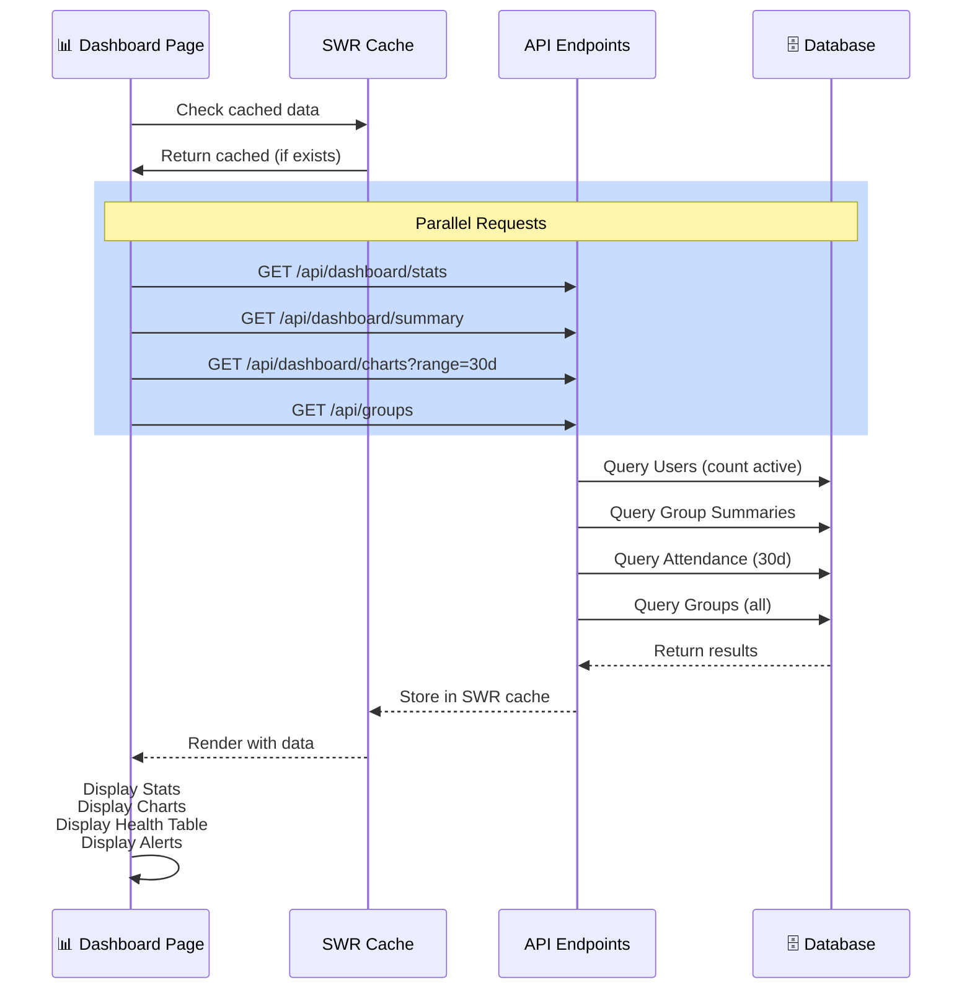
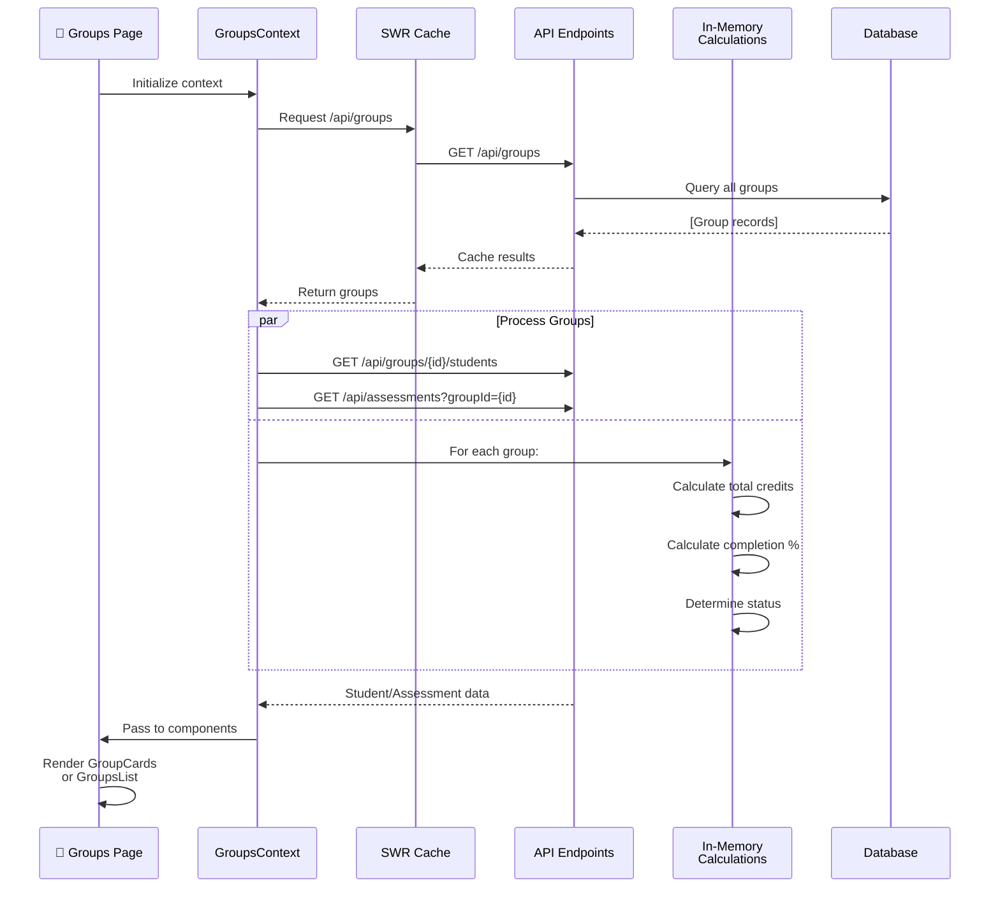
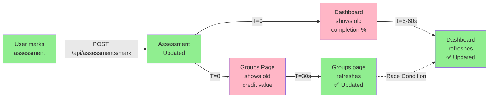
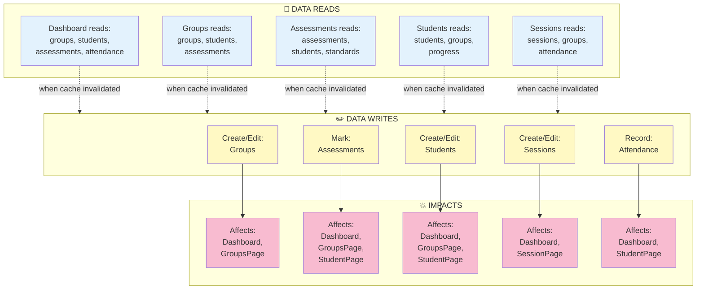
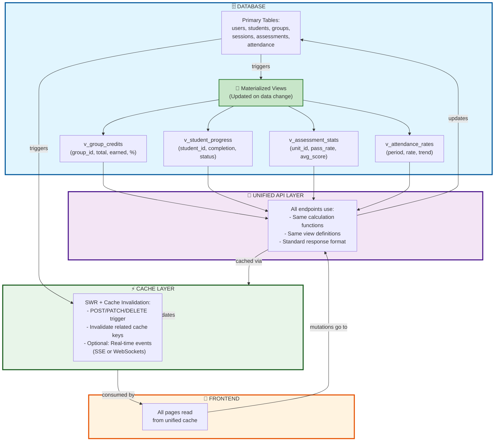
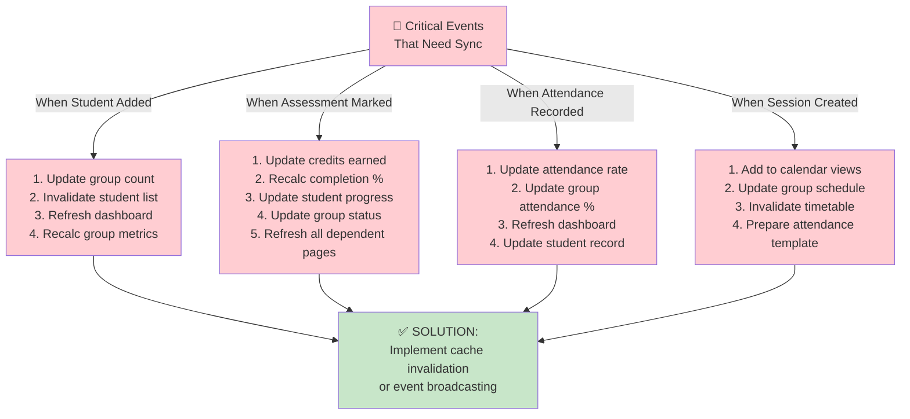

# System Data Flow - Visual Mermaid Diagrams

## Complete System Architecture

```mermaid
graph TB
    subgraph Database["🗄️ DATABASE (Prisma)"]
        Users[("Users")]
        Students[("Students")]
        Groups[("Groups")]
        UnitStandards[("Unit Standards")]
        Modules[("Modules")]
        Sessions[("Sessions")]
        Assessments[("Assessments")]
        Attendance[("Attendance")]
    end

    subgraph APIs["🔌 API LAYER"]
        AuthAPI["🔐 Auth API<br/>/api/auth/*"]
        StatsAPI["📊 Stats API<br/>/api/dashboard/stats"]
        SummaryAPI["📋 Summary API<br/>/api/dashboard/summary"]
        GroupsAPI["👥 Groups API<br/>/api/groups"]
        AssessAPI["📝 Assessment API<br/>/api/assessments"]
        StudentAPI["🎓 Student API<br/>/api/students"]
        SessionAPI["📅 Session API<br/>/api/sessions"]
        AttendAPI["✅ Attendance API<br/>/api/attendance"]
    end

    subgraph Pages["📄 FRONTEND PAGES"]
        Dashboard["🏠 Dashboard<br/>src/app/page.tsx"]
        GroupsPage["👥 Groups Manager<br/>src/app/groups/page.tsx"]
        AssessPage["📝 Assessments<br/>src/app/assessments/page.tsx"]
        StudentPage["🎓 Students<br/>src/app/students/page.tsx"]
        SessionPage["📅 Sessions<br/>src/app/sessions/page.tsx"]
    end

    subgraph Components["🎨 COMPONENTS"]
        Stats["DashboardStats"]
        Charts["Charts<br/>Attendance/Distribution"]
        Table["ProgrammeHealthTable"]
        Cards["GroupCards<br/>GridView/ListView"]
        Modal["Modals<br/>Create/Edit/Details"]
        Progress["ProgressBars<br/>Status Badges"]
    end

    %% Database to API connections
    Users --> AuthAPI
    Students --> StatsAPI
    Groups --> StatsAPI
    Assessments --> StatsAPI

    Students --> SummaryAPI
    Groups --> SummaryAPI
    Assessments --> SummaryAPI

    Groups --> GroupsAPI
    Students --> GroupsAPI
    Assessments --> GroupsAPI

    Students --> StudentAPI
    Groups --> GroupsAPI

    Sessions --> SessionAPI
    Attendance --> SessionAPI

    Assessments --> AssessAPI

    Attendance --> AttendAPI
    Sessions --> AttendAPI

    %% API to Pages
    StatsAPI --> Dashboard
    SummaryAPI --> Dashboard
    GroupsAPI --> Dashboard
    
    GroupsAPI --> GroupsPage
    StudentAPI --> GroupsPage
    AssessAPI --> GroupsPage

    AssessAPI --> AssessPage
    StudentAPI --> AssessPage

    StudentAPI --> StudentPage
    GroupsAPI --> StudentPage

    SessionAPI --> SessionPage
    AttendAPI --> SessionPage

    %% Pages to Components
    Dashboard --> Stats
    Dashboard --> Charts
    Dashboard --> Table

    GroupsPage --> Cards
    GroupsPage --> Modal
    GroupsPage --> Progress

    AssessPage --> Modal
    StudentPage --> Cards
    SessionPage --> Charts

    %% Styling
    classDef db fill:#e1f5ff,stroke:#01579b,stroke-width:2px
    classDef api fill:#f3e5f5,stroke:#4a148c,stroke-width:2px
    classDef page fill:#e8f5e9,stroke:#1b5e20,stroke-width:2px
    classDef comp fill:#fff3e0,stroke:#e65100,stroke-width:2px

    class Users,Students,Groups,UnitStandards,Modules,Sessions,Assessments,Attendance db
    class AuthAPI,StatsAPI,SummaryAPI,GroupsAPI,AssessAPI,StudentAPI,SessionAPI,AttendAPI api
    class Dashboard,GroupsPage,AssessPage,StudentPage,SessionPage page
    class Stats,Charts,Table,Cards,Modal,Progress comp
```



---

## Page-Specific Data Flows

### Dashboard Page Flow



---

### Groups Page Flow



---

### Cross-Page Synchronization Issue



---

## Data Dependency Matrix



---

## Proposed Unified Architecture



---

## Critical Sync Points (Red Flags)



---

## Legend

```
Color Coding:
🟦 Blue  = Database/Storage
🟪 Purple = API Layer
🟩 Green = Frontend/Caching
🟨 Yellow = Calculations/Processing
🟥 Red = Issues/Concerns

Symbols:
→  Synchronous call
⇢  Asynchronous call
..  Suggested/Optional
💥 Impact/Side effect
✅ Working correctly
❌ Issue/Problem
```
