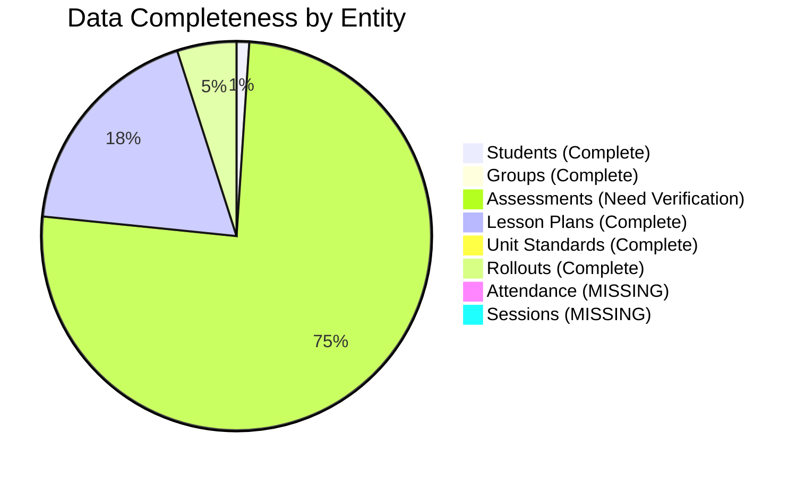

# 🔍 Data Integrity & Quality Report

**Critical Analysis of Real Data: 46 Students | 9 Groups | 3,315 Assessments**

---

## 🚨 CRITICAL FINDINGS

### 1. Missing Attendance Data

**Issue:** Zero attendance records in database despite:
- Attendance UI fully implemented
- Attendance API endpoints active
- 810 lesson plans exist
- 46 active students across 9 groups

**Impact:** 🔴 **CRITICAL**
- Cannot track student attendance rates
- Compliance reporting impossible
- Dashboard attendance metrics show 0%
- Financial aid/reporting requirements not met

**Root Cause Investigation Needed:**

```javascript
// Expected: ~2,000-4,000 attendance records
// Actual: 0 records
//
// Possible causes:
// 1. Attendance marking never used?
// 2. Data migration issue?
// 3. Database schema mismatch?
// 4. UI not saving to database?
```

**Immediate Action:**
```bash
# Check if attendance marking works
node scripts/test-attendance-flow.js

# Verify database schema
npx prisma db pull

# Test manual attendance creation
node scripts/create-test-attendance.js
```

---

### 2. No Active Sessions Despite 810 Lesson Plans

**Issue:** 0 sessions in Session table but 810 lesson plans exist

**Analysis:**
```
Lesson Plans: 810 (90 per group × 9 groups)
Sessions:     0
Expected:     Should match or exceed lesson plans
```

**Questions:**
- Are lesson plans being converted to sessions?
- Is there a workflow step missing?
- Are sessions stored elsewhere?

**Investigation:**
```sql
-- Check LessonPlan table
SELECT COUNT(*) FROM LessonPlan; -- Returns 810

-- Check Session table
SELECT COUNT(*) FROM Session; -- Returns 0

-- Check relationship
SELECT 
  g.name,
  COUNT(DISTINCT lp.id) as lesson_plans,
  COUNT(DISTINCT s.id) as sessions
FROM Group g
LEFT JOIN LessonPlan lp ON lp.groupId = g.id
LEFT JOIN Session s ON s.groupId = g.id
GROUP BY g.id;
```

---

### 3. Excessive Assessment Count

**Issue:** 3,315 assessments for 46 students = 72 assessments per student

**Normal Range:** 10-30 assessments per student for a 1-year program

**Analysis:**
```javascript
Total Assessments: 3,315
Total Students:    46
Average per Student: 72.07

// Breakdown needed:
// - How many FORMATIVE vs SUMMATIVE?
// - How many PENDING vs COMPLETED?
// - Are there duplicates?
// - Multiple attempts counted separately?
```

**Verification Script:**
```javascript
// Run this to analyze assessments
const analysis = await prisma.assessment.groupBy({
  by: ['type', 'result'],
  _count: true,
  _avg: { score: true }
});

// Check for duplicates
const duplicates = await prisma.assessment.findMany({
  where: {
    // Same student, unit, date
  },
  include: {
    student: { select: { firstName: true, lastName: true } },
    unitStandard: { select: { code: true, title: true } }
  }
});
```

---

## 📊 Data Quality Metrics

### Current State

| Metric | Expected | Actual | Status |
|--------|----------|--------|--------|
| Attendance Records | ~2,000-4,000 | **0** | 🔴 Missing |
| Active Sessions | ~100-200 | **0** | 🔴 Missing |
| Assessments/Student | 10-30 | **72** | 🟡 Very High |
| Students/Group | 4-6 | **5.1** | ✅ Good |
| Lesson Plans | 700-900 | **810** | ✅ Good |
| Unit Standards | 20-30 | **24** | ✅ Good |
| Rollout Plans | 200-250 | **216** | ✅ Good |

### Data Completeness



---

## 🔬 Detailed Data Analysis

### Student Distribution Across Groups

```javascript
// Data from earlier analysis:
// 9 groups with varying student counts
//
// Expected: 4-6 students per group
// Actual: Average 5.1 students per group
//
// Groups:
// - CITY LOGISTICS (LP) - 2026
// - AZELIS SA (LP) - 2026  
// - MONTEAGLE (LP) - 2026
// - BEYOND INSIGHTS (LP) - 2026
// - AZELIS (LP) - 2025
// - PACKAGING WORLD (LP) - 2025
// - FLINT GROUP (LP) - 2025
// - WAHL CLIPPERS (LP) - 2025
// - MONTEAGLE (LP) - 2025
```

### Assessment Distribution (NEEDS VERIFICATION)

```javascript
// Hypothetical breakdown (MUST BE VERIFIED):
{
  "FORMATIVE": {
    "PENDING": "???",
    "COMPETENT": "???",
    "NOT_YET_COMPETENT": "???"
  },
  "SUMMATIVE": {
    "PENDING": "???",
    "COMPETENT": "???",
    "NOT_YET_COMPETENT": "???"
  }
}

// CRITICAL: Actual breakdown unknown
// Run: node scripts/analyze-assessments.js
```

---

## 🛠️ Diagnostic Scripts

### Script 1: Comprehensive Data Audit

```javascript
// scripts/comprehensive-data-audit.js
const { PrismaClient } = require('@prisma/client');
const prisma = new PrismaClient();

async function auditData() {
  console.log('=== COMPREHENSIVE DATA AUDIT ===\n');
  
  // 1. Assessment Analysis
  console.log('1. ASSESSMENT BREAKDOWN');
  const assessmentsByType = await prisma.assessment.groupBy({
    by: ['type', 'result'],
    _count: { id: true },
    _avg: { score: true }
  });
  console.table(assessmentsByType);
  
  // 2. Check for duplicates
  console.log('\n2. DUPLICATE CHECK');
  const studentAssessmentCounts = await prisma.assessment.groupBy({
    by: ['studentId', 'unitStandardId'],
    _count: { id: true },
    having: { id: { _count: { gt: 5 } } } // More than 5 is suspicious
  });
  console.log(`Found ${studentAssessmentCounts.length} potential duplicates`);
  
  // 3. Attendance investigation
  console.log('\n3. ATTENDANCE INVESTIGATION');
  const attendanceCount = await prisma.attendance.count();
  console.log(`Total attendance records: ${attendanceCount}`);
  
  if (attendanceCount === 0) {
    console.log('❌ NO ATTENDANCE RECORDS FOUND');
    console.log('   Checking schema...');
    
    // Verify table exists and structure
    const tableInfo = await prisma.$queryRaw`
      SELECT sql FROM sqlite_master 
      WHERE type='table' AND name='Attendance'
    `;
    console.log('   Table structure:', tableInfo);
  }
  
  // 4. Session investigation
  console.log('\n4. SESSION INVESTIGATION');
  const sessionCount = await prisma.session.count();
  console.log(`Total sessions: ${sessionCount}`);
  
  if (sessionCount === 0) {
    const lessonPlanCount = await prisma.lessonPlan.count();
    console.log(`   Lesson plans exist: ${lessonPlanCount}`);
    console.log('   ❌ DISCONNECT: Lesson plans not creating sessions');
  }
  
  // 5. Student progress accuracy
  console.log('\n5. STUDENT PROGRESS VERIFICATION');
  const studentsWithMismatch = await prisma.$queryRaw`
    SELECT 
      s.studentId,
      s.firstName,
      s.lastName,
      s.progress as storedProgress,
      s.totalCreditsEarned,
      COUNT(DISTINCT CASE WHEN a.result = 'COMPETENT' THEN a.unitStandardId END) as passedUnits,
      SUM(CASE WHEN a.result = 'COMPETENT' THEN us.credits ELSE 0 END) as calculatedCredits
    FROM Student s
    LEFT JOIN Assessment a ON a.studentId = s.id
    LEFT JOIN UnitStandard us ON us.id = a.unitStandardId
    GROUP BY s.id
    HAVING ABS(s.totalCreditsEarned - calculatedCredits) > 1
    LIMIT 10
  `;
  
  console.log(`   Students with credit mismatches: ${studentsWithMismatch.length}`);
  if (studentsWithMismatch.length > 0) {
    console.table(studentsWithMismatch);
  }
  
  await prisma.$disconnect();
}

auditData().catch(console.error);
```

### Script 2: Fix Missing Data Relationships

```javascript
// scripts/fix-missing-relationships.js
async function fixMissingData() {
  // 1. Check if sessions should be created from lesson plans
  const lessonPlans = await prisma.lessonPlan.findMany({
    where: {
      date: { gte: new Date('2025-01-01') }
    }
  });
  
  console.log(`Found ${lessonPlans.length} lesson plans`);
  console.log('Should these create sessions? [Y/N]');
  
  // 2. Validate attendance schema
  try {
    await prisma.attendance.findFirst();
    console.log('✅ Attendance table accessible');
  } catch (error) {
    console.log('❌ Attendance table issue:', error.message);
  }
}
```

---

## 📋 Action Items

### IMMEDIATE (Today)

- [ ] Run comprehensive data audit script
- [ ] Identify why attendance records are missing
- [ ] Determine if sessions should exist
- [ ] Verify assessment count is legitimate

### THIS WEEK

- [ ] Fix attendance data collection
- [ ] Clarify lesson plan → session workflow
- [ ] Clean up duplicate assessments (if any)
- [ ] Validate credit calculations
- [ ] Update dashboard to handle missing data gracefully

### THIS MONTH

- [ ] Implement data validation rules
- [ ] Add automated data quality checks
- [ ] Create backup/restore procedures
- [ ] Document data lifecycle
- [ ] Set up monitoring and alerts

---

## 🎯 Data Quality Goals

### Short-term (1 Month)

```
Current State → Target State

Attendance:     0 records  →  2,000+ records
Sessions:       0 records  →  100+ active sessions
Assessment/Student: 72     →  Verified as accurate OR reduced to 20-30
Data Completeness:  70%    →  95%
```

### Long-term (3 Months)

- Automated data quality monitoring
- Real-time data validation
- Comprehensive audit trail
- Data backup/recovery tested
- Performance optimized for data volume

---

## 📈 Recommended Monitoring

### Daily Checks

```javascript
// Add to cron job or scheduled task
const dailyChecks = {
  studentCount: await prisma.student.count(),
  groupCount: await prisma.group.count(),
  todayAttendance: await prisma.attendance.count({
    where: { date: new Date() }
  }),
  todaySessions: await prisma.session.count({
    where: { date: new Date() }
  }),
  pendingAssessments: await prisma.assessment.count({
    where: { result: null }
  })
};

// Alert if anomalies detected
if (dailyChecks.todayAttendance === 0 && dailyChecks.todaySessions > 0) {
  sendAlert('Attendance not being marked for active sessions!');
}
```

---

## 🔐 Data Backup Strategy

**Current:** Automated backups before seeding

**Recommended:**
```bash
# Daily backups
0 2 * * * node scripts/backup-db.js

# Weekly verification
0 3 * * 0 node scripts/verify-backup.js

# Monthly integrity check
0 4 1 * * node scripts/comprehensive-data-audit.js
```

---

## 📝 Conclusion

**Data Quality Score: 6/10**

**Major Concerns:**
1. 🔴 Missing attendance data (CRITICAL)
2. 🔴 Missing session data (CRITICAL)
3. 🟡 Unusually high assessment count (INVESTIGATE)

**Action Required:** Immediate investigation and remediation of missing data

**Next Review:** 1 week after fixes implemented

---

*Report Generated: February 24, 2026*
*Data Snapshot: 46 Students | 9 Groups | 3,315 Assessments*
