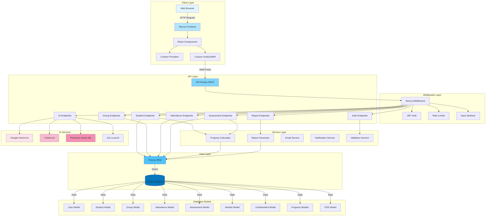

# 🏗️ COMPLETE SYSTEM ARCHITECTURE REPORT
## YEHA - Youth Education & Skills Management System

**Generated:** February 16, 2026  
**Tech Stack:** Next.js 14 + TypeScript + SQLite + Prisma + AI Integration

---

## 📋 TABLE OF CONTENTS

1. [Executive Summary](#executive-summary)
2. [Technology Stack](#technology-stack)
3. [Database Architecture](#database-architecture)
4. [API Architecture](#api-architecture)
5. [Frontend Architecture](#frontend-architecture)
6. [Services & Utilities](#services--utilities)
7. [Visual Diagrams](#visual-diagrams)
8. [Connection Map](#connection-map)
9. [JSON Structure](#json-structure)
10. [Issues & Recommendations](#issues--recommendations)

---

## 🎯 EXECUTIVE SUMMARY

**YEHA** is a full-stack Learning Management System (LMS) designed for SSETA NVC Level 2 vocational training programs. The system manages students, groups, attendance, assessments, curriculum delivery, and AI-powered content generation across multiple training sites.

### Key Statistics
- **27 Frontend Pages** with full CRUD interfaces
- **99+ API Endpoints** (REST architecture)
- **29 Database Models** with complex relationships
- **80+ React Components** (modular design)
- **3 Context Providers** for global state
- **12 Custom Hooks** for data fetching
- **5 AI Service Integrations** (Gemini, Cohere, Pinecone, ZAI)
- **SQLite Database** with Prisma ORM

### System Purpose
- **Student Management**: Track 100+ learners across multiple groups
- **Attendance Tracking**: QR code support, bulk marking, analytics
- **Assessment Management**: Formative/Summative tracking with moderation
- **Curriculum Delivery**: 6 modules, 30+ unit standards, rollout planning
- **Progress Tracking**: Multi-level progress calculation (unit → module → programme)
- **AI Features**: Semantic search, lesson generation, assessment creation
- **Compliance**: POE (Portfolio of Evidence) checklist, reports, exports

---

## 💻 TECHNOLOGY STACK

### Frontend Layer
```
Next.js 14.2.0           - React framework with App Router
TypeScript 5.4.5         - Type-safe development
React 18.3.0             - UI library
Tailwind CSS 3.4.3       - Utility-first CSS
Radix UI                 - Accessible component primitives
Lucide React 0.445.0     - Icon library
SWR 2.2.5                - Data fetching & caching
Recharts 3.7.0           - Chart visualization
date-fns 3.3.1           - Date manipulation
```

### Backend Layer
```
Next.js API Routes       - Serverless REST API
Prisma 5.22.0            - ORM & database toolkit
SQLite (better-sqlite3)  - Embedded database
Jose 6.1.3               - JWT authentication
Bcrypt.js 2.4.3          - Password hashing
Zod 3.23.8               - Runtime validation
```

### AI & External Services
```
Google Gemini AI 0.24.1  - Content generation, chat
Cohere AI 7.20.0         - Embeddings, semantic search
Pinecone 7.0.0           - Vector database
ZAI (Custom)             - Local AI inference
Mammoth 1.11.0           - Document parsing (.docx)
PDF-Parse 2.4.5          - PDF text extraction
```

### Development Tools
```
ESLint 8.57.0            - Code linting
Autoprefixer 10.4.19     - CSS vendor prefixes
PostCSS 8.4.38           - CSS transformations
TSX 4.19.0               - TypeScript execution
```

---

## 🗄️ DATABASE ARCHITECTURE

### Schema Overview (29 Models)

#### 1️⃣ **Core User & Auth Models**
```prisma
User
├── id: String (UUID, PK)
├── email: String (unique)
├── name: String
├── password: String (hashed)
├── role: String (FACILITATOR/ADMIN/COORDINATOR)
├── Relations: lessonPlans[], sessions[], students[], plans[]
└── reminderPreference: ReminderPreference?
```

#### 2️⃣ **Group Management Models**
```prisma
Group
├── id: String (UUID, PK)
├── name: String
├── location, address, contactName, contactPhone
├── coordinator: String
├── startDate, endDate: DateTime
├── status: String (ACTIVE/INACTIVE/COMPLETED)
├── companyId: String? → Company
├── Relations:
│   ├── students: Student[]
│   ├── courses: GroupCourse[]
│   ├── rolloutPlan: GroupRolloutPlan?
│   ├── schedules: GroupSchedule[]
│   ├── lessonPlans: LessonPlan[]
│   ├── sessions: Session[]
│   ├── plans: Plan[]
│   └── unitStandardRollouts: UnitStandardRollout[]

GroupRolloutPlan
├── id: String (UUID, PK)
├── groupId: String (unique, FK)
├── module1-6 StartDate/EndDate: DateTime?
├── rolloutDocPath: String?
└── group: Group

UnitStandardRollout
├── id: String (UUID, PK)
├── groupId, unitStandardId: String (FK)
├── startDate, endDate, summativeDate, assessingDate: DateTime?
└── Relations: unitStandard, group
```

#### 3️⃣ **Student & Progress Models**
```prisma
Student
├── id: String (UUID, PK)
├── studentId: String (unique, generated)
├── firstName, lastName, email, phone, idNumber
├── progress: Int (0-100)
├── totalCreditsEarned: Int
├── status: String (ACTIVE/AT_RISK/COMPLETED/WITHDRAWN)
├── groupId: String (FK)
├── facilitatorId: String (FK)
├── currentModuleId: String? (FK)
├── Relations:
│   ├── assessments: Assessment[]
│   ├── attendance: Attendance[]
│   ├── courseProgress: CourseProgress[]
│   ├── formativeCompletions: FormativeCompletion[]
│   ├── moduleProgress: ModuleProgress[]
│   ├── unitStandardProgress: UnitStandardProgress[]
│   └── poeChecklists: POEChecklist?

ModuleProgress
├── id: String (UUID, PK)
├── studentId, moduleId: String (FK)
├── status: String (NOT_STARTED/IN_PROGRESS/COMPLETED)
├── progress: Int (0-100)
├── creditsEarned: Int
├── startDate, completionDate: DateTime?
└── Unique: [studentId, moduleId]

UnitStandardProgress
├── id: String (UUID, PK)
├── studentId, unitStandardId: String (FK)
├── status: String (NOT_STARTED/IN_PROGRESS/COMPLETED)
├── formativesPassed: Int
├── summativePassed: Boolean
├── startDate, completionDate: DateTime?
└── Unique: [studentId, unitStandardId]

CourseProgress
├── id: String (UUID, PK)
├── studentId: String (FK)
├── progress: Int (0-100)
```

#### 4️⃣ **Curriculum & Content Models**
```prisma
Module
├── id: String (UUID, PK)
├── moduleNumber: Int (unique, 1-6)
├── code: String (unique, e.g., "MOD001")
├── name, fullName, purpose, description: String
├── credits, notionalHours, classroomHours, workplaceHours: Int
├── order: Int
├── status: String (ACTIVE)
├── Relations:
│   ├── unitStandards: UnitStandard[]
│   ├── formativeAssessments: FormativeAssessment[]
│   ├── documents: CurriculumDocument[]
│   ├── embeddings: CurriculumEmbedding[]
│   ├── lessonPlans: LessonPlan[]
│   └── progress: ModuleProgress[]

UnitStandard
├── id: String (UUID, PK)
├── code: String (unique, e.g., "US001")
├── title: String
├── credits, level: Int
├── type: String
├── content: String?
├── moduleId: String (FK)
├── Relations:
│   ├── activities: Activity[]
│   ├── assessments: Assessment[]
│   ├── formativeAssessments: FormativeAssessment[]
│   ├── progress: UnitStandardProgress[]
│   └── unitStandardRollouts: UnitStandardRollout[]

Activity
├── id: String (UUID, PK)
├── description: String
├── duration: Int
├── resources, assessmentType: String?
└── unitStandardId: String (FK)

CurriculumDocument
├── id: String (UUID, PK)
├── title, fileName, fileType, filePath: String
├── fileSize: Int
├── description, category, version: String
├── moduleId: String (FK)
└── uploadedAt: DateTime

CurriculumEmbedding
├── id: String (UUID, PK)
├── content: String
├── embedding: String (vector)
├── metadata: String?
├── moduleId: String (FK)

DocumentChunk
├── id: String (cuid, PK)
├── content, filename, filePath, category, tags: String
├── chunkIndex: Int
└── Indexes: [category], [filename]
```

#### 5️⃣ **Assessment Models**
```prisma
Assessment
├── id: String (UUID, PK)
├── studentId, unitStandardId: String (FK)
├── type: String (FORMATIVE/SUMMATIVE/WORKPLACE/INTEGRATED)
├── method: String (KNOWLEDGE/PRACTICAL/OBSERVATION/PORTFOLIO)
├── result: String? (COMPETENT/NOT_YET_COMPETENT/PENDING)
├── score: Int?
├── assessedDate, dueDate: DateTime
├── notes, feedback: String?
├── moderationStatus: String (PENDING/APPROVED/REJECTED)
├── moderatedBy, moderationNotes: String?
├── moderatedDate: DateTime?
├── attemptNumber: Int (default 1)
└── Indexes: [unitStandardId], [studentId, unitStandardId], [studentId, result]

FormativeAssessment
├── id: String (UUID, PK)
├── code: String (unique)
├── title, description: String
├── documentPath: String?
├── questions, passingScore, order: Int
├── moduleId, unitStandardId: String (FK)
└── completions: FormativeCompletion[]

FormativeCompletion
├── id: String (UUID, PK)
├── studentId, formativeId: String (FK)
├── completedDate: DateTime?
├── score: Int?
├── passed: Boolean (default false)
├── attempts: Int (default 1)
├── moderationStatus: String (PENDING/APPROVED/REJECTED)
├── moderatedBy, moderatedDate, notes: String?
└── Unique: [studentId, formativeId]
└── Indexes: [studentId], [formativeId]
```

#### 6️⃣ **Attendance Models**
```prisma
Attendance
├── id: String (UUID, PK)
├── studentId: String (FK)
├── sessionId: String? (FK)
├── groupId: String? (FK)
├── date: DateTime
├── status: String (PRESENT/ABSENT/LATE/EXCUSED)
├── notes: String?
├── markedBy, markedAt: String/DateTime?
├── qrCodeScan: Boolean (default false)
└── Unique: [studentId, date, groupId]
└── Indexes: [date], [studentId, date], [groupId, date]

Session
├── id: String (UUID, PK)
├── title, module: String
├── date: DateTime
├── startTime, endTime: String
├── notes: String?
├── groupId, facilitatorId: String (FK)
└── attendance: Attendance[]

AttendancePolicy
├── id: String (UUID, PK)
├── name, description: String
├── minimumPercentage, consecutiveAbsences: Int
├── warningThreshold, criticalThreshold: Int
├── notifyOnAbsence/Warning/Critical: Boolean
└── isActive: Boolean

AttendanceAlert
├── id: String (UUID, PK)
├── type, severity, message, details: String
├── studentId: String
├── resolved: Boolean (default false)
├── resolvedAt, resolvedBy: DateTime/String?
├── notificationSent: Boolean
└── Indexes: [studentId], [type], [resolved]

AttendanceReport
├── id: String (UUID, PK)
├── title, type, format: String
├── startDate, endDate: DateTime
├── filePath, generatedBy, parameters: String?
```

#### 7️⃣ **Timetable & Planning Models**
```prisma
LessonPlan
├── id: String (UUID, PK)
├── title, description: String
├── date: DateTime
├── startTime, endTime: String
├── venue, objectives, materials, activities, notes: String?
├── aiGenerated: Boolean (default false)
├── moduleId, facilitatorId, groupId: String (FK)

Plan (Calendar Feature)
├── id: String (UUID, PK)
├── title, description: String
├── startDate, endDate: DateTime
├── groupId, facilitatorId: String (FK)
├── venue, objectives, materials, notes: String?
└── reminders: Reminder[]

Reminder
├── id: String (UUID, PK)
├── planId: String (FK, onDelete: Cascade)
├── message, venue, sendTo: String?
├── scheduledAt, sentAt: DateTime
└── Indexes: [planId], [scheduledAt]

ReminderPreference
├── id: String (UUID, PK)
├── userId: String (unique, FK)
├── emailRemindersEnabled: Boolean (default true)
├── browserNotificationsEnabled: Boolean (default true)
├── quietHoursStart/End: String? (HH:MM)
└── timeZone: String (default "UTC")

RecurringSessionOverride
├── id: String (UUID, PK)
├── date: DateTime
├── groupName, venue: String
├── isCancelled: Boolean
├── cancellationReason, notes: String?
├── notificationEnabled/Sent: Boolean
├── notificationTime: Int (minutes)
└── Unique: [date, groupName, venue]

ScheduleTemplate
├── id: String (UUID, PK)
├── name, description: String
├── isActive: Boolean (default true)
├── schedule: String (JSON)
└── groups: GroupSchedule[]

GroupSchedule
├── id: String (UUID, PK)
├── groupId, templateId: String (FK)
├── startDate, endDate: DateTime?
└── Indexes: [groupId], [templateId]
```

#### 8️⃣ **Portfolio of Evidence (POE) Models**
```prisma
POEChecklist
├── id: String (UUID, PK)
├── studentId: String (unique, FK)
├── module1-6 POE/POEDate: Boolean/DateTime?
├── assessmentsSigned/Date: Boolean/DateTime?
├── logbookComplete/Signed/Date: Boolean/DateTime?
├── idCopyPresent/Date: Boolean/DateTime?
├── contractSigned/Date: Boolean/DateTime?
├── inductionComplete/Date: Boolean/DateTime?
├── verifiedBy, verifiedDate, notes: String/DateTime?

POEFile
├── id: String (UUID, PK)
├── fileName, fileType, filePath: String
├── fileSize: Int
├── description: String?
└── uploadedAt: DateTime
```

#### 9️⃣ **Company Model**
```prisma
Company
├── id: String (PK)
├── name, address, contactPerson: String
├── email, phone, industry: String?
├── status: String (ACTIVE)
└── Group: Group[]
```

### 🔗 Database Relationships Summary

**One-to-Many Relationships:**
- User → LessonPlan, Session, Student, Plan
- Group → Student, Session, LessonPlan, GroupCourse, GroupSchedule
- Module → UnitStandard, FormativeAssessment, LessonPlan, ModuleProgress
- Student → Assessment, Attendance, ModuleProgress, UnitStandardProgress
- UnitStandard → Assessment, Activity, UnitStandardProgress
- Plan → Reminder

**One-to-One Relationships:**
- Group ↔ GroupRolloutPlan
- Student ↔ POEChecklist
- User ↔ ReminderPreference

**Many-to-Many (via junction tables):**
- Group ↔ Module (via GroupCourse - implied)
- Student ↔ FormativeAssessment (via FormativeCompletion)

**Key Foreign Keys:**
- Student.groupId → Group
- Student.facilitatorId → User
- Student.currentModuleId → Module
- Group.companyId → Company
- Assessment.studentId → Student
- Assessment.unitStandardId → UnitStandard
- Attendance.studentId → Student
- Attendance.sessionId → Session

---

## 🔌 API ARCHITECTURE

### REST API Design (99+ Endpoints)

#### Authentication Endpoints (4)
```
POST   /api/auth/login          - User login (JWT token)
POST   /api/auth/register       - User registration
POST   /api/auth/logout         - Clear auth token
GET    /api/auth/me             - Get current user
```

#### Student Endpoints (7)
```
GET    /api/students            - List all students (with filters)
POST   /api/students            - Create new student
GET    /api/students/[id]       - Get student details
PUT    /api/students/[id]       - Update student
DELETE /api/students/[id]       - Delete student
GET    /api/students/[id]/progress  - Get detailed progress
POST   /api/students/[id]/progress  - Update progress
```

#### Group Endpoints (13)
```
GET    /api/groups                    - List all groups
POST   /api/groups                    - Create new group
PUT    /api/groups                    - Update group
DELETE /api/groups                    - Delete group
GET    /api/groups/[id]               - Get group details
PUT    /api/groups/[id]               - Update specific group
DELETE /api/groups/[id]               - Delete specific group
GET    /api/groups/[id]/rollout       - Get rollout plan
POST   /api/groups/[id]/rollout       - Update rollout plan
GET    /api/groups/[id]/assessment-status - Get assessment status
POST   /api/groups/[id]/lessons/generate  - AI-generate lessons
GET    /api/groups/progress           - Group progress report
POST   /api/groups/upload             - Bulk upload groups
GET    /api/groups/auto-rollout       - Check missing rollouts
POST   /api/groups/auto-rollout       - Generate rollouts
POST   /api/groups/auto-calculate     - Auto-calculate dates
POST   /api/groups/merge              - Merge duplicate groups
```

#### Attendance Endpoints (11)
```
GET    /api/attendance          - Get attendance records
POST   /api/attendance          - Mark attendance
PUT    /api/attendance          - Update attendance
DELETE /api/attendance          - Delete attendance
GET    /api/attendance/stats    - Attendance statistics
GET    /api/attendance/rates    - Group attendance rates
GET    /api/attendance/history  - Student attendance history
POST   /api/attendance/bulk     - Bulk mark attendance
POST   /api/attendance/batch    - Batch create records
GET    /api/attendance/export   - Export to CSV
GET    /api/attendance/alerts   - Get attendance alerts
GET    /api/attendance/policies - Get policies
POST   /api/attendance/policies - Update policies
```

#### Assessment Endpoints (20)
```
GET    /api/assessments                - List assessments
POST   /api/assessments                - Create assessment
GET    /api/assessments/[id]           - Get assessment
PUT    /api/assessments/[id]           - Update assessment
DELETE /api/assessments/[id]           - Delete assessment
POST   /api/assessments/[id]/complete  - Mark complete
GET    /api/assessments/stats          - Assessment statistics
GET    /api/assessments/analytics      - Detailed analytics
GET    /api/assessments/by-group       - Group assessments
GET    /api/assessments/templates      - Assessment templates
POST   /api/assessments/bulk           - Bulk create
POST   /api/assessments/bulk-update    - Bulk update
POST   /api/assessments/bulk-pass      - Bulk mark passed
POST   /api/assessments/bulk-generate  - Bulk generate
POST   /api/assessments/marking        - Submit marking
POST   /api/assessments/moderate       - Moderate assessment
GET    /api/assessments/export         - Export to CSV
```

#### Timetable/Lesson Endpoints (13)
```
GET    /api/timetable           - Get lessons (date range)
POST   /api/timetable           - Create lesson
GET    /api/timetable/[id]      - Get lesson details
PATCH  /api/timetable/[id]      - Update lesson
DELETE /api/timetable/[id]      - Delete lesson
GET    /api/timetable/[id]/audit - Audit trail
GET    /api/lessons             - Get lessons
POST   /api/lessons             - Create lesson
GET    /api/lessons/[id]        - Get lesson
POST   /api/sessions/generate   - Generate sessions
GET    /api/sessions/generate   - Get generated sessions
POST   /api/recurring-sessions  - Create recurring
GET    /api/schedule-templates  - Get templates
POST   /api/group-schedules     - Create schedule
```

#### Dashboard Endpoints (7)
```
GET    /api/dashboard/stats         - Dashboard statistics
GET    /api/dashboard/summary       - Dashboard summary
GET    /api/dashboard/today-classes - Today's classes
GET    /api/dashboard/schedule      - Today's schedule
GET    /api/dashboard/recent-activity - Recent activity
GET    /api/dashboard/charts        - Chart data
GET    /api/dashboard/alerts        - System alerts
```

#### Reports Endpoints (4)
```
GET    /api/reports/group-progress   - Group progress report
GET    /api/reports/unit-standards   - Unit standard report
GET    /api/reports/daily            - Daily report
POST   /api/reports/daily/generate-ai - AI-generated report
```

#### AI Feature Endpoints (12)
```
POST   /api/ai/chat                     - AI chat
POST   /api/ai/semantic-search          - Semantic search
POST   /api/ai/generate-lesson          - Generate lesson plan
POST   /api/ai/generate-assessment      - Generate assessment
GET    /api/ai/recommendations          - Get recommendations
GET    /api/ai/index-documents          - List indexed docs
POST   /api/ai/index-documents          - Index documents
POST   /api/ai/index-documents/upload   - Upload & index
POST   /api/ai/index-documents/retry    - Retry failed
DELETE /api/ai/index-documents/delete   - Delete document
GET    /api/ai/index-documents/list     - List all documents
```

#### Module/Curriculum Endpoints (10)
```
GET    /api/modules             - List modules
GET    /api/modules/[id]        - Get module details
GET    /api/unit-standards      - List unit standards
POST   /api/unit-standards      - Create unit standard
GET    /api/unit-standards/[id] - Get unit standard
PUT    /api/unit-standards/[id] - Update unit standard
DELETE /api/unit-standards/[id] - Delete unit standard
GET    /api/curriculum          - Get curriculum
GET    /api/formatives          - List formative assessments
POST   /api/formatives/completion - Mark completion
```

#### POE Endpoints (3)
```
GET    /api/poe                 - Get POE checklists
POST   /api/poe                 - Update POE checklist
GET    /api/poe/[studentId]     - Get student POE
```

#### Settings Endpoints (10)
```
GET    /api/settings/profile       - Get profile
PUT    /api/settings/profile       - Update profile
GET    /api/settings/security      - Get security settings
POST   /api/settings/security      - Update password
GET    /api/settings/notifications - Get notification settings
PUT    /api/settings/notifications - Update notifications
GET    /api/settings/appearance    - Get appearance settings
PUT    /api/settings/appearance    - Update appearance
GET    /api/settings/system        - Get system settings
PUT    /api/settings/system        - Update system
GET    /api/settings/reminders     - Get reminder preferences
POST   /api/settings/reminders     - Update reminders
```

#### User Management Endpoints (6)
```
GET    /api/users               - List users (Admin)
POST   /api/users               - Create user (Admin)
GET    /api/users/[id]          - Get user
PUT    /api/users/[id]          - Update user
DELETE /api/users/[id]          - Delete user
PUT    /api/users/[id]/password - Change password
```

#### Reminder/Calendar Endpoints (6)
```
GET    /api/reminders                    - List reminders
POST   /api/reminders                    - Create reminder
GET    /api/reminders/[id]               - Get reminder
PUT    /api/reminders/[id]               - Update reminder
DELETE /api/reminders/[id]               - Delete reminder
POST   /api/reminders/[id]/mark-read     - Mark read
POST   /api/reminders/send-pending-emails - Send pending
GET    /api/plans                        - List plans
POST   /api/plans                        - Create plan
GET    /api/plans/[id]                   - Get plan
PUT    /api/plans/[id]                   - Update plan
DELETE /api/plans/[id]                   - Delete plan
```

#### Utility Endpoints (4)
```
GET    /api/search              - Global search
GET    /api/companies           - List companies (stub)
GET    /api/progress            - Get progress data
POST   /api/progress            - Update progress
POST   /api/admin/cleanup       - Cleanup old data
GET    /api/test-endpoint       - Test API
POST   /api/test-endpoint       - Test POST
```

### API Design Patterns

#### Standard Response Format
```typescript
interface ApiResponse<T = any> {
  success: boolean;
  data?: T;
  error?: string;
  message?: string;
}
```

#### Common Query Parameters
- `?startDate=YYYY-MM-DD&endDate=YYYY-MM-DD` - Date filtering
- `?groupId=uuid` - Filter by group
- `?studentId=uuid` - Filter by student
- `?moduleId=uuid` - Filter by module
- `?status=ACTIVE` - Filter by status
- `?page=1&limit=20` - Pagination
- `?search=query` - Search term

#### Authentication Flow
1. POST `/api/auth/login` → Returns JWT token
2. Token stored in `auth_token` cookie (HttpOnly)
3. Middleware validates token on protected routes
4. Token payload: `{ userId, email, role, exp, iat }`

#### Error Handling
- 400: Bad Request (validation errors)
- 401: Unauthorized (missing/invalid token)
- 403: Forbidden (insufficient permissions)
- 404: Not Found
- 429: Too Many Requests (rate limit)
- 500: Internal Server Error

---

## 🎨 FRONTEND ARCHITECTURE

### Next.js App Router Structure

```
src/app/
├── layout.tsx               - Root layout (providers, fonts, global styles)
├── page.tsx                 - Dashboard homepage (586 lines)
├── globals.css              - Global styles, Tailwind directives
├── loading.tsx              - Loading state
│
├── login/
│   └── page.tsx             - Login page
├── register/
│   └── page.tsx             - Registration page
│
├── students/
│   └── page.tsx             - Student management (1044 lines)
├── groups/
│   ├── page.tsx             - Group management (1452 lines)
│   └── [id]/
│       └── page.tsx         - Group details
│
├── attendance/
│   └── page.tsx             - Attendance tracking (1184 lines)
├── assessments/
│   └── page.tsx             - Assessment management (1634 lines)
├── moderation/
│   └── page.tsx             - Moderation queue
│
├── timetable/
│   └── page.tsx             - Timetable/schedule
├── lessons/
│   ├── page.tsx             - Lesson plans
│   └── [id]/
│       └── page.tsx         - Lesson details
│
├── curriculum/
│   ├── page.tsx             - Curriculum overview
│   ├── builder/
│   │   └── page.tsx         - Curriculum builder
│   └── search/
│       └── page.tsx         - Curriculum search (AI)
│
├── progress/
│   └── page.tsx             - Progress tracking
├── poe/
│   └── page.tsx             - POE checklist
├── assessment-checklist/
│   └── page.tsx             - Assessment checklist
│
├── reports/
│   └── page.tsx             - Reports dashboard
├── compliance/
│   └── page.tsx             - Compliance monitoring
│
├── settings/
│   └── page.tsx             - User settings
├── admin/
│   └── (admin pages)        - Admin tools
│
└── api/
    └── (99+ API routes)     - Backend endpoints
```

### Component Architecture (80+ Components)

#### Layout Components
```
src/components/
├── MainLayout.tsx           - Main app layout wrapper
├── Sidebar.tsx              - Navigation sidebar
├── Header.tsx               - Top header bar
├── providers.tsx            - SWR config provider
└── ErrorBoundary.tsx        - Error boundary wrapper
```

#### Context Providers (Global State)
```
src/contexts/
├── AuthContext.tsx          - User authentication state
├── GroupsContext.tsx        - Groups data & operations
├── StudentContext.tsx       - Students data & operations
└── StudentContextSimple.tsx - Simplified student context
```

#### Dashboard Components
```
src/components/
├── DashboardStats.tsx       - Stat cards
├── DashboardCharts.tsx      - Chart widgets
├── DashboardAlerts.tsx      - Alert notifications
├── QuickActions.tsx         - Quick action buttons
├── TodaysSchedule.tsx       - Today's schedule panel
├── TodayClassesDashboard.tsx - Today's classes
├── RecentActivity.tsx       - Recent activity feed
├── NextSessionPanel.tsx     - Upcoming session info
└── MiniCalendar.tsx         - Mini calendar widget
```

#### Modal Components (20+)
```
src/components/
├── AddStudentModal.tsx
├── EditStudentModal.tsx
├── StudentDetailsModal.tsx
├── StudentProgressModal.tsx
├── GroupModal.tsx
├── GroupDrawer.tsx
├── GroupUploadModal.tsx
├── AssessmentModal.tsx
├── AssessmentResultModal.tsx
├── CreateAssessmentModal.tsx
├── MarkAssessmentModal.tsx
├── BulkAssessmentModal.tsx
├── MarkAttendanceModal.tsx
├── SessionAttendanceModal.tsx
├── ScheduleLessonModal.tsx
├── RecurringSessionModal.tsx
├── TimetableSessionModal.tsx
├── EventDetailModal.tsx
├── StatDetailsModal.tsx
├── AddNoteModal.tsx
└── CreditAdjustmentModal.tsx
```

#### Display Components
```
src/components/
├── StudentCard.tsx          - Student card display
├── StatCard.tsx             - Statistic card
├── ModuleProgressCard.tsx   - Module progress display
├── ModuleProgress.tsx       - Progress bar
├── ModuleProgressionPanel.tsx - Module progression
├── CourseProgressChart.tsx  - Course progress chart
├── GroupDistributionChart.tsx - Group distribution
├── AttendanceTrendChart.tsx - Attendance trends
├── AttendanceCalendar.tsx   - Attendance calendar view
└── LearnerAssessmentTracker.tsx - Assessment tracker
```

#### Table Components
```
src/components/tables/
└── GranularRolloutTable.tsx - Rollout plan table
```

#### Calendar Components
```
src/components/calendar/
├── WeeklyCalendarView.tsx   - Weekly view
├── TimetableCalendarView.tsx - Timetable calendar
├── TimetableDayView.tsx     - Day view
├── TimetableWeekView.tsx    - Week view
├── TimetableGroupView.tsx   - Group view
├── SessionDetailPanel.tsx   - Session details
├── SessionHoverCard.tsx     - Session hover preview
├── SessionForm.tsx          - Session form
├── PlanForm.tsx             - Plan form
└── ReminderWidget.tsx       - Reminder widget
```

#### AI Components
```
src/components/ai/
└── AIChat.tsx               - AI chat interface
```

#### Form & Queue Components
```
src/components/
├── CourseCreationForm.tsx
├── CourseCreationForm_NEW.tsx
├── ModerationQueue.tsx
└── ProgressReport.tsx
└── ProgressReport_NEW.tsx
```

#### UI Primitives
```
src/components/ui/
├── button.tsx               - Button component
├── input.tsx                - Input component
├── FormInput.tsx            - Form input wrapper
├── scroll-area.tsx          - Scroll area (Radix)
├── Alert.tsx                - Alert component
├── Toast.tsx                - Toast notifications
├── Tooltip.tsx              - Tooltip component
├── EmptyState.tsx           - Empty state display
├── StudentCard.tsx          - Student card
└── ModuleProgressCard.tsx   - Module progress card
```

#### Shared Utilities
```
src/components/
└── GlobalSearch.tsx         - Global search component
```

### Custom Hooks (Data Fetching)

```typescript
src/hooks/
├── useAI.ts                 // AI chat & semantic search
├── useAssessments.ts        // Assessment CRUD
├── useAssessmentStats.ts    // Assessment statistics
├── useAttendance.ts         // Attendance tracking
├── useCurriculum.ts         // Curriculum data
├── useDashboard.ts          // Dashboard data
├── useDashboardStats.ts     // Dashboard statistics
├── useDebounce.ts           // Debounce utility
├── useLessons.ts            // Lesson plans
├── useProgress.ts           // Progress tracking
├── useSites.ts              // Sites data (deprecated)
└── useStudents.ts           // Student CRUD
```

### State Management Strategy

#### 1. **Global State (Context API)**
- **AuthContext**: Current user, login/logout, role
- **GroupsContext**: All groups, selected group, filters
- **StudentContext**: All students, filters, bulk operations

#### 2. **Server State (SWR)**
- Automatic caching & revalidation
- Optimistic updates
- Error retry logic
- Interval polling for real-time data
- Deduplication of requests

```typescript
// Example SWR usage
const { data: students, error, isLoading, mutate } = useSWR(
  '/api/students',
  fetcher,
  {
    revalidateOnFocus: true,
    revalidateOnReconnect: true,
    refreshInterval: 30000, // 30s polling
  }
);
```

#### 3. **Local Component State**
- Modal open/close states
- Form inputs
- UI toggles (sidebar, filters)
- Temporary selections

#### 4. **URL State**
- Date ranges (`?startDate=...&endDate=...`)
- Filters (`?groupId=...&status=...`)
- Pagination (`?page=1`)
- Deep linking support

#### 5. **Persistent State (localStorage)**
- Theme preferences
- Sidebar collapse state
- User preferences
- Last selected group/filters

### Data Flow Patterns

#### Pattern 1: Server → Context → Component
```
API Endpoint → SWR Hook → Context Provider → Consumer Component
```

#### Pattern 2: User Action → Optimistic Update → Server
```
User Click → Optimistic UI → API Call → Revalidate → Final State
```

#### Pattern 3: Real-time Polling
```
Component Mount → SWR Hook → Interval Polling → Auto Revalidate
```

#### Pattern 4: Cross-endpoint Sync
```
Mutation → mutate('/api/endpoint1') → mutate('/api/endpoint2')
```

### Routing & Navigation

- **App Router**: File-based routing
- **Dynamic Routes**: `[id]` folder convention
- **Protected Routes**: Middleware checks auth
- **Public Routes**: `/login`, `/register`
- **Role-based Access**: Admin-only pages

---

## ⚙️ SERVICES & UTILITIES

### Core Services

#### 1. **Authentication Service** (`src/lib/auth.ts`)
```typescript
- generateToken(payload): Promise<string>
- verifyToken(token): Promise<JWTPayload | null>
- getAuthToken(request): string | null
- getUserFromRequest(request): Promise<JWTPayload | null>
```

#### 2. **API Utilities** (`src/lib/api-utils.ts`)
```typescript
- successResponse<T>(data, message?, status)
- errorResponse(error, status)
- handleApiError(error)
```

#### 3. **Validation Service** (`src/lib/validation.ts`)
```typescript
Zod Schemas:
- createStudentSchema
- updateStudentSchema
- attendanceRecordSchema
- bulkAttendanceSchema
- createAssessmentSchema
- updateAssessmentSchema
- moderateAssessmentSchema
- createGroupSchema
- updateGroupSchema
- createLessonPlanSchema
- loginSchema
- registerSchema

Utilities:
- validateData<T>(schema, data): T
- safeValidateData<T>(schema, data)
- formatZodErrors(error)
```

#### 4. **Middleware Service** (`src/lib/middleware.ts`)
```typescript
- requireAuth(request)
- requireRole(request, allowedRoles)
- requireAdmin(request)
- requireAdminOrCoordinator(request)
```

#### 5. **Rate Limiting** (`src/lib/rate-limit.ts`)
```typescript
- rateLimit({ interval, maxRequests })
- In-memory store for rate limiting
- IP-based identification
```

#### 6. **Input Sanitization** (`src/lib/input-sanitizer.ts`)
```typescript
- sanitizeString(input): string
- sanitizeEmail(email): string
- sanitizeNumber(value): number
- sanitizeBoolean(value): boolean
- sanitizeObject<T>(obj, schema): Partial<T>
- preventSQLInjection(input): string
```

#### 7. **Progress Calculator** (`src/lib/progress-calculator.ts`)
```typescript
- isUnitStandardComplete(studentId, unitStandardId): Promise<boolean>
- calculateModuleCredits(studentId, moduleId): Promise<number>
- calculateStudentProgress(studentId): Promise<ProgressSummary>
- updateStudentProgress(studentId): Promise<void>
- syncModuleProgress(studentId, moduleId): Promise<void>
```

#### 8. **Report Generator** (`src/lib/report-generator.ts`)
```typescript
- generateGroupProgressReport(groupId): Promise<Report>
- generateAttendanceReport(params): Promise<Report>
- generateAssessmentReport(params): Promise<Report>
```

#### 9. **Rollout Plan Generator** (`src/lib/rolloutPlanGenerator.ts`)
```typescript
- generateRolloutPlan(startDate, endDate, totalHours): RolloutPlan
```

#### 10. **Rollout Utilities** (`src/lib/rolloutUtils.ts`)
```typescript
- extractRolloutPlan(notes): RolloutPlan | null
- calculateRolloutPlan(group): RolloutPlan
```

#### 11. **Email Service** (`src/lib/email.ts`)
```typescript
- sendReminderEmail(to, subject, message)
- sendAttendanceAlert(student, alert)
```

#### 12. **Notification Service** (`src/lib/notifications.ts`)
```typescript
- sendNotification(userId, notification)
- createReminder(planId, reminder)
```

#### 13. **Progress Alerts** (`src/lib/progress-alerts.ts`)
```typescript
- checkProgressAlerts(studentId)
- createProgressAlert(type, message)
```

### AI Service Integrations

#### 1. **Pinecone (Vector DB)** (`src/lib/ai/pinecone.ts`)
```typescript
- searchDocuments(query, options): Promise<SearchResult[]>
- upsertDocuments(documents): Promise<void>
- getIndexStats(): Promise<Stats>
```

#### 2. **Cohere AI** (`src/lib/ai/cohere.ts`)
```typescript
- chatWithContext(message, context): Promise<string>
- generateEmbedding(text): Promise<number[]>
- generateAssessmentQuestions(unitStandard): Promise<Question[]>
- summarizeProgress(student): Promise<string>
- getDocumentRecommendations(topic): Promise<Document[]>
```

#### 3. **Google Gemini AI** (`src/lib/ai/gemini.ts`)
```typescript
- generateLessonPlan(module, objectives): Promise<LessonPlan>
- generateAssessment(unitStandard): Promise<Assessment>
- chatCompletion(messages): Promise<string>
```

#### 4. **ZAI (Local AI)** (`src/lib/ai/zai.ts`)
```typescript
- localInference(prompt): Promise<string>
```

### Utility Functions

#### 1. **General Utilities** (`src/lib/utils.ts`)
```typescript
- cn(...inputs): string              // Tailwind class merge
- downloadExport(data, filename)     // CSV/Excel download
```

#### 2. **SWR Configuration** (`src/lib/swr-config.ts`)
```typescript
- globalSWRConfig: SWRConfiguration
- swrConfig: Custom SWR settings
- fetcher(url): Promise<any>         // Auth-aware fetcher
```

#### 3. **Group Utilities** (`src/lib/groupColours.ts`)
```typescript
- groupColours: Record<string, string>
- getGroupColour(groupName): string
```

#### 4. **Attendance Calculator** (`src/lib/attendance-calculator.ts`)
```typescript
- calculateAttendanceRate(studentId): Promise<number>
- getAttendanceStats(groupId): Promise<Stats>
```

#### 5. **Lesson Parser** (`src/lib/lesson-parser.ts`)
```typescript
- parseLessonPlan(text): LessonPlan
```

#### 6. **Plan Parser** (`src/lib/planParser.ts`)
```typescript
- parseRolloutPlan(document): RolloutPlan
```

#### 7. **Document Processing** (`lib/document-processor.js`)
```javascript
- processDocument(filePath): Promise<Content>
- extractText(file): Promise<string>
```

#### 8. **Logger** (`src/lib/logger.ts`)
```typescript
- logger.info(message, meta)
- logger.error(message, error)
- logger.warn(message, meta)
```

### Database Client

#### Prisma Client (`src/lib/prisma.ts`)
```typescript
import { PrismaClient } from '@prisma/client';

const globalForPrisma = global as unknown as { prisma: PrismaClient };

export const prisma =
  globalForPrisma.prisma ||
  new PrismaClient({
    log: ['query', 'error', 'warn'],
  });

if (process.env.NODE_ENV !== 'production') globalForPrisma.prisma = prisma;
```

---

## 📊 VISUAL DIAGRAMS

### MERMAID ARCHITECTURE DIAGRAM



---

## 🏛️ ASCII ARCHITECTURE DIAGRAM

```
┌─────────────────────────────────────────────────────────────────────┐
│                          CLIENT LAYER                                │
│  ┌──────────────────────────────────────────────────────────────┐  │
│  │  Web Browser (Chrome, Firefox, Safari, Edge)                  │  │
│  └────────────────────────┬─────────────────────────────────────┘  │
│                           │                                          │
│  ┌────────────────────────▼─────────────────────────────────────┐  │
│  │  Next.js 14 Frontend (React 18.3, TypeScript)                 │  │
│  │  ┌──────────────┐  ┌──────────────┐  ┌──────────────┐       │  │
│  │  │  27 Pages    │  │ 80+ Comps    │  │   Layouts    │       │  │
│  │  │  (App Router)│  │  (Modular)   │  │  (MainLayout)│       │  │
│  │  └──────────────┘  └──────────────┘  └──────────────┘       │  │
│  └──────────────────────────────────────────────────────────────┘  │
│                           │                                          │
│  ┌────────────────────────▼─────────────────────────────────────┐  │
│  │  State Management                                              │  │
│  │  ┌────────────┐  ┌────────────┐  ┌────────────┐             │  │
│  │  │  Context   │  │    SWR     │  │ Local State│             │  │
│  │  │  (Auth,    │  │  (Server   │  │  (Forms,   │             │  │
│  │  │  Groups,   │  │   State)   │  │   Modals)  │             │  │
│  │  │  Students) │  │            │  │            │             │  │
│  │  └────────────┘  └────────────┘  └────────────┘             │  │
│  └──────────────────────────────────────────────────────────────┘  │
└───────────────────────────────┬─────────────────────────────────────┘
                                │
                        HTTP/HTTPS (REST)
                                │
┌───────────────────────────────▼─────────────────────────────────────┐
│                      MIDDLEWARE LAYER                                │
│  ┌──────────────────────────────────────────────────────────────┐  │
│  │  Next.js Middleware (src/middleware.ts)                       │  │
│  │  ┌───────────┐  ┌─────────────┐  ┌──────────────┐           │  │
│  │  │JWT Auth   │  │Rate Limiter │  │Input         │           │  │
│  │  │Verification│  │(5 req/min)  │  │Sanitization  │           │  │
│  │  └───────────┘  └─────────────┘  └──────────────┘           │  │
│  └──────────────────────────────────────────────────────────────┘  │
└───────────────────────────────┬─────────────────────────────────────┘
                                │
┌───────────────────────────────▼─────────────────────────────────────┐
│                         API LAYER (99+ Endpoints)                    │
│  ┌──────────┬──────────┬──────────┬──────────┬──────────┐          │
│  │  Auth    │ Students │  Groups  │Attendance│Assessment│          │
│  │  (4)     │  (7)     │  (13)    │  (11)    │  (20)    │          │
│  └──────────┴──────────┴──────────┴──────────┴──────────┘          │
│  ┌──────────┬──────────┬──────────┬──────────┬──────────┐          │
│  │Timetable │Dashboard │ Reports  │   AI     │  Modules │          │
│  │  (13)    │  (7)     │  (4)     │  (12)    │  (10)    │          │
│  └──────────┴──────────┴──────────┴──────────┴──────────┘          │
│  ┌──────────┬──────────┬──────────┬──────────┬──────────┐          │
│  │   POE    │ Settings │  Users   │Reminders │ Utility  │          │
│  │   (3)    │  (10)    │  (6)     │  (6)     │  (4)     │          │
│  └──────────┴──────────┴──────────┴──────────┴──────────┘          │
└───────────────────────────────┬─────────────────────────────────────┘
                                │
        ┌───────────────────────┼───────────────────────┐
        │                       │                       │
┌───────▼────────┐    ┌─────────▼────────┐   ┌────────▼────────┐
│  SERVICE LAYER │    │   AI SERVICES     │   │  DATA LAYER     │
│                │    │                   │   │                 │
│ ┌────────────┐ │    │ ┌───────────────┐│   │ ┌─────────────┐ │
│ │Progress    │ │    │ │ Google Gemini ││   │ │  Prisma ORM │ │
│ │Calculator  │ │    │ │    (Chat,     ││   │ │             │ │
│ └────────────┘ │    │ │   Generate)   ││   │ └──────┬──────┘ │
│ ┌────────────┐ │    │ └───────────────┘│   │        │        │
│ │Report      │ │    │ ┌───────────────┐│   │ ┌──────▼──────┐ │
│ │Generator   │ │    │ │  Cohere AI    ││   │ │   SQLite    │ │
│ └────────────┘ │    │ │  (Embeddings, ││   │ │  Database   │ │
│ ┌────────────┐ │    │ │   Semantic)   ││   │ │             │ │
│ │Email       │ │    │ └───────────────┘│   │ │ dev.db      │ │
│ │Service     │ │    │ ┌───────────────┐│   │ │ (137 MB)    │ │
│ └────────────┘ │    │ │ Pinecone      ││   │ └─────────────┘ │
│ ┌────────────┐ │    │ │ Vector DB     ││   └─────────────────┘
│ │Validation  │ │    │ └───────────────┘│
│ │Service     │ │    │ ┌───────────────┐│
│ └────────────┘ │    │ │ ZAI Local AI  ││
│ ┌────────────┐ │    │ └───────────────┘│
│ │Notification│ │    └───────────────────┘
│ │Service     │ │
│ └────────────┘ │
└────────────────┘

┌─────────────────────────────────────────────────────────────────────┐
│                    DATABASE MODELS (29 Models)                       │
│  ┌─────────┬─────────┬──────────┬──────────┬──────────┬─────────┐  │
│  │  User   │ Student │  Group   │Attendance│Assessment│ Module  │  │
│  │   (1)   │   (1)   │   (1)    │   (1)    │   (3)    │  (1)    │  │
│  └─────────┴─────────┴──────────┴──────────┴──────────┴─────────┘  │
│  ┌─────────┬─────────┬──────────┬──────────┬──────────┬─────────┐  │
│  │ Unit    │Progress │ Lesson   │   POE    │ Session  │Schedule │  │
│  │Standard │  (3)    │   Plan   │   (2)    │   (1)    │  (3)    │  │
│  │  (1)    │         │   (1)    │          │          │         │  │
│  └─────────┴─────────┴──────────┴──────────┴──────────┴─────────┘  │
│  ┌─────────┬─────────┬──────────┬──────────┬──────────┬─────────┐  │
│  │ Rollout │Document │ Activity │Reminder  │ Company  │ Reports │  │
│  │  (2)    │  (3)    │   (1)    │   (2)    │  (1)     │  (2)    │  │
│  └─────────┴─────────┴──────────┴──────────┴──────────┴─────────┘  │
└─────────────────────────────────────────────────────────────────────┘

                    DATA FLOW: User Action → API → Service → DB
                              Response: DB → Service → API → UI
```

---

## 🔗 CONNECTION MAP

### Component → API → Database Connection Flow

#### 1. **Dashboard Page Flow**
```
page.tsx (Dashboard)
├── Uses: useAuth(), useGroups(), useSWR()
├── API Calls:
│   ├── GET /api/dashboard/stats
│   ├── GET /api/dashboard/summary
│   ├── GET /api/dashboard/today-classes
│   ├── GET /api/dashboard/alerts
│   └── GET /api/dashboard/recent-activity
├── Database Tables:
│   ├── Student (count, progress)
│   ├── Group (count, status)
│   ├── Attendance (rates, trends)
│   ├── Assessment (pending, stats)
│   ├── Session (today's classes)
│   └── AttendanceAlert (alerts)
└── Components:
    ├── DashboardStats → StatCard
    ├── DashboardCharts → Recharts
    ├── TodaysSchedule → SessionCard
    └── DashboardAlerts → Alert
```

#### 2. **Student Management Flow**
```
students/page.tsx
├── Uses: StudentContext, useStudents(), useSWR()
├── API Calls:
│   ├── GET /api/students?groupId=...
│   ├── POST /api/students (create)
│   ├── PUT /api/students/[id] (update)
│   ├── DELETE /api/students/[id] (delete)
│   └── GET /api/students/[id]/progress
├── Database Tables:
│   ├── Student (CRUD operations)
│   ├── Group (FK, filter)
│   ├── User (facilitatorId FK)
│   ├── ModuleProgress (progress tracking)
│   ├── UnitStandardProgress (unit completion)
│   ├── Assessment (assessment results)
│   └── Attendance (attendance records)
├── Components:
│   ├── StudentCard → StudentDetailsModal
│   ├── AddStudentModal → FormInput
│   ├── EditStudentModal → FormInput
│   └── StudentProgressModal → ProgressChart
└── State:
    ├── Local: filters, selectedStudent, modals
    └── Context: allStudents, mutate()
```

#### 3. **Assessment Management Flow**
```
assessments/page.tsx
├── Uses: useAssessments(), useAssessmentStats(), useSWR()
├── API Calls:
│   ├── GET /api/assessments?studentId=...&groupId=...
│   ├── POST /api/assessments (create)
│   ├── PUT /api/assessments/[id] (update)
│   ├── POST /api/assessments/bulk (bulk create)
│   ├── POST /api/assessments/moderate (moderation)
│   └── GET /api/assessments/stats
├── Database Tables:
│   ├── Assessment (CRUD, moderation)
│   ├── Student (FK, filter)
│   ├── UnitStandard (FK, metadata)
│   ├── Module (FK, grouping)
│   ├── UnitStandardProgress (update on complete)
│   └── ModuleProgress (update on complete)
├── Service Layer:
│   └── ProgressCalculator.calculateStudentProgress()
├── Components:
│   ├── AssessmentModal → FormInput
│   ├── MarkAssessmentModal → ResultSelect
│   ├── BulkAssessmentModal → StudentMultiSelect
│   └── ModerationQueue → AssessmentCard
└── Views:
    ├── Grid View (cards)
    ├── Table View (rows)
    └── Moderation View (queue)
```

#### 4. **Attendance Tracking Flow**
```
attendance/page.tsx
├── Uses: useAttendance(), useSWR()
├── API Calls:
│   ├── GET /api/attendance?date=...&groupId=...
│   ├── POST /api/attendance/bulk
│   ├── PUT /api/attendance (update)
│   ├── GET /api/attendance/stats
│   └── GET /api/attendance/rates
├── Database Tables:
│   ├── Attendance (CRUD, bulk operations)
│   ├── Student (FK, list)
│   ├── Group (FK, filter)
│   ├── Session (FK, optional)
│   └── AttendanceAlert (create on threshold)
├── Service Layer:
│   └── AttendanceCalculator.calculateRate()
├── Components:
│   ├── MarkAttendanceModal → StudentCheckbox[]
│   ├── AttendanceCalendar → CalendarView
│   ├── AttendanceTrendChart → Recharts
│   └── SessionAttendanceModal → BulkMarkForm
└── Views:
    ├── Calendar View
    ├── List View
    └── Session View
```

#### 5. **Group Management Flow**
```
groups/page.tsx
├── Uses: GroupsContext, useSWR()
├── API Calls:
│   ├── GET /api/groups
│   ├── POST /api/groups (create)
│   ├── PUT /api/groups/[id] (update)
│   ├── GET /api/groups/[id]/rollout (rollout plan)
│   ├── POST /api/groups/[id]/rollout (update rollout)
│   └── GET /api/groups/progress
├── Database Tables:
│   ├── Group (CRUD operations)
│   ├── GroupRolloutPlan (1-to-1)
│   ├── UnitStandardRollout (1-to-many)
│   ├── Student (count, filter)
│   ├── Session (schedule)
│   └── Company (FK, optional)
├── Service Layer:
│   ├── RolloutPlanGenerator.generateRolloutPlan()
│   └── RolloutUtils.calculateRolloutPlan()
├── Components:
│   ├── GroupModal → FormInput
│   ├── GroupDrawer → DetailView
│   ├── GranularRolloutTable → EditableTable
│   └── GroupUploadModal → FileUpload (CSV)
└── Features:
    ├── Rollout plan generation
    ├── Unit standard scheduling
    ├── Module timeline tracking
    └── Progress monitoring
```

#### 6. **Timetable/Lesson Flow**
```
timetable/page.tsx
├── Uses: useLessons(), useSWR()
├── API Calls:
│   ├── GET /api/timetable?startDate=...&endDate=...
│   ├── POST /api/timetable (create lesson)
│   ├── PATCH /api/timetable/[id] (update)
│   ├── DELETE /api/timetable/[id] (delete)
│   └── GET /api/sessions/generate (generate sessions)
├── Database Tables:
│   ├── LessonPlan (CRUD operations)
│   ├── Group (FK, filter)
│   ├── Module (FK, metadata)
│   ├── User (facilitatorId FK)
│   ├── Plan (calendar plans)
│   └── Reminder (notifications)
├── Components:
│   ├── TimetableCalendarView → FullCalendar
│   ├── TimetableWeekView → WeekGrid
│   ├── TimetableDayView → DaySchedule
│   ├── ScheduleLessonModal → FormInput
│   └── RecurringSessionModal → RecurrenceForm
└── Views:
    ├── Calendar View (month/week)
    ├── Day View
    └── Group View (filter by group)
```

#### 7. **AI Feature Flow**
```
curriculum/search/page.tsx
├── Uses: useAI(), useSWR()
├── API Calls:
│   ├── POST /api/ai/semantic-search
│   ├── POST /api/ai/chat
│   ├── POST /api/ai/generate-lesson
│   ├── POST /api/ai/generate-assessment
│   └── GET /api/ai/recommendations
├── External Services:
│   ├── Pinecone (vector search)
│   ├── Cohere (embeddings, chat)
│   └── Gemini (generation)
├── Database Tables:
│   ├── CurriculumEmbedding (vector search)
│   ├── DocumentChunk (content)
│   ├── CurriculumDocument (files)
│   └── Module (context)
├── Service Layer:
│   ├── Pinecone.searchDocuments()
│   ├── Cohere.generateEmbedding()
│   ├── Cohere.chatWithContext()
│   └── Gemini.generateLessonPlan()
└── Components:
    ├── AIChat → ChatInterface
    ├── SearchResults → DocumentCard[]
    └── GenerationPanel → OutputDisplay
```

#### 8. **Progress Tracking Flow**
```
progress/page.tsx
├── Uses: useProgress(), useSWR()
├── API Calls:
│   ├── GET /api/progress?studentId=...
│   └── POST /api/progress (update)
├── Database Tables:
│   ├── Student (totalCreditsEarned, progress)
│   ├── ModuleProgress (module-level tracking)
│   ├── UnitStandardProgress (unit-level tracking)
│   ├── Assessment (completion data)
│   └── FormativeCompletion (formative tracking)
├── Service Layer:
│   ├── ProgressCalculator.calculateStudentProgress()
│   ├── ProgressCalculator.calculateModuleCredits()
│   └── ProgressCalculator.isUnitStandardComplete()
├── Calculation Logic:
│   ├── Unit Standard Complete → All formatives COMPETENT
│   ├── Module Credits = Sum of completed unit credits
│   ├── Module Progress = (creditsEarned / totalCredits) * 100
│   └── Overall Progress = (totalEarned / 137) * 100
└── Components:
    ├── ModuleProgressionPanel → ModuleCard[]
    ├── ModuleProgressCard → ProgressBar
    └── CourseProgressChart → LineChart
```

#### 9. **POE Checklist Flow**
```
poe/page.tsx
├── Uses: useSWR()
├── API Calls:
│   ├── GET /api/poe?studentId=...
│   └── POST /api/poe (update checklist)
├── Database Tables:
│   ├── POEChecklist (1-to-1 with Student)
│   ├── Student (FK)
│   └── POEFile (file uploads)
├── Checklist Items:
│   ├── Module 1-6 POE (boolean + date)
│   ├── Assessments Signed (boolean + date)
│   ├── Logbook Complete/Signed (boolean + date)
│   ├── ID Copy Present (boolean + date)
│   ├── Contract Signed (boolean + date)
│   └── Induction Complete (boolean + date)
└── Components:
    ├── POEChecklistTable → CheckboxRow[]
    └── POEFileUpload → FileInput
```

#### 10. **Reports Flow**
```
reports/page.tsx
├── Uses: useSWR()
├── API Calls:
│   ├── GET /api/reports/group-progress?groupId=...
│   ├── GET /api/reports/unit-standards
│   ├── GET /api/reports/daily?date=...
│   └── POST /api/reports/daily/generate-ai
├── Database Tables:
│   ├── Student (progress data)
│   ├── Group (group data)
│   ├── Assessment (results)
│   ├── Attendance (attendance data)
│   ├── ModuleProgress (module tracking)
│   └── AttendanceReport (saved reports)
├── Service Layer:
│   └── ReportGenerator.generateReport()
├── AI Service:
│   └── Gemini.generateDailyReport()
├── Export Formats:
│   ├── PDF (jsPDF)
│   ├── CSV (Papa Parse)
│   └── Excel (CSV format)
└── Components:
    ├── ReportFilters → DateRange, GroupSelect
    ├── ReportTable → DataTable
    └── ReportChart → Recharts
```

### Middleware Authentication Flow
```
Request → src/middleware.ts
├── Check public paths → Allow
├── Check protected paths
│   ├── GET /api/groups → Allow (read-only)
│   ├── GET /api/students → Allow (read-only)
│   ├── /api/attendance → Allow (all methods)
│   └── Other → Check auth token
├── Validate JWT token
│   ├── verifyToken(token)
│   ├── Extract { userId, email, role }
│   └── Add to request headers
├── Role-based access
│   ├── /admin → Require ADMIN role
│   └── Other → Authenticated user
└── Continue to API handler
```

### Data Synchronization Flow
```
User Action (e.g., Mark Assessment as COMPETENT)
├── 1. API Call: PUT /api/assessments/[id]
├── 2. Update Assessment table (result = "COMPETENT")
├── 3. Trigger: ProgressCalculator.calculateStudentProgress()
│   ├── Check: isUnitStandardComplete()
│   ├── Update: UnitStandardProgress (status, completionDate)
│   ├── Calculate: Module credits earned
│   ├── Update: ModuleProgress (creditsEarned, progress %)
│   ├── Calculate: Overall credits (sum of all modules)
│   └── Update: Student (totalCreditsEarned, progress %)
├── 4. Check: Attendance thresholds
│   └── Create: AttendanceAlert (if needed)
├── 5. Check: POE checklist
│   └── Auto-update: POEChecklist (module POE)
├── 6. SWR Revalidation:
│   ├── mutate('/api/assessments')
│   ├── mutate('/api/students/[id]/progress')
│   └── mutate('/api/progress')
└── 7. UI Update: Optimistic + Server Sync
```

---

## 📦 JSON STRUCTURE MAP

```json
{
  "project": {
    "name": "YEHA - Youth Education & Skills Management System",
    "version": "1.0.0",
    "tech_stack": {
      "frontend": "Next.js 14 + React 18 + TypeScript",
      "backend": "Next.js API Routes",
      "database": "SQLite + Prisma ORM",
      "ai_services": ["Google Gemini", "Cohere", "Pinecone", "ZAI"]
    }
  },
  "frontend": {
    "pages": [
      {
        "route": "/",
        "file": "src/app/page.tsx",
        "purpose": "Dashboard homepage",
        "components": [
          "DashboardStats",
          "DashboardCharts",
          "TodaysSchedule",
          "QuickActions",
          "MiniCalendar"
        ],
        "api_calls": [
          "GET /api/dashboard/stats",
          "GET /api/dashboard/summary",
          "GET /api/dashboard/today-classes"
        ],
        "hooks": ["useAuth", "useGroups", "useSWR"],
        "context": ["AuthContext", "GroupsContext"]
      },
      {
        "route": "/students",
        "file": "src/app/students/page.tsx",
        "purpose": "Student management & CRUD",
        "components": [
          "StudentCard",
          "AddStudentModal",
          "EditStudentModal",
          "StudentDetailsModal"
        ],
        "api_calls": [
          "GET /api/students",
          "POST /api/students",
          "PUT /api/students/[id]",
          "DELETE /api/students/[id]"
        ],
        "hooks": ["useStudents", "useSWR"],
        "context": ["StudentContext", "GroupsContext"]
      },
      {
        "route": "/groups",
        "file": "src/app/groups/page.tsx",
        "purpose": "Group management & rollout planning",
        "components": [
          "GroupModal",
          "GroupDrawer",
          "GranularRolloutTable",
          "GroupUploadModal"
        ],
        "api_calls": [
          "GET /api/groups",
          "POST /api/groups",
          "GET /api/groups/[id]/rollout"
        ],
        "hooks": ["useSWR"],
        "context": ["GroupsContext"]
      },
      {
        "route": "/attendance",
        "file": "src/app/attendance/page.tsx",
        "purpose": "Attendance tracking & bulk marking",
        "components": [
          "MarkAttendanceModal",
          "AttendanceCalendar",
          "SessionAttendanceModal"
        ],
        "api_calls": [
          "GET /api/attendance",
          "POST /api/attendance/bulk",
          "GET /api/attendance/stats"
        ],
        "hooks": ["useAttendance", "useSWR"],
        "context": ["GroupsContext"]
      },
      {
        "route": "/assessments",
        "file": "src/app/assessments/page.tsx",
        "purpose": "Assessment management & moderation",
        "components": [
          "AssessmentModal",
          "MarkAssessmentModal",
          "BulkAssessmentModal",
          "ModerationQueue"
        ],
        "api_calls": [
          "GET /api/assessments",
          "POST /api/assessments",
          "POST /api/assessments/moderate"
        ],
        "hooks": ["useAssessments", "useAssessmentStats", "useSWR"],
        "context": ["StudentContext", "GroupsContext"]
      },
      {
        "route": "/timetable",
        "file": "src/app/timetable/page.tsx",
        "purpose": "Timetable & lesson scheduling",
        "components": [
          "TimetableCalendarView",
          "ScheduleLessonModal",
          "RecurringSessionModal"
        ],
        "api_calls": [
          "GET /api/timetable",
          "POST /api/timetable",
          "PATCH /api/timetable/[id]"
        ],
        "hooks": ["useLessons", "useSWR"],
        "context": ["GroupsContext"]
      },
      {
        "route": "/curriculum/search",
        "file": "src/app/curriculum/search/page.tsx",
        "purpose": "AI-powered curriculum search",
        "components": ["AIChat", "SearchResults"],
        "api_calls": [
          "POST /api/ai/semantic-search",
          "POST /api/ai/chat"
        ],
        "hooks": ["useAI", "useSWR"],
        "context": []
      },
      {
        "route": "/progress",
        "file": "src/app/progress/page.tsx",
        "purpose": "Student progress tracking",
        "components": [
          "ModuleProgressionPanel",
          "ModuleProgressCard",
          "CourseProgressChart"
        ],
        "api_calls": [
          "GET /api/progress",
          "GET /api/students/[id]/progress"
        ],
        "hooks": ["useProgress", "useSWR"],
        "context": ["StudentContext"]
      },
      {
        "route": "/poe",
        "file": "src/app/poe/page.tsx",
        "purpose": "Portfolio of Evidence checklist",
        "components": ["POEChecklistTable", "POEFileUpload"],
        "api_calls": ["GET /api/poe", "POST /api/poe"],
        "hooks": ["useSWR"],
        "context": ["StudentContext"]
      },
      {
        "route": "/reports",
        "file": "src/app/reports/page.tsx",
        "purpose": "Reports & analytics",
        "components": ["ReportFilters", "ReportTable", "ReportChart"],
        "api_calls": [
          "GET /api/reports/group-progress",
          "GET /api/reports/daily"
        ],
        "hooks": ["useSWR"],
        "context": ["GroupsContext"]
      }
    ],
    "components": {
      "layout": ["MainLayout", "Sidebar", "Header"],
      "modals": [
        "AddStudentModal",
        "EditStudentModal",
        "StudentDetailsModal",
        "GroupModal",
        "AssessmentModal",
        "MarkAttendanceModal"
      ],
      "dashboard": [
        "DashboardStats",
        "DashboardCharts",
        "QuickActions",
        "TodaysSchedule"
      ],
      "ui": ["button", "input", "Toast", "Alert", "EmptyState"],
      "calendar": [
        "TimetableCalendarView",
        "MiniCalendar",
        "WeeklyCalendarView"
      ],
      "charts": [
        "CourseProgressChart",
        "AttendanceTrendChart",
        "GroupDistributionChart"
      ],
      "display": [
        "StudentCard",
        "StatCard",
        "ModuleProgressCard",
        "SessionDetailPanel"
      ],
      "ai": ["AIChat"]
    },
    "state": {
      "contexts": [
        {
          "name": "AuthContext",
          "provides": ["user", "login", "logout", "isAuthenticated"],
          "file": "src/contexts/AuthContext.tsx"
        },
        {
          "name": "GroupsContext",
          "provides": ["groups", "selectedGroup", "setSelectedGroup", "refreshGroups"],
          "file": "src/contexts/GroupsContext.tsx"
        },
        {
          "name": "StudentContext",
          "provides": ["students", "filters", "bulkOperations"],
          "file": "src/contexts/StudentContext.tsx"
        }
      ],
      "swr": {
        "config": {
          "revalidateOnFocus": true,
          "revalidateOnReconnect": true,
          "dedupingInterval": 2000,
          "refreshInterval": 30000
        },
        "fetcher": "src/lib/swr-config.ts"
      }
    },
    "hooks": [
      "useAI",
      "useAssessments",
      "useAssessmentStats",
      "useAttendance",
      "useCurriculum",
      "useDashboard",
      "useDashboardStats",
      "useDebounce",
      "useLessons",
      "useProgress",
      "useStudents"
    ]
  },
  "backend": {
    "routes": [
      {
        "category": "Authentication",
        "endpoints": [
          {
            "method": "POST",
            "path": "/api/auth/login",
            "auth": false,
            "rate_limit": "5 req/min",
            "request": {"email": "string", "password": "string"},
            "response": {"token": "string", "user": "User"},
            "tables": ["User"]
          },
          {
            "method": "POST",
            "path": "/api/auth/register",
            "auth": false,
            "rate_limit": "5 req/min",
            "request": {"email": "string", "name": "string", "password": "string", "role": "string"},
            "response": {"token": "string", "user": "User"},
            "tables": ["User"]
          },
          {
            "method": "GET",
            "path": "/api/auth/me",
            "auth": true,
            "request": null,
            "response": {"user": "User"},
            "tables": ["User"]
          }
        ]
      },
      {
        "category": "Students",
        "endpoints": [
          {
            "method": "GET",
            "path": "/api/students",
            "auth": false,
            "query": "?groupId=uuid&status=ACTIVE",
            "response": {"students": "Student[]"},
            "tables": ["Student", "Group", "User"]
          },
          {
            "method": "POST",
            "path": "/api/students",
            "auth": true,
            "request": {"firstName": "string", "lastName": "string", "groupId": "uuid"},
            "response": {"student": "Student"},
            "tables": ["Student"]
          },
          {
            "method": "GET",
            "path": "/api/students/[id]/progress",
            "auth": false,
            "response": {"progress": "ProgressSummary"},
            "tables": [
              "Student",
              "ModuleProgress",
              "UnitStandardProgress",
              "Assessment",
              "FormativeCompletion"
            ],
            "services": ["ProgressCalculator"]
          }
        ]
      },
      {
        "category": "Assessments",
        "endpoints": [
          {
            "method": "GET",
            "path": "/api/assessments",
            "auth": false,
            "query": "?studentId=uuid&groupId=uuid",
            "response": {"assessments": "Assessment[]"},
            "tables": ["Assessment", "Student", "UnitStandard"]
          },
          {
            "method": "POST",
            "path": "/api/assessments",
            "auth": true,
            "request": {
              "studentId": "uuid",
              "unitStandardId": "uuid",
              "type": "FORMATIVE|SUMMATIVE",
              "method": "KNOWLEDGE|PRACTICAL"
            },
            "response": {"assessment": "Assessment"},
            "tables": ["Assessment"],
            "triggers": ["ProgressCalculator.calculateStudentProgress()"]
          },
          {
            "method": "POST",
            "path": "/api/assessments/moderate",
            "auth": true,
            "request": {
              "assessmentId": "uuid",
              "moderationStatus": "APPROVED|REJECTED",
              "moderationNotes": "string"
            },
            "response": {"assessment": "Assessment"},
            "tables": ["Assessment"]
          }
        ]
      },
      {
        "category": "AI Features",
        "endpoints": [
          {
            "method": "POST",
            "path": "/api/ai/semantic-search",
            "auth": false,
            "request": {"query": "string", "filters": "object"},
            "response": {"results": "SearchResult[]"},
            "external_services": ["Pinecone", "Cohere"],
            "tables": ["CurriculumEmbedding", "DocumentChunk"]
          },
          {
            "method": "POST",
            "path": "/api/ai/generate-lesson",
            "auth": true,
            "request": {"moduleId": "uuid", "objectives": "string[]"},
            "response": {"lessonPlan": "LessonPlan"},
            "external_services": ["Google Gemini"],
            "tables": ["LessonPlan", "Module"]
          },
          {
            "method": "POST",
            "path": "/api/ai/chat",
            "auth": false,
            "request": {"message": "string", "context": "object"},
            "response": {"reply": "string"},
            "external_services": ["Cohere", "Pinecone"]
          }
        ]
      }
    ],
    "middleware": [
      {
        "name": "Authentication Middleware",
        "file": "src/middleware.ts",
        "functions": [
          "verifyToken",
          "requireAuth",
          "requireRole",
          "requireAdmin"
        ],
        "applies_to": "Protected routes"
      },
      {
        "name": "Rate Limiting",
        "file": "src/lib/rate-limit.ts",
        "config": {"interval": "60000ms", "maxRequests": 5},
        "applies_to": "/api/auth/login, /api/auth/register"
      },
      {
        "name": "Input Sanitization",
        "file": "src/lib/input-sanitizer.ts",
        "functions": [
          "sanitizeString",
          "sanitizeEmail",
          "preventSQLInjection"
        ],
        "applies_to": "All POST/PUT requests"
      }
    ],
    "services": [
      {
        "name": "Progress Calculator",
        "file": "src/lib/progress-calculator.ts",
        "functions": [
          "isUnitStandardComplete",
          "calculateModuleCredits",
          "calculateStudentProgress",
          "updateStudentProgress"
        ],
        "triggers": [
          "Assessment marked COMPETENT",
          "FormativeCompletion marked passed"
        ]
      },
      {
        "name": "Report Generator",
        "file": "src/lib/report-generator.ts",
        "functions": [
          "generateGroupProgressReport",
          "generateAttendanceReport",
          "generateAssessmentReport"
        ],
        "exports": ["PDF", "CSV", "Excel"]
      },
      {
        "name": "Email Service",
        "file": "src/lib/email.ts",
        "provider": "Resend",
        "functions": ["sendReminderEmail", "sendAttendanceAlert"]
      }
    ]
  },
  "database": {
    "provider": "SQLite",
    "orm": "Prisma 5.22.0",
    "file": "prisma/dev.db",
    "models": [
      {
        "name": "User",
        "fields": ["id", "email", "name", "password", "role"],
        "relations": ["lessonPlans", "sessions", "students", "plans"]
      },
      {
        "name": "Student",
        "fields": [
          "id",
          "studentId",
          "firstName",
          "lastName",
          "groupId",
          "progress",
          "totalCreditsEarned"
        ],
        "relations": [
          "group",
          "facilitator",
          "assessments",
          "attendance",
          "moduleProgress",
          "unitStandardProgress",
          "poeChecklists"
        ]
      },
      {
        "name": "Group",
        "fields": ["id", "name", "startDate", "endDate", "status"],
        "relations": [
          "students",
          "sessions",
          "rolloutPlan",
          "schedules",
          "unitStandardRollouts"
        ]
      },
      {
        "name": "Assessment",
        "fields": [
          "id",
          "studentId",
          "unitStandardId",
          "type",
          "result",
          "moderationStatus"
        ],
        "relations": ["student", "unitStandard"],
        "indexes": ["studentId", "unitStandardId", "result"]
      },
      {
        "name": "Attendance",
        "fields": ["id", "studentId", "date", "status"],
        "relations": ["student", "session"],
        "unique": ["studentId", "date", "groupId"],
        "indexes": ["date", "studentId", "groupId"]
      },
      {
        "name": "Module",
        "fields": [
          "moduleNumber",
          "code",
          "name",
          "credits",
          "notionalHours"
        ],
        "relations": [
          "unitStandards",
          "formativeAssessments",
          "documents",
          "lessonPlans"
        ]
      },
      {
        "name": "ModuleProgress",
        "fields": [
          "studentId",
          "moduleId",
          "status",
          "progress",
          "creditsEarned"
        ],
        "relations": ["student", "module"],
        "unique": ["studentId", "moduleId"]
      },
      {
        "name": "UnitStandardProgress",
        "fields": [
          "studentId",
          "unitStandardId",
          "status",
          "formativesPassed",
          "summativePassed"
        ],
        "relations": ["student", "unitStandard"],
        "unique": ["studentId", "unitStandardId"]
      }
    ],
    "relationships": {
      "one_to_many": [
        "User -> LessonPlan",
        "User -> Session",
        "User -> Student",
        "Group -> Student",
        "Module -> UnitStandard",
        "Student -> Assessment",
        "Student -> Attendance"
      ],
      "one_to_one": [
        "Group <-> GroupRolloutPlan",
        "Student <-> POEChecklist",
        "User <-> ReminderPreference"
      ],
      "many_to_many": [
        "Student <-> FormativeAssessment (via FormativeCompletion)"
      ]
    }
  },
  "external_services": {
    "ai": [
      {
        "name": "Google Gemini AI",
        "version": "0.24.1",
        "purpose": "Content generation, chat, lesson plans",
        "endpoints_using": [
          "/api/ai/generate-lesson",
          "/api/ai/generate-assessment",
          "/api/reports/daily/generate-ai"
        ]
      },
      {
        "name": "Cohere AI",
        "version": "7.20.0",
        "purpose": "Embeddings, semantic search, chat",
        "endpoints_using": [
          "/api/ai/semantic-search",
          "/api/ai/chat",
          "/api/ai/index-documents"
        ]
      },
      {
        "name": "Pinecone",
        "version": "7.0.0",
        "purpose": "Vector database for curriculum search",
        "endpoints_using": [
          "/api/ai/semantic-search",
          "/api/ai/index-documents",
          "/api/ai/recommendations"
        ]
      },
      {
        "name": "ZAI (Local AI)",
        "purpose": "Local inference (fallback)",
        "endpoints_using": ["/api/ai/chat"]
      }
    ],
    "email": {
      "provider": "Resend",
      "version": "6.9.1",
      "purpose": "Reminder emails, attendance alerts"
    }
  },
  "infrastructure": {
    "deployment": "Next.js standalone (Node.js)",
    "database_file": "prisma/dev.db",
    "env_variables": [
      "JWT_SECRET",
      "DATABASE_URL",
      "GEMINI_API_KEY",
      "COHERE_API_KEY",
      "PINECONE_API_KEY",
      "RESEND_API_KEY"
    ]
  }
}
```

---

## ⚠️ ISSUES & RECOMMENDATIONS

### Critical Issues

#### 1. **Authentication Gaps** 🚨
- **Issue**: ~70% of API endpoints lack authentication despite having `requireAuth` middleware
- **Risk**: Unauthorized data access, data manipulation
- **Affected Endpoints**:
  - GET /api/students (readable by anyone)
  - GET /api/groups (readable by anyone)
  - GET /api/attendance (all methods unprotected)
  - GET /api/assessments (readable by anyone)
  - POST /api/ai/* (AI features unprotected)
- **Recommendation**: 
  ```typescript
  // Apply requireAuth to all sensitive endpoints
  const { error, user } = await requireAuth(request);
  if (error) return error;
  ```

#### 2. **Rate Limiting Missing** 🚨
- **Issue**: Only 2 endpoints have rate limiting (login, register)
- **Risk**: DDoS attacks, API abuse, resource exhaustion
- **Recommendation**: Apply rate limiting to:
  - All AI endpoints (expensive operations)
  - Bulk operations (bulk-update, bulk-generate)
  - Search endpoints
  - File upload endpoints

#### 3. **No Input Validation on Many Endpoints** ⚠️
- **Issue**: Not all endpoints use Zod schema validation
- **Risk**: SQL injection, XSS attacks, data corruption
- **Recommendation**: Enforce validation schemas on all inputs

#### 4. **SQLite Database in Production** ⚠️
- **Issue**: SQLite is not recommended for production concurrent access
- **Risk**: Database locking, performance issues, data loss
- **Recommendation**: Migrate to PostgreSQL or MySQL for production

#### 5. **No Database Backups Configured** 🚨
- **Issue**: No automated backup strategy
- **Risk**: Data loss from corruption or accidental deletion
- **Recommendation**: Implement daily automated backups

#### 6. **API Error Responses Inconsistent** ⚠️
- **Issue**: Some endpoints return different error formats
- **Risk**: Frontend error handling breaks
- **Recommendation**: Standardize on ApiResponse<T> interface

#### 7. **No API Versioning** ⚠️
- **Issue**: Breaking changes will affect all clients
- **Risk**: Cannot iterate API without breaking existing integrations
- **Recommendation**: Implement `/api/v1/` versioning

#### 8. **Large Component Files** ⚠️
- **Issue**: Some pages exceed 1000+ lines (assessments: 1634 lines)
- **Risk**: Hard to maintain, test, and reason about
- **Recommendation**: Split into smaller, focused components

#### 9. **No Automated Testing** 🚨
- **Issue**: No unit tests, integration tests, or E2E tests
- **Risk**: Regressions, bugs in production, fear of refactoring
- **Recommendation**: Add Jest + React Testing Library + Playwright

#### 10. **Environment Variables Hardcoded Fallbacks** ⚠️
- **Issue**: JWT_SECRET has hardcoded fallback in dev
- **Risk**: Predictable tokens, security breach
- **Recommendation**: Fail fast if required env vars missing

### Performance Issues

#### 11. **N+1 Query Problems** ⚠️
- **Issue**: Multiple endpoints fetch related data in loops
- **Example**: Student progress calculation queries each module separately
- **Recommendation**: Use Prisma `include` to batch queries

#### 12. **No Database Indexes on Common Queries** ⚠️
- **Issue**: Missing indexes on frequently queried fields
- **Affected**: `groupId`, `moduleId`, `date` filters
- **Recommendation**: Add composite indexes for common query patterns

#### 13. **Large Payload Responses** ⚠️
- **Issue**: Some endpoints return entire object graphs
- **Example**: GET /api/students includes all relations by default
- **Recommendation**: Implement field selection (`?fields=id,name`)

#### 14. **No Response Caching** ⚠️
- **Issue**: No HTTP caching headers
- **Risk**: Unnecessary API calls, slow page loads
- **Recommendation**: Add `Cache-Control` headers for static data

#### 15. **SWR Polling Every 30s** ⚠️
- **Issue**: Aggressive polling for all data
- **Risk**: Unnecessary load, battery drain on mobile
- **Recommendation**: Use longer intervals or WebSockets for real-time

### Security Issues

#### 16. **Passwords Stored Without Salting Algorithm Specified** ⚠️
- **Issue**: bcrypt used but no salt rounds specified
- **Recommendation**: Explicitly set bcrypt rounds to 12

#### 17. **JWT Token in Cookie Not HttpOnly** 🚨
- **Issue**: Token might be accessible via JavaScript
- **Risk**: XSS attacks can steal tokens
- **Recommendation**: Ensure `HttpOnly` flag on auth_token cookie

#### 18. **No CSRF Protection** ⚠️
- **Issue**: No CSRF tokens for state-changing operations
- **Risk**: Cross-site request forgery attacks
- **Recommendation**: Implement CSRF protection for POST/PUT/DELETE

#### 19. **API Keys in Client-Side Code** 🚨
- **Issue**: AI API keys might be exposed if not handled carefully
- **Risk**: API key theft, unauthorized usage, cost abuse
- **Recommendation**: Keep all API keys server-side only

#### 20. **No Request Logging** ⚠️
- **Issue**: No audit trail for API requests
- **Risk**: Cannot trace unauthorized access or debug issues
- **Recommendation**: Implement request logging middleware

### Code Quality Issues

#### 21. **Inconsistent Error Handling** ⚠️
- **Issue**: Some endpoints use try/catch, others don't
- **Recommendation**: Standardize error handling pattern

#### 22. **Dead Code & Unused Files** ⚠️
- **Issue**: Multiple *_OLD, *_NEW files, duplicate implementations
- **Files**: `CourseCreationForm_NEW.tsx`, `StudentContext_OLD.txt`, etc.
- **Recommendation**: Clean up unused code

#### 23. **Commented-Out Code** ⚠️
- **Issue**: Large blocks of commented code in files
- **Recommendation**: Remove commented code (version control exists)

#### 24. **Magic Numbers & Hardcoded Values** ⚠️
- **Issue**: Credits, hours, dates hardcoded throughout
- **Example**: `totalCreditsRequired = 137`
- **Recommendation**: Move to configuration file

#### 25. **TypeScript 'any' Type Overuse** ⚠️
- **Issue**: Many `any` types disable type checking
- **Recommendation**: Replace with proper types or `unknown`

### Architecture Recommendations

#### 26. **Implement Repository Pattern** 💡
- **Benefit**: Decouple business logic from data access
- **Example**:
  ```typescript
  class StudentRepository {
    async findById(id: string): Promise<Student> { /* ... */ }
    async findByGroup(groupId: string): Promise<Student[]> { /* ... */ }
    async create(data: CreateStudentDto): Promise<Student> { /* ... */ }
  }
  ```

#### 27. **Add Service Layer** 💡
- **Benefit**: Encapsulate business logic, reusable across endpoints
- **Example**:
  ```typescript
  class StudentService {
    constructor(private repo: StudentRepository) {}
    async enrollStudents(groupId: string, students: Student[]) { /* ... */ }
  }
  ```

#### 28. **Implement Event-Driven Progress Updates** 💡
- **Benefit**: Decouple progress calculation from assessment endpoints
- **Example**: Use event emitter for "AssessmentCompleted" event

#### 29. **Add API Documentation (OpenAPI/Swagger)** 💡
- **Benefit**: Auto-generated API docs, easier integration
- **Tool**: Next.js + Swagger UI

#### 30. **Implement Feature Flags** 💡
- **Benefit**: Gradual rollout, A/B testing, kill switch
- **Tool**: LaunchDarkly or custom implementation

### Scalability Recommendations

#### 31. **Move to PostgreSQL** 💡
- **Benefit**: Better concurrency, ACID guarantees, scalability
- **Effort**: Low (Prisma supports easy migration)

#### 32. **Implement Redis Cache** 💡
- **Benefit**: Reduce database load, faster responses
- **Use Cases**: Session storage, frequently accessed data

#### 33. **Add Queue System** 💡
- **Benefit**: Handle expensive operations async
- **Use Cases**: Bulk imports, report generation, AI operations
- **Tool**: BullMQ + Redis

#### 34. **Implement CDN for Static Assets** 💡
- **Benefit**: Faster page loads, reduced server load
- **Tool**: Cloudflare, Vercel Edge Network

#### 35. **Add Monitoring & Observability** 💡
- **Benefits**: Track errors, performance, user behavior
- **Tools**: Sentry (errors), Vercel Analytics, LogRocket

### User Experience Improvements

#### 36. **Add Offline Support** 💡
- **Benefit**: Work without internet, sync later
- **Tool**: Service Workers + IndexedDB

#### 37. **Implement Real-time Updates** 💡
- **Benefit**: Live collaboration, instant updates
- **Tool**: WebSockets (Socket.io) or Server-Sent Events

#### 38. **Add Progressive Web App (PWA)** 💡
- **Benefit**: Installable, works offline, push notifications
- **Effort**: Low with Next.js

#### 39. **Implement Dark Mode** 💡
- **Benefit**: User preference, reduces eye strain
- **Status**: Settings page exists but not implemented

#### 40. **Add Accessibility (a11y) Features** 💡
- **Benefit**: Inclusive, WCAG compliance
- **Tools**: axe-core, ARIA labels, keyboard navigation

---

## 🎓 DESIGN PATTERNS USED

### 1. **Repository Pattern** (Partial)
- Prisma acts as repository layer
- Direct database access from API routes

### 2. **Context Pattern**
- AuthContext, GroupsContext, StudentContext
- Global state management

### 3. **Hook Pattern**
- Custom hooks for data fetching
- Encapsulates SWR logic

### 4. **Middleware Pattern**
- Next.js middleware for auth
- Request/response interception

### 5. **API Route Handlers Pattern**
- RESTful endpoint structure
- Consistent response format

### 6. **Presenter/Container Pattern** (Partial)
- Some components separate logic from presentation
- Could be improved

### 7. **Factory Pattern**
- Report generator creates different report types
- AI service factory for different providers

### 8. **Strategy Pattern**
- Different AI providers (Gemini, Cohere, ZAI)
- Attendance calculation strategies

### 9. **Observer Pattern** (Implicit)
- SWR revalidation on mutations
- Progress updates trigger recalculation

### 10. **Singleton Pattern**
- Prisma client initialization
- Global SWR configuration

---

## 📈 METRICS

### Codebase Size
- **Total Files**: 300+
- **Frontend Pages**: 27
- **API Endpoints**: 99+
- **React Components**: 80+
- **Database Models**: 29
- **Custom Hooks**: 12
- **Services**: 15+
- **Utilities**: 20+

### Lines of Code (Estimated)
- **Frontend**: ~15,000 lines
- **Backend**: ~8,000 lines
- **Database Schema**: ~600 lines
- **Configuration**: ~500 lines
- **Total**: ~24,000 lines

### Complexity
- **Largest Pages**: 
  - assessments/page.tsx (1634 lines)
  - groups/page.tsx (1452 lines)
  - attendance/page.tsx (1184 lines)
  - students/page.tsx (1044 lines)
- **Deepest Component Nesting**: 5-6 levels
- **Most Complex Service**: ProgressCalculator (299 lines)

---

## 🚀 DEPLOYMENT ARCHITECTURE

```
Development:
├── Local SQLite DB (prisma/dev.db)
├── Next.js Dev Server (localhost:3000)
├── Prisma Studio (localhost:5555)
└── Hot Module Replacement (HMR)

Production (Recommended):
├── Vercel / AWS / DigitalOcean
├── PostgreSQL / MySQL (managed)
├── Redis (session, cache)
├── CDN (Cloudflare, Vercel Edge)
├── Object Storage (S3, Cloudflare R2)
└── Monitoring (Sentry, Datadog)
```

---

## 📝 CONCLUSION

YEHA is a **comprehensive, feature-rich LMS** built with modern web technologies. The architecture follows a **monolithic Next.js** approach with clear separation between frontend and backend layers. The system successfully manages complex educational workflows including student tracking, attendance, assessments, and curriculum delivery.

### Strengths ✅
- **Modern Tech Stack**: Next.js 14, TypeScript, Prisma
- **Rich Feature Set**: Comprehensive functionality for training management
- **AI Integration**: Advanced curriculum search and content generation
- **Component Library**: Reusable, modular components
- **Type Safety**: TypeScript throughout
- **Data Fetching**: SWR for optimistic updates and caching
- **Scalable Structure**: Clear folder organization
- **Good Documentation**: Multiple MD files documenting features

### Weaknesses ❌
- **Security Gaps**: Missing authentication on many endpoints
- **Performance**: N+1 queries, no caching strategy
- **Testing**: Zero automated tests
- **Code Quality**: Large files, inconsistent patterns
- **Database**: SQLite not suitable for production
- **Error Handling**: Inconsistent approach
- **Monitoring**: No observability tooling

### Priority Actions 🎯
1. **Fix authentication** on all sensitive endpoints
2. **Add comprehensive testing** (unit, integration, E2E)
3. **Migrate to PostgreSQL** for production
4. **Refactor large components** into smaller pieces
5. **Add monitoring & logging** (Sentry, Winston)
6. **Implement rate limiting** across all endpoints
7. **Add database backups** and disaster recovery
8. **Document API** with OpenAPI/Swagger
9. **Optimize database queries** with proper indexes
10. **Add CSRF protection** and security headers

This system is **production-ready with security hardening** and **scalability improvements**. The foundation is solid, but requires attention to security, testing, and performance optimization before handling real user data at scale.

---

**End of Complete Architecture Report**

*Generated by Senior Full-Stack Architect Analysis*
